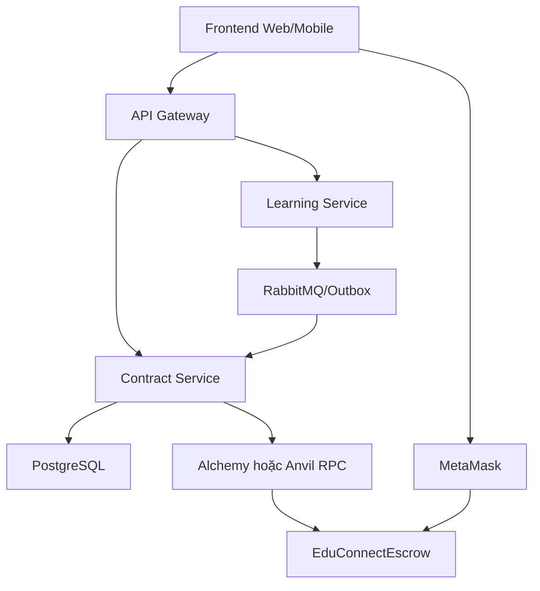
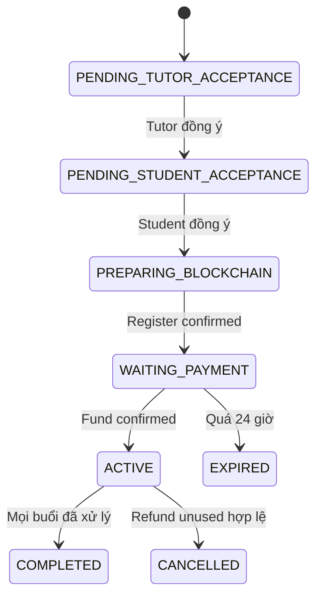

# EDUCONNECT — HƯỚNG DẪN TRIỂN KHAI BLOCKCHAIN MASTER ESCROW

> Tài liệu chốt hướng phát triển Blockchain cho khóa luận EDUCONNECT.  
> Môi trường: Windows + Git Bash, Foundry, Solidity, Anvil, Ethereum Sepolia, Circle test USDC, Alchemy, MetaMask, Java Spring Boot, PostgreSQL và RabbitMQ.  
> Phiên bản tài liệu: 2.1 — baseline triển khai V1.  
> Cập nhật: 27/08/2026.

---

## 0. Cách sử dụng tài liệu này

Tài liệu được sắp xếp từ dễ đến khó. Không cần đọc và làm toàn bộ trong một lần. Chỉ chuyển sang chặng tiếp theo khi checkpoint của chặng hiện tại đã đạt.

| Chặng                 | Đọc phần | Việc cần làm                                                                 | Checkpoint trước khi đi tiếp                                           |
| --------------------- | -------: | ---------------------------------------------------------------------------- | ---------------------------------------------------------------------- |
| A — Hiểu nền tảng     |      1–7 | Hiểu blockchain, ví, ETH, USDC, RPC, master contract và cách quy đổi học phí | Giải thích được tiền học nằm ở đâu và ETH khác USDC thế nào            |
| B — Chốt nghiệp vụ    |     8–13 | Chốt trạng thái hợp đồng, payout, khiếu nại, role và các điều kiện bảo mật   | Viết được luồng từ enrollment đến refund/settlement mà không mâu thuẫn |
| C — Solidity local    |    14–17 | Cài Foundry, tạo project, viết mock USDC, master contract và unit test       | `forge build` và toàn bộ `forge test` đều pass                         |
| D — Blockchain local  |       18 | Chạy Anvil, deploy local, thử ba account và toàn bộ luồng tiền               | Chạy được `approve → fund → finalize/dispute` mà không dùng Sepolia    |
| E — Tích hợp hệ thống |    22–25 | Kết nối MetaMask, Contract Service, Web3j, RabbitMQ/Outbox và scheduler      | Chạy end-to-end local từ giao diện/API đến transaction receipt         |
| F — Testnet           |    19–21 | Tạo Alchemy RPC, chuẩn bị account/test token, deploy và verify trên Sepolia  | Có contract address, tx hash và event thật trên Sepolia                |
| G — Nghiệm thu        |    26–30 | Chạy các kịch bản demo, đối soát và hoàn thiện minh chứng khóa luận          | Đạt toàn bộ tiêu chí ở phần 29                                         |

Thứ tự **thực hiện** tối ưu là A → B → C → D → E → F → G. Các phần 19–21 được đặt trước phần tích hợp để làm tài liệu tra cứu deployment, nhưng khi bắt tay làm project, hãy hoàn thành tích hợp local trước rồi mới deploy Sepolia. Phần 30 là checklist ngắn để bắt đầu ngay.

> Nguyên tắc quan trọng: local trước, Sepolia sau; test trước, deploy sau; xác nhận transaction receipt trước khi cập nhật trạng thái nghiệp vụ.

### 0.1. Thứ tự triển khai có hiệu lực

Các chương trong tài liệu vừa dùng để học vừa dùng để tra cứu nên số chương không hoàn toàn trùng thứ tự thi công. Khi code, **chỉ dùng thứ tự dưới đây làm thứ tự chính thức**:

```text
P0 Chốt nghiệp vụ và state machine
→ P1 Tạo project Foundry
→ P2 Viết contract + unit/invariant test
→ P3 Deploy và chạy luồng trên Anvil
→ P4 Làm Contract Service + database + Web3j
→ P5 Làm frontend MetaMask + chạy end-to-end local
→ P6 Deploy/verify Sepolia qua Alchemy
→ P7 Chạy demo, đối soát và viết báo cáo
```

Không nhảy thẳng lên Sepolia chỉ để “xem contract chạy”. Sai sót trên Anvil sửa miễn phí và deploy lại tức thì; sai sót trên Sepolia tạo thêm địa chỉ contract, tốn test ETH và làm dữ liệu demo khó đối soát.

### 0.2. Quy tắc cho AI hoặc thành viên triển khai

AI đọc tài liệu này phải tuân thủ các quy tắc sau:

1. Không tự đổi các quyết định V1 ở phần 1. Nếu cần đổi, phải ghi thành quyết định mới và nêu ảnh hưởng đến contract, DB, API, test.
2. Mỗi lần chỉ làm một phase; báo rõ file đã tạo/sửa, lệnh đã chạy, kết quả và việc còn thiếu.
3. Không tuyên bố hoàn thành nếu chưa chạy test/checkpoint tương ứng.
4. Không dùng khóa riêng của MetaMask trong source, `.env` được commit, log, ảnh chụp hoặc hội thoại.
5. Không cập nhật DB thành `LOCKED`, `ACTIVE`, `SETTLED` chỉ vì đã có `txHash`; phải có receipt thành công và event đúng.
6. Không để backend giữ private key của học viên/gia sư. Backend chỉ ký transaction của `OPERATOR_ROLE` bằng testnet operator keystore.
7. Không deploy một contract cho mỗi lớp/học viên. Chỉ một `EduConnectEscrow`, nhiều `agreementId`.
8. Không thêm Chainlink, proxy upgradeable, EIP-712, DAO/multisig hoặc oracle vào V1 khi chưa hoàn thành baseline.
9. Mọi consumer RabbitMQ, scheduler và watcher Blockchain phải idempotent.
10. Khi tài liệu VBI/TerranCrypt khác tài liệu Foundry/OpenZeppelin hiện tại, ưu tiên tài liệu chính thức hiện tại; phần 3.1 ghi rõ các khác biệt đã biết.

### 0.3. Mẫu báo cáo sau mỗi phase

```text
PHASE: P...
Mục tiêu:
File đã tạo/sửa:
Lệnh đã chạy:
Kết quả test/checkpoint:
Địa chỉ/txHash liên quan (nếu có):
Rủi ro hoặc TODO còn lại:
Quyết định: PASS / BLOCKED
```

Chỉ chuyển phase nếu là `PASS`. Nếu `BLOCKED`, giữ nguyên lỗi đầy đủ và sửa ở phase hiện tại.

### 0.4. Phân biệt bốn loại môi trường

| Môi trường       | Tiền                           | RPC                     | Mục đích                             | Có giá trị thật? |
| ---------------- | ------------------------------ | ----------------------- | ------------------------------------ | ---------------- |
| Forge unit test  | Balance giả do test tạo        | Forge VM nội bộ         | Kiểm thử nhanh từng hàm/invariant    | Không            |
| Anvil local      | ETH/mUSDC local                | `http://127.0.0.1:8545` | Tích hợp nhiều ví, frontend, backend | Không            |
| Ethereum Sepolia | Sepolia ETH + Circle test USDC | Alchemy Sepolia RPC     | Demo public cho khóa luận            | Không            |
| Ethereum mainnet | ETH + USDC thật                | Mainnet RPC             | Sản phẩm thật sau audit/pháp lý      | Có               |

Tài liệu này chỉ triển khai ba dòng đầu, **không triển khai mainnet**.

---

## 1. Mục tiêu và các quyết định đã chốt

EDUCONNECT dùng Blockchain để giữ toàn bộ học phí của từng học viên trong một smart contract ký quỹ, sau đó giải ngân theo từng buổi học.

Các quyết định của phiên bản V1:

1. Chỉ deploy **một master smart contract** tên `EduConnectEscrow`.
2. Mỗi học viên tham gia một lớp có một `agreementId` riêng trong master contract.
3. Học viên đóng **toàn bộ học phí một lần** trước khi được vào lớp.
4. Học phí được thanh toán bằng USDC testnet; Sepolia ETH chỉ dùng trả gas.
5. Một khóa học 1.000.000 VND có thể quy ước thành 40 USDC tại tỷ giá snapshot `1 USDC = 25.000 VND`.
6. “Ký hợp đồng” trong V1 là hai bên bấm **Tôi đồng ý** trong ứng dụng. Không triển khai chữ ký số, chứng thư số hoặc EIP-712 ở V1.
7. Giao dịch `approve` và `fundAgreement` của học viên vẫn được MetaMask ký bằng private key của ví.
8. `Account 1` của nền tảng có thể đồng thời là deployer, admin, operator, arbitrator và ví nhận phí nền tảng.
9. Học viên và gia sư tự có ví MetaMask riêng; backend không giữ private key của họ.
10. Điểm danh do từng người tự thực hiện. Gia sư không điểm danh thay học viên và học viên không điểm danh thay gia sư.
11. Khiếu nại V1 chỉ tập trung vào trường hợp học viên đã điểm danh nhưng tố gia sư đã điểm danh mà thực tế không dạy.
12. Sau mỗi buổi có cửa sổ khiếu nại 24 giờ. Nếu có đơn hợp lệ, tiền buổi đó bị khóa đến khi Staff/Admin xử lý, kể cả đã hết 24 giờ.
13. Google Meet/Zoom chỉ là link học bên ngoài; V1 không tự đo thời lượng dạy. Admin xử lý tranh chấp dựa vào minh chứng hai bên cung cấp.
14. Một khiếu nại chỉ ảnh hưởng khoản tiền buổi học của học viên gửi đơn, không tự động ảnh hưởng toàn lớp.
15. Không dùng Chainlink trong V1 vì agreement đã chốt trực tiếp số USDC phải trả.

---

## 2. Các khái niệm cần hiểu trước

### 2.1. Blockchain

Blockchain là nơi lưu transaction, trạng thái smart contract và số dư token. Trong hệ thống này, Blockchain không thay PostgreSQL.

Blockchain chịu trách nhiệm:

- Giữ USDC ký quỹ.
- Ghi nhận agreement nào đã được nạp tiền.
- Ghi nhận buổi nào đã giải ngân hoặc hoàn tiền.
- Chia tiền theo quy tắc cố định.
- Chặn giải ngân một buổi nhiều lần.
- Ghi event để đối soát.

PostgreSQL chịu trách nhiệm:

- Người dùng, lớp học, enrollment và session.
- Nội dung hợp đồng đầy đủ.
- Hành động chấp thuận của hai bên.
- Điểm danh.
- Nội dung khiếu nại và minh chứng.
- Trạng thái nghiệp vụ và transaction mirror.

### 2.2. Smart contract

Smart contract là chương trình Solidity được deploy lên Blockchain. Sau khi deploy, nó có một địa chỉ riêng, ví dụ:

```text
EduConnectEscrow = 0xABCD...
```

Địa chỉ smart contract giữ USDC. `Account 1` không giữ toàn bộ học phí.

Smart contract không thể:

- Đọc PostgreSQL.
- Gọi API Google Meet hoặc Zoom.
- Tự biết ai đã dạy thật.
- Tự thức dậy sau 24 giờ.

Contract Service phải gửi transaction để gọi các hàm của smart contract.

### 2.3. Transaction

Transaction là một yêu cầu thay đổi trạng thái Blockchain, ví dụ:

- Deploy `EduConnectEscrow`.
- Đăng ký agreement.
- Approve USDC.
- Nạp USDC.
- Đề xuất kết quả buổi học.
- Mở khiếu nại.
- Giải ngân hoặc hoàn tiền.

### 2.4. Gas

Mọi transaction trên Sepolia cần gas, trả bằng Sepolia ETH.

```text
Sepolia ETH  → trả phí thực thi transaction
Test USDC    → mô phỏng học phí
```

Hai tài sản này độc lập. Học viên có thể đóng 40 test USDC nhưng chỉ mất một lượng nhỏ Sepolia ETH làm gas.

### 2.5. USDC

USDC là token ERC-20. Circle test USDC trên Ethereum Sepolia:

```text
Address:  0x1c7D4B196Cb0C7B01d743Fbc6116a902379C7238
Decimals: 6
```

Đơn vị lưu trên Blockchain:

```text
1 USDC  = 1_000_000 base units
4 USDC  = 4_000_000 base units
40 USDC = 40_000_000 base units
```

Test USDC và Sepolia ETH không có giá trị tiền thật.

### 2.6. RPC và Alchemy

Alchemy cung cấp RPC URL để Forge, Cast và Contract Service kết nối tới Ethereum Sepolia.

```text
Ứng dụng → Alchemy RPC → Ethereum Sepolia
```

Alchemy không làm block xác nhận nhanh hơn; nó giúp kết nối node, gửi transaction, đọc receipt và event ổn định hơn public RPC.

---

## 3. Các công cụ và nhiệm vụ của từng công cụ

| Công cụ           | Nhiệm vụ                                                               |
| ----------------- | ---------------------------------------------------------------------- |
| Solidity          | Ngôn ngữ viết smart contract                                           |
| Foundry           | Bộ công cụ phát triển Ethereum                                         |
| Forge             | Khởi tạo project, compile, format, test, deploy và verify              |
| Anvil             | Blockchain Ethereum local, tạo sẵn tài khoản và ETH local              |
| Cast              | Tương tác Blockchain, đọc dữ liệu, gửi transaction và quản lý keystore |
| MetaMask          | Ví người dùng, kết nối frontend và ký transaction                      |
| OpenZeppelin      | Thư viện smart contract ERC-20 và bảo mật                              |
| Alchemy           | RPC provider kết nối Sepolia                                           |
| Web3j             | Thư viện Java để Contract Service gọi smart contract                   |
| PostgreSQL        | Dữ liệu nghiệp vụ và transaction mirror                                |
| RabbitMQ + Outbox | Truyền event giữa các service và chống xử lý trùng                     |
| S3/MinIO          | Lưu ảnh, video, file minh chứng khiếu nại nếu cần                      |

Không cài Chainlink trong V1.

### 3.1. Các lệnh Foundry dễ nhầm

| Lệnh/khái niệm                              | Ý nghĩa đúng trong project này                                                                           |
| ------------------------------------------- | -------------------------------------------------------------------------------------------------------- |
| `forge init blockchain --no-git`            | Tạo project Foundry trong thư mục `blockchain/`, không tạo Git repository lồng                           |
| `forge build`                               | Compile toàn bộ contract; đây là lệnh chuẩn dùng trong guide                                             |
| `forge compile`                             | Alias của `forge build`; chạy được nhưng không cần dùng song song                                        |
| `forge test -vvv`                           | Chạy test và hiện trace đủ để chẩn đoán lỗi                                                              |
| `anvil`                                     | Mở Blockchain local; phải giữ terminal này chạy                                                          |
| `forge script ...`                          | Chạy deployment/interaction script; chỉ ghi lên chain khi có `--broadcast`                               |
| `forge create ... --broadcast`              | Deploy trực tiếp một contract; hợp với thử nghiệm đơn giản, không phải đường deploy chính của EDUCONNECT |
| `cast wallet import account1 --interactive` | Nhập private key vào encrypted keystore của Cast                                                         |
| `source .env`                               | Nạp biến môi trường vào terminal Git Bash hiện tại; terminal mới phải nạp lại                            |
| `--verify`                                  | Yêu cầu Forge gửi source/metadata đến verifier; không phải điều kiện để contract hoạt động               |

`--broadcast` mới là cờ làm transaction thật sự được gửi lên Anvil/Sepolia. Không có cờ này, script chỉ mô phỏng. Verify giúp người khác đọc source và đối chiếu bytecode; contract đã deploy vẫn gọi được dù chưa verify.

### 3.2. Cách đọc tài liệu tham khảo VBI

Các README của `vbi-academy/solidity-basics` và `vbi-academy/foundry-basics` rất hữu ích để học cấu trúc `src/`, `script/`, `test/`, `vm.startBroadcast()` và Makefile. Khi áp dụng vào project hiện tại cần lưu ý:

- Dùng `--match-path`, không dùng lỗi đánh máy `--math-path`.
- `--network sepolia` trong Makefile mẫu là biến quy ước do chính Makefile phân tích, không phải cờ mạng chung của Forge.
- Không dùng `forge install ... --no-commit`; cờ cũ này đã bị loại khỏi Foundry hiện tại.
- Ví dụ Chainlink `v2.14.0` thuộc bài crowdfunding cũ; EDUCONNECT V1 không cần price feed nên không cài.
- Deployment script vẫn là lựa chọn tốt nhất vì EDUCONNECT phải truyền nhiều constructor address, ghi log địa chỉ và có nhánh Anvil/Sepolia.

### 3.3. Alchemy thực sự làm gì?

Alchemy chỉ là nhà cung cấp **node/RPC API**. Forge, Cast và Web3j gửi JSON-RPC qua URL Alchemy để đọc block, gửi raw transaction, lấy receipt và đọc event trên Sepolia. Alchemy không giữ USDC, không giữ private key và không thay thế MetaMask.

```text
MetaMask/Forge/Web3j
        │ JSON-RPC
        ▼
Alchemy endpoint
        │
        ▼
Ethereum Sepolia
```

Chọn Alchemy thay Infura trong V1 vì project đã thống nhất một provider và có API dashboard dễ theo dõi. Nó không làm thời gian tạo block của Sepolia nhanh hơn; độ trễ xác nhận vẫn do mạng quyết định.

---

## 4. Phân biệt hợp đồng nghiệp vụ và master smart contract

Ba đối tượng sau hoàn toàn khác nhau:

| Đối tượng            | Nơi lưu                  | Tạo khi nào               |                          Số lượng |
| -------------------- | ------------------------ | ------------------------- | --------------------------------: |
| `ContractAgreement`  | PostgreSQL               | Gia sư chấp nhận học viên |      Một bản cho mỗi học viên/lớp |
| `Agreement` on-chain | Trong `EduConnectEscrow` | Hai bên đã chấp thuận     | Một agreement cho mỗi hợp đồng DB |
| `EduConnectEscrow`   | Ethereum/Anvil           | Khi triển khai hệ thống   |           Một contract dùng chung |

Ví dụ:

```text
EduConnectEscrow
├── Agreement 101: Student A ↔ Tutor X
├── Agreement 102: Student B ↔ Tutor X
└── Agreement 103: Student C ↔ Tutor Y
```

Không deploy một smart contract mới cho mỗi học viên hoặc mỗi lớp.

---

## 5. Kiến trúc trong project hiện tại

```text
KLTN_Edu/
├── backend/
│   ├── account-service/
│   ├── api-gateway/
│   ├── learning-service/
│   ├── contract-service/
│   └── notification-service/
│
├── blockchain/
│   ├── src/
│   │   ├── EduConnectEscrow.sol
│   │   └── mocks/
│   │       └── EduTestUSDC.sol
│   ├── test/
│   │   ├── EduConnectEscrow.t.sol
│   │   └── EduConnectEscrow.invariant.t.sol
│   ├── script/
│   │   └── DeployEduConnectEscrow.s.sol
│   ├── lib/
│   ├── foundry.toml
│   ├── Makefile
│   ├── .env.example
│   └── .gitignore
│
├── frontend-web/
└── docker-compose.yml
```

Không đặt file `.sol` trong `backend/contract-service/src/main/java`.



Hai đường ghi Blockchain khác nhau: MetaMask ký `approve/fund` thay học viên; Contract Service ký các transaction operator/arbitrator. Cả hai đều gọi cùng một `EduConnectEscrow` qua RPC đúng chain.

### 5.1. Trách nhiệm các service

| Service              | Sở hữu nghiệp vụ                                                                           |
| -------------------- | ------------------------------------------------------------------------------------------ |
| Account Service      | User, Role, TutorProfile, địa chỉ ví người dùng                                            |
| Learning Service     | Classroom, EnrollmentRequest, Enrollment, Session, Attendance                              |
| Contract Service     | ContractAgreement, Acceptance, Payment, Escrow, Settlement, Dispute, BlockchainTransaction |
| Notification Service | Gửi thông báo hợp đồng, thanh toán, điểm danh và khiếu nại                                 |
| API Gateway          | Route API và xác thực đầu vào                                                              |

Hệ thống có thể dùng chung một PostgreSQL vật lý nhưng mỗi service chỉ ghi bảng của mình. Không dùng JPA relation xuyên service và không ghi trực tiếp bảng service khác.

---

## 6. Thiết kế tài khoản và ví

### 6.1. Cấu hình tối thiểu cho khóa luận

```text
Account 1 — nền tảng
├── Deployer
├── DEFAULT_ADMIN_ROLE
├── OPERATOR_ROLE
├── ARBITRATOR_ROLE
└── Platform Treasury

Account 2 — học viên
Account 3 — gia sư
```

Một `Account 1` là đủ cho toàn bộ vai trò của nền tảng trong V1.

Tên “Account 1/2/3” chỉ là nhãn hiển thị trong MetaMask và có thể khác trên máy khác. Hệ thống nhận diện bằng **wallet address + chainId**, không nhận diện bằng tên account. Trên Anvil, hướng dẫn dùng Account 0 làm platform; trên Sepolia, ví bạn đang gọi là Account 1 làm platform. Hai ví/môi trường này không phải cùng một tài khoản.

### 6.2. Vai trò cụ thể

| Vai trò           | Quyền                                                          |
| ----------------- | -------------------------------------------------------------- |
| Deployer          | Gửi transaction deploy contract                                |
| Admin             | Cấp/thu hồi role, pause/unpause                                |
| Operator          | Register agreement, propose/finalize session, expire agreement |
| Arbitrator        | Xử lý khiếu nại                                                |
| Platform Treasury | Nhận đúng phần trăm phí nền tảng                               |

### 6.3. Tiền được giữ ở đâu?

```text
Student Wallet → EduConnectEscrow → Tutor / Platform / Student Refund
```

Tiền toàn khóa nằm trong địa chỉ `EduConnectEscrow`, không nằm trong `Account 1`.

### 6.4. Lưu ví trong database

Account Service lưu:

```text
account_wallet
- id
- account_id
- wallet_address
- chain_id
- verified
- verified_at
- created_at
```

Contract Service snapshot lại ví trong agreement:

```text
contract_agreement
- student_wallet
- tutor_wallet
- platform_wallet
- chain_id
- escrow_contract_address
```

Không lưu trong PostgreSQL:

- Seed phrase.
- Private key học viên.
- Private key gia sư.
- Mật khẩu MetaMask.

Private key người dùng chỉ nằm trong MetaMask.

### 6.5. Operator key của backend

Khi Contract Service tự động gửi transaction, backend phải có quyền ký bằng operator wallet.

V1 có thể dùng `Account 1`, nhưng phải:

- Dùng testnet-only wallet.
- Lưu bằng encrypted keystore hoặc secret của server.
- Không commit private key hoặc keystore password.
- Không ghi private key trực tiếp trong source code hay database.

Khi triển khai thực tế mới tách Admin, Operator và Treasury thành ba ví khác nhau.

---

## 7. Quy đổi VND sang USDC

Blockchain không tự hiểu VND. Contract Service tính tỷ giá tại thời điểm tạo hợp đồng và snapshot kết quả.

Ví dụ:

```text
Giá khóa học:  1.000.000 VND
Tỷ giá V1:        25.000 VND/USDC
Số USDC:              40 USDC
Số buổi:               10
Giá mỗi buổi:           4 USDC
```

Giá trị gửi vào smart contract:

```text
totalAmount      = 40_000_000
pricePerSession  =  4_000_000
```

Contract Service nên lưu:

```text
total_price_vnd
vnd_per_usdc
total_amount_usdc_units
price_per_session_usdc_units
fx_snapshot_at
```

Java dùng `BigDecimal` để tính và `BigInteger` cho base units; không dùng `double` cho tiền.

Không cần Chainlink vì hai bên đã chấp thuận số USDC cố định.

Quy ước tỷ giá này là dữ liệu nghiệp vụ phục vụ demo, không phải đổi 1.000.000 VND thật thành tiền mã hóa. Với Sepolia, 40 test USDC chỉ là token thử nghiệm và không được mua/bán như USDC mainnet. Nếu sau này làm sản phẩm thật, tỷ giá, thanh toán fiat, KYC/AML, kế toán và pháp lý là một phạm vi riêng cần được thiết kế lại.

V1 yêu cầu giá mỗi buổi bằng nhau và:

```text
totalAmount = pricePerSession × totalSessions
```

Nếu phép chia VND không đều, Contract Service phải chốt số base unit USDC trước khi hai bên chấp thuận. Không dùng số thập phân trực tiếp trong Solidity. V2 có thể lưu mảng giá từng buổi; V1 không làm để giữ contract gọn.

---

## 8. Luồng hợp đồng, thanh toán và vào lớp

### 8.1. State chính

```text
EnrollmentRequest:
PENDING → ACCEPTED / REJECTED

ContractAgreement:
DRAFT
→ PENDING_TUTOR_ACCEPTANCE
→ PENDING_STUDENT_ACCEPTANCE
→ PREPARING_BLOCKCHAIN
→ WAITING_PAYMENT
→ PAYMENT_CONFIRMING
→ ACTIVE
→ COMPLETED

Nhánh lỗi:
EXPIRED / CANCELLED

Payment:
NOT_STARTED
→ APPROVAL_PENDING
→ DEPOSIT_PENDING
→ CONFIRMING
→ LOCKED
→ PARTIALLY_RELEASED
→ SETTLED / REFUNDED

Enrollment:
RESERVED → ACTIVE → COMPLETED
```

Nếu code hiện tại muốn giữ enum `PENDING_TUTOR_SIGNATURE` và `PENDING_STUDENT_SIGNATURE`, vẫn có thể dùng, nhưng ý nghĩa V1 là hành động bấm chấp thuận chứ không phải chữ ký số.



### 8.2. Luồng chi tiết

1. Học viên bấm **Tham gia lớp**.
2. Learning Service tạo `EnrollmentRequest = PENDING`.
3. Gia sư xem yêu cầu và bấm **Chấp nhận**.
4. Learning Service chuyển request sang `ACCEPTED`, tạo `Enrollment = RESERVED` và phát event.
5. Contract Service nhận event, tạo `ContractAgreement`.
6. Giao diện hiển thị nội dung hợp đồng cho gia sư.
7. Gia sư kết nối ví nếu chưa có, tích **Tôi đồng ý** và xác nhận.
8. Contract chuyển `PENDING_STUDENT_ACCEPTANCE`.
9. Học viên xem đúng phiên bản hợp đồng, kết nối ví và bấm **Tôi đồng ý**.
10. Contract Service dùng Account 1 gọi `registerAgreement(...)` trên `EduConnectEscrow`.
11. Khi transaction register được confirm, Contract chuyển `WAITING_PAYMENT` và bắt đầu thời hạn 24 giờ.
12. Học viên gọi `USDC.approve(escrowAddress, totalAmount)` bằng MetaMask.
13. Sau khi approve confirm, học viên gọi `fundAgreement(agreementId)`.
14. `EduConnectEscrow` chuyển toàn bộ USDC từ học viên vào contract.
15. Contract Service kiểm tra receipt và event `AgreementFunded`.
16. Nếu đúng: `Payment = LOCKED`, `Contract = ACTIVE`.
17. Contract Service phát `contract.activated`.
18. Learning Service nhận event, chuyển `Enrollment = ACTIVE`.
19. Học viên được phép vào lớp.

### 8.3. Thanh toán thất bại

Nếu approve hoặc deposit thất bại:

```text
Payment = FAILED_RETRYABLE
Contract = WAITING_PAYMENT
Enrollment = RESERVED
```

Học viên được thanh toán lại trong thời hạn.

### 8.4. Quá hạn thanh toán

Nếu hết 24 giờ mà chưa có `AgreementFunded`:

```text
Contract = EXPIRED
Payment = EXPIRED
Enrollment = EXPIRED
```

Giữ chỗ bị hủy và học viên không được vào lớp.

### 8.5. Ai bấm gì, ai trả gas và cái gì được ghi ở đâu?

| Hành động                   | Người/hệ thống thực hiện             | Có mở MetaMask? | Người trả gas      | Nơi ghi chính               |
| --------------------------- | ------------------------------------ | --------------: | ------------------ | --------------------------- |
| Tutor bấm đồng ý hợp đồng   | Tutor qua API                        |           Không | Không có gas       | PostgreSQL                  |
| Student bấm đồng ý hợp đồng | Student qua API                      |           Không | Không có gas       | PostgreSQL                  |
| Register agreement          | Contract Service/operator            |      Không ở UI | Account 1/operator | Blockchain + DB mirror      |
| Approve USDC                | Student                              |              Có | Student            | USDC contract               |
| Fund toàn khóa              | Student                              |              Có | Student            | `EduConnectEscrow`          |
| Gửi điểm danh               | Tutor/Student qua API                |           Không | Không có gas       | Learning Service DB         |
| Propose/finalize settlement | Contract Service/operator            |      Không ở UI | Account 1/operator | Blockchain + DB mirror      |
| Gửi đơn/minh chứng          | Student qua API                      |           Không | Không có gas       | Contract Service + S3/MinIO |
| Mở/resolve dispute on-chain | Contract Service/operator/arbitrator |      Không ở UI | Account 1 V1       | Blockchain + DB mirror      |

Như vậy, “ký hợp đồng” V1 là xác nhận điều khoản trong ứng dụng; hai transaction MetaMask xuất hiện ở bước thanh toán là chữ ký mật mã để cho token allowance và chuyển token, không phải chữ ký số pháp lý trên PDF.

### 8.6. Điều kiện duy nhất để cho vào lớp

Learning Service không tự đoán kết quả thanh toán. Nó chỉ chuyển `Enrollment = ACTIVE` khi nhận event nghiệp vụ `contract.activated` do Contract Service phát **sau khi**:

```text
receipt.status = SUCCESS
AND AgreementFunded event đúng contract address
AND agreementId/amount/student đúng dữ liệu DB
AND block nằm trên chainId cấu hình
```

Nếu watcher tạm mất kết nối Alchemy, trạng thái giữ ở `PAYMENT_CONFIRMING`; không cho vào lớp sớm và cũng không yêu cầu học viên trả lại ngay. Watcher phải đọc bù event từ block cursor đã lưu.

---

## 9. Nội dung hợp đồng hiển thị cho người dùng

Trang hợp đồng cần hiển thị:

- Mã hợp đồng.
- Học viên và gia sư.
- Địa chỉ ví hai bên.
- Lớp học và số buổi.
- Giá VND, tỷ giá snapshot và số USDC phải khóa.
- Giá mỗi buổi bằng USDC.
- Quy tắc 85/15, 45/10/45 và hoàn 100%.
- Cửa sổ khiếu nại 24 giờ.
- Chính sách hủy và hoàn tiền phần buổi chưa học.
- Phiên bản điều khoản.

Contract Service tạo canonical JSON, tính `termsHash`, lưu JSON/PDF ngoài chuỗi và ghi `termsHash` vào Blockchain khi register agreement.

Quy tắc tạo hash phải cố định để Java, frontend và test cho cùng kết quả:

1. Tạo JSON chỉ gồm trường điều khoản được chốt, dùng tên trường và thứ tự cố định.
2. Số tiền ghi bằng chuỗi base units; thời gian dùng UTC ISO-8601; không chứa `updatedAt`, khoảng trắng tùy ý hoặc URL tạm thời.
3. Encode UTF-8.
4. Tính Keccak-256 bằng `org.web3j.crypto.Hash.sha3(...)`.
5. Lưu cả `terms_json`, `terms_hash`, `contract_version` trong DB; gửi đúng `bytes32 termsHash` lên chain.

Không hash file PDF do metadata PDF có thể thay đổi dù nội dung hiển thị giống nhau. PDF là bản trình bày; canonical JSON mới là nguồn tạo hash.

V1 lưu hành động chấp thuận:

```text
contract_acceptance
- contract_id
- user_id
- role
- wallet_address
- accepted_at
- terms_hash
- contract_version
- ip_address
- user_agent
```

ID on-chain không dùng trực tiếp UUID dạng chuỗi. Contract Service tạo:

```text
agreementId = keccak256(UTF-8("EDUCONNECT:AGREEMENT:" + agreementUuid))
sessionId   = keccak256(UTF-8("EDUCONNECT:SESSION:" + sessionUuid))
```

DB phải lưu cặp UUID ↔ `bytes32` để API, event và transaction luôn đối soát được.

---

## 10. Quy tắc tiền theo từng buổi

Dùng basis points, `10_000 = 100%`.

| Kết quả                        |    Gia sư |  Nền tảng | Hoàn học viên |
| ------------------------------ | --------: | --------: | ------------: |
| `BOTH_PRESENT`                 | 8.500 bps | 1.500 bps |         0 bps |
| `STUDENT_ABSENT_TUTOR_PRESENT` | 4.500 bps | 1.000 bps |     4.500 bps |
| `TUTOR_ABSENT`                 |     0 bps |     0 bps |    10.000 bps |
| Cả hai không điểm danh         |     0 bps |     0 bps |    10.000 bps |

Để không còn dust:

```solidity
tutorAmount = sessionAmount * tutorBps / 10_000;
platformAmount = sessionAmount * platformBps / 10_000;
studentAmount = sessionAmount - tutorAmount - platformAmount;
```

### 10.1. Ví dụ 10 buổi, 40 USDC

Mỗi buổi có giá 4 USDC. Nếu cả 10 buổi đều hợp lệ:

```text
Gia sư nhận:      34 USDC
Nền tảng nhận:     6 USDC
EduEscrow còn:     0 USDC
```

Account 1 chỉ nhận 6 USDC phí nền tảng, không được lấy phần tiền còn lại.

### 10.2. Hủy khóa học trước hạn

Nếu đã quyết toán 3/10 buổi và khóa học bị hủy hợp lệ:

- Ba buổi đã quyết toán giữ nguyên.
- Nếu có buổi `PROPOSED`/`DISPUTED`, phải finalize/resolve buổi đó trước; V1 không cho cancel agreement khi còn settlement đang xử lý.
- Tiền của các buổi chưa học được hoàn lại học viên theo chính sách đã chấp thuận.
- Tiền chưa sử dụng không tự động thuộc về Account 1.

---

## 11. Điểm danh và khiếu nại V1

### 11.1. Nguyên tắc

- Gia sư chỉ tự điểm danh cho gia sư.
- Học viên chỉ tự điểm danh cho học viên.
- Hệ thống không xác minh tự động thời lượng Google Meet/Zoom.
- Việc học viên có vắng thật hay không không tạo dispute riêng; hệ thống căn cứ vào hành động tự điểm danh của học viên.
- Dispute V1 chỉ bắt trường hợp học viên đã điểm danh tố gia sư đã điểm danh nhưng thực tế không dạy.

### 11.2. Kết quả tạm thời

| Gia sư          | Học viên           | Kết quả tạm thời               |
| --------------- | ------------------ | ------------------------------ |
| Điểm danh       | Điểm danh          | `BOTH_PRESENT` và chờ 24 giờ   |
| Điểm danh       | Không điểm danh    | `STUDENT_ABSENT_TUTOR_PRESENT` |
| Không điểm danh | Có/không điểm danh | `TUTOR_ABSENT`                 |

### 11.3. Không có khiếu nại

```text
Buổi học kết thúc
→ Contract Service đề xuất outcome
→ Chờ 24 giờ
→ Không có dispute OPEN
→ Gọi finalizeSession
→ Smart contract giải ngân
```

### 11.4. Có khiếu nại

Điều kiện V1:

```text
Tutor attendance = PRESENT
Student attendance = PRESENT
Student gửi TUTOR_FRAUD trong 24 giờ
```

Luồng:

1. Contract Service tạo `Dispute = OPEN`.
2. Settlement của đúng học viên và đúng buổi chuyển `DISPUTED`.
3. Contract Service dùng operator wallet gọi `openTutorFraudDispute(...)` để khóa trạng thái on-chain; học viên không phải trả gas.
4. Notification Service thông báo gia sư.
5. Gia sư xem nội dung khiếu nại và gửi phản hồi/minh chứng.
6. Staff/Admin xem dữ liệu hai bên.
7. Staff/Admin chọn `APPROVED` hoặc `REJECTED`.
8. Contract Service gọi `resolveTutorFraudDispute(...)`.

Quan trọng:

> Mốc 24 giờ chỉ là thời hạn học viên được gửi đơn. Nếu đã có dispute thì hết 24 giờ vẫn không giải ngân; tiền bị khóa cho đến lúc Staff/Admin xử lý.

### 11.5. Thẩm quyền và kết quả xử lý

Quyền xử lý khiếu nại ở tầng nghiệp vụ được chốt như sau:

- `ADMIN` được xem và xử lý mọi khiếu nại.
- `STAFF` chỉ được xem và xử lý khiếu nại thuộc lớp do chính staff đó duyệt mở.
- Trong V1, Learning Service xác định người duyệt bằng
  `ClassRoom.reviewedByEmail`; việc so khớp email phải không phân biệt hoa/thường.
  Về sau nên lưu thêm immutable reviewer account ID để không phụ thuộc việc đổi email.
- Contract Service phải hỏi Learning Service qua internal API/read model và kiểm tra
  quyền này trước khi tạo lệnh resolve. Contract Service không truy vấn trực tiếp
  database của Learning Service.
- `ARBITRATOR_ROLE` on-chain chỉ xác thực signer kỹ thuật của Contract Service;
  smart contract không biết staff nào đã duyệt lớp nào. Vì vậy không được bỏ qua
  kiểm tra phạm vi staff ở API/service chỉ vì transaction dùng đúng arbitrator signer.
- Mỗi quyết định phải lưu `resolvedBy`, role, thời điểm, lý do và transaction hash để
  audit. Nếu không xác định được người duyệt lớp thì chỉ `ADMIN` được xử lý.

| Kết luận                               | Phân phối                |
| -------------------------------------- | ------------------------ |
| `REJECTED` — khiếu nại sai             | 85% gia sư, 15% nền tảng |
| `APPROVED` — gia sư không dạy/gian lận | Hoàn 100% cho học viên   |

Admin/Staff hợp lệ không tự nhập phần trăm tùy ý.

Bulk dispute resolution V1:

- Staff/Admin có thể xử lý khiếu nại trước khi hết cửa sổ 24 giờ.
- Một lần xử lý hàng loạt chỉ áp dụng cho các khiếu nại hợp lệ đang được chọn
  hoặc đang khớp bộ lọc hiện tại, thường là cùng một classroom session và cùng
  một kết luận.
- Nếu học viên khác gửi khiếu nại hợp lệ sau đó nhưng vẫn trước
  `disputeDeadline`, đơn mới vẫn được nhận và phải được xử lý bằng một lần
  Staff/Admin action sau.
- Bulk approval chỉ hoàn tiền cho học viên đã gửi khiếu nại hợp lệ. Không tự
  động hoàn tiền mọi học viên trong lớp/buổi học.
- Contract Service vẫn tạo một transaction on-chain
  `RESOLVE:{chainId}:{agreementId}:{sessionId}` cho từng student agreement,
  có receipt tracking và audit riêng.
- Nếu một phần transaction thất bại hoặc còn pending, retry/reconciliation chạy
  theo từng dispute. Dispute đã refund confirmed thì không được gửi refund lại.

### 11.6. Phạm vi cá nhân

Một học viên khiếu nại chỉ khóa khoản tiền buổi đó của agreement của học viên đó.

```text
Student 1 khiếu nại → khóa Student 1 / Session 3
Student 2 không khiếu nại → xử lý bình thường
```

Nếu nhiều học viên cùng khiếu nại, giao diện Staff hiển thị số lượng đơn cùng session, nhưng V1 vẫn xử lý từng đơn; không tự động hoàn toàn lớp.

UI nên có `approve selected`, `reject selected` và `approve all valid open
disputes in this classroom session` để Staff/Admin không phải bấm từng đơn khi
cùng một kết luận. Đây vẫn là batch của nhiều dispute cá nhân, không phải
class-wide refund.

### 11.7. Minh chứng

Học viên và gia sư có thể gửi:

- Ảnh chụp Google Meet/Zoom.
- Tin nhắn.
- Ảnh lỗi không vào được phòng.
- Video hoặc bản ghi nếu có.
- Mô tả sự việc.

File lưu ở S3/MinIO; database lưu URL/metadata; Blockchain chỉ lưu hash quyết định hoặc hash gói minh chứng, không lưu file.

### 11.8. Quy tắc thời gian để tránh “lọt” giải ngân

- Backend chỉ nhận đơn nếu `submittedAt <= disputeDeadline` theo thời gian server UTC.
- Staff/Admin xử lý trước `disputeDeadline` không đóng cửa nhận đơn của các học
  viên khác. Các khiếu nại hợp lệ gửi sau đó nhưng vẫn trước deadline vẫn được
  nhận và xử lý bằng action sau.
- Khi nhận đơn, transaction DB phải tạo dispute và đánh dấu settlement `DISPUTE_OPENING` trước khi trả thành công cho API.
- Scheduler loại mọi settlement có `OPEN`, `UNDER_REVIEW` hoặc `DISPUTE_OPENING` trước khi gửi `finalizeSession`.
- Smart contract cũng kiểm tra trạng thái `DISPUTED`, nên nếu hai tiến trình cạnh tranh thì chỉ một transaction hợp lệ.
- Nếu transaction mở dispute thất bại, job retry cùng `agreementId + sessionId`; không tạo dispute DB thứ hai.
- V1 nên đóng nhận đơn sớm hơn scheduler vài giây hoặc dùng lock DB để giảm race condition đúng sát deadline.

---

## 12. Thiết kế master smart contract

### 12.1. Role

```solidity
DEFAULT_ADMIN_ROLE
OPERATOR_ROLE
ARBITRATOR_ROLE
```

V1 cấp cả ba role cho Account 1.

Constructor tối thiểu:

```solidity
constructor(
    address usdcToken,
    address platformWallet,
    address adminWallet
)
```

Constructor phải kiểm tra ba address khác `address(0)`, lưu `IERC20 immutable usdc`, lưu ví nhận phí và cấp cho `adminWallet` các role V1. Deployment script truyền cùng Account 1 vào `platformWallet` và `adminWallet`, nhưng contract vẫn tách hai khái niệm để V2 có thể dùng hai ví khác nhau.

### 12.2. Enum gợi ý

```solidity
enum AgreementStatus {
    NONE,
    CREATED,
    FUNDED,
    COMPLETED,
    EXPIRED,
    CANCELLED
}

enum SessionStatus {
    NONE,
    PROPOSED,
    DISPUTED,
    SETTLED,
    REFUNDED
}

enum Outcome {
    BOTH_PRESENT,
    STUDENT_ABSENT_TUTOR_PRESENT,
    TUTOR_ABSENT
}
```

### 12.3. Agreement on-chain

```solidity
struct Agreement {
    address student;
    address tutor;
    bytes32 termsHash;
    uint256 totalAmount;
    uint256 pricePerSession;
    uint32 totalSessions;
    uint32 settledSessions;
    uint256 remainingAmount;
    uint64 paymentDeadline;
    AgreementStatus status;
}
```

### 12.4. Session settlement

```solidity
struct SessionSettlement {
    Outcome proposedOutcome;
    SessionStatus status;
    uint64 disputeDeadline;
    bytes32 proposalEvidenceHash;
    bytes32 disputeEvidenceHash;
    bytes32 resolutionHash;
}
```

Mapping gợi ý:

```solidity
mapping(bytes32 => Agreement) public agreements;
mapping(bytes32 => mapping(bytes32 => SessionSettlement)) public sessions;
```

### 12.5. Hàm chính

```solidity
registerAgreement(
    bytes32 agreementId,
    address student,
    address tutor,
    bytes32 termsHash,
    uint256 totalAmount,
    uint256 pricePerSession,
    uint32 totalSessions,
    uint64 paymentDeadline
)

fundAgreement(bytes32 agreementId)

proposeSessionSettlement(
    bytes32 agreementId,
    bytes32 sessionId,
    Outcome outcome,
    bytes32 evidenceHash
)

openTutorFraudDispute(
    bytes32 agreementId,
    bytes32 sessionId,
    bytes32 evidenceHash
)

finalizeSession(
    bytes32 agreementId,
    bytes32 sessionId
)

resolveTutorFraudDispute(
    bytes32 agreementId,
    bytes32 sessionId,
    bool complaintApproved,
    bytes32 resolutionHash
)

expireAgreement(bytes32 agreementId)

cancelAgreementAndRefundUnused(
    bytes32 agreementId,
    bytes32 reasonHash
)
```

### 12.6. Ai được gọi từng hàm?

| Hàm                              | Caller V1                                 | Lý do                                                     |
| -------------------------------- | ----------------------------------------- | --------------------------------------------------------- |
| `registerAgreement`              | `OPERATOR_ROLE`                           | Backend đã kiểm tra hai bên chấp thuận                    |
| `fundAgreement`                  | Đúng `agreement.student`                  | Token được kéo từ chính ví học viên                       |
| `proposeSessionSettlement`       | `OPERATOR_ROLE`                           | Backend tổng hợp điểm danh từ Learning Service            |
| `openTutorFraudDispute`          | `OPERATOR_ROLE`                           | Student gửi API không tốn gas; backend xác thực điều kiện |
| `finalizeSession`                | `OPERATOR_ROLE`                           | Scheduler gọi sau deadline                                |
| `resolveTutorFraudDispute`       | `ARBITRATOR_ROLE`                         | Chỉ Staff/Admin đã phân quyền quyết định                  |
| `expireAgreement`                | `OPERATOR_ROLE`                           | Scheduler hết hạn thanh toán                              |
| `cancelAgreementAndRefundUnused` | `ARBITRATOR_ROLE` hoặc role riêng sau này | Có chuyển tiền hoàn nên cần quyền cao                     |
| `pause/unpause`                  | `DEFAULT_ADMIN_ROLE`                      | Xử lý sự cố                                               |

Không thiết kế hàm kiểu `withdrawAll()` hoặc `adminTransfer(address,uint256)`. Account 1 chỉ nhận phí khi payout đúng quy tắc.

### 12.7. Event tối thiểu

```solidity
AgreementRegistered
AgreementFunded
SessionSettlementProposed
TutorFraudDisputeOpened
SessionSettled
TutorFraudDisputeResolved
AgreementCompleted
AgreementExpired
AgreementCancelled
UnusedAmountRefunded
```

Mỗi event liên quan agreement/session phải index `agreementId`, và nếu có thì index `sessionId`. Event chuyển tiền phải chứa `tutorAmount`, `platformAmount`, `studentRefund` để backend không phải suy đoán từ balance.

### 12.8. Điều kiện bắt buộc

- `agreementId` không được trùng.
- Student/tutor không được là `address(0)`.
- Student và tutor phải khác nhau.
- Chỉ đúng student wallet được `fundAgreement`.
- Fund đúng toàn bộ `totalAmount`, chỉ một lần và trước deadline.
- Mỗi `sessionId` chỉ propose và settle một lần.
- `proposeSessionSettlement` chỉ cho agreement `FUNDED`, đặt `disputeDeadline = block.timestamp + 24 hours` và không nhận deadline tùy ý từ caller.
- Chỉ mở dispute trước/đúng deadline và khi outcome tạm thời là `BOTH_PRESENT` theo phạm vi V1.
- `finalizeSession` chỉ chạy sau `disputeDeadline`.
- Session `DISPUTED` không được finalize.
- Chỉ Arbitrator resolve dispute.
- Không cancel agreement khi còn session `PROPOSED` hoặc `DISPUTED`; xử lý xong session đang mở rồi mới refund phần tương lai chưa dùng.
- Mỗi lần settle chỉ trừ đúng `pricePerSession`.
- Tổng released/refunded không vượt total funded.
- Không có hàm admin rút toàn bộ escrow tùy ý.
- Agreement hoàn thành bình thường phải có `remainingAmount = 0`.

### 12.9. State transition on-chain hợp lệ

```text
Agreement:
NONE → CREATED → FUNDED → COMPLETED
               ↘ CANCELLED
CREATED → EXPIRED

Session:
NONE → PROPOSED → SETTLED
                ↘ DISPUTED → SETTLED hoặc REFUNDED
```

Mọi nhánh khác phải revert bằng custom error. Ưu tiên custom errors như `AgreementAlreadyExists`, `InvalidAgreementStatus`, `OnlyStudent`, `PaymentDeadlinePassed`, `DisputeWindowOpen`, `SessionDisputed`, `AlreadySettled` thay vì chuỗi `require` dài.

### 12.10. Công thức payout và làm tròn

Với `sessionAmount = pricePerSession`:

```solidity
// BOTH_PRESENT
tutorAmount = sessionAmount * 8_500 / 10_000;
platformAmount = sessionAmount - tutorAmount;

// STUDENT_ABSENT_TUTOR_PRESENT
tutorAmount = sessionAmount * 4_500 / 10_000;
platformAmount = sessionAmount * 1_000 / 10_000;
studentRefund = sessionAmount - tutorAmount - platformAmount;

// TUTOR_ABSENT hoặc complaintApproved
studentRefund = sessionAmount;
```

Khoản cuối cùng nhận phần dư do chia số nguyên. Vì vậy invariant luôn đúng:

```text
tutorAmount + platformAmount + studentRefund = sessionAmount
```

Contract cập nhật `status`, `settledSessions`, `remainingAmount` trước khi `safeTransfer`. Khi `remainingAmount == 0`, chuyển agreement sang `COMPLETED` và phát `AgreementCompleted`.

### 12.11. Pause và khả năng khôi phục V1

`pause()` phải chặn đăng ký mới, funding mới, propose và finalize bình thường. Resolve dispute và hoàn tiền hợp lệ nên vẫn có đường thực hiện để không khóa tiền vĩnh viễn; phải test rõ các hàm nào có `whenNotPaused`. Đây là pause khẩn cấp, không phải công cụ để Admin thay kết quả.

---

## 13. Thư viện Solidity và bảo mật

Cài OpenZeppelin Contracts:

```bash
forge install OpenZeppelin/openzeppelin-contracts@v5.7.0
```

Pin version để CI, máy của bạn và AI dùng cùng dependency. Nếu repository kiểm tra tại thời điểm triển khai có bản vá mới hơn, nâng version trong một commit riêng rồi chạy lại toàn bộ test. Không dùng `--no-commit`; cờ này đã cũ trong các hướng dẫn Foundry trước đây.

Các thành phần cần dùng:

```solidity
IERC20
SafeERC20
AccessControl
Pausable
ReentrancyGuard
```

Quy tắc bảo mật:

- Chỉ nhận đúng token USDC address được truyền vào constructor.
- Dùng `SafeERC20.safeTransferFrom` và `safeTransfer`.
- Dùng `nonReentrant` cho hàm chuyển tiền.
- Dùng checks-effects-interactions.
- Không dùng `tx.origin`.
- Không lưu dữ liệu cá nhân lên Blockchain.
- Không thay tỷ lệ của agreement đang active.
- Không dùng proxy upgradeable trong V1.
- Nếu cần V2, deploy contract mới và để agreement cũ tiếp tục ở V1.
- Trước mainnet phải audit; V1 chỉ dùng local và Sepolia.

V1 chuyển payout trực tiếp trong `finalizeSession`/`resolveDispute`. Nếu sau này cần hardening hơn, có thể chuyển sang `claimable[address]` + `withdraw()`.

### 13.1. Vì sao chưa cài Chainlink?

Chainlink price feed chỉ cần nếu smart contract tự tính giá token theo thị trường. V1 đã snapshot `totalAmount` USDC trong điều khoản trước khi register, vì vậy thêm oracle chỉ tăng dependency, test và failure mode mà không giải quyết yêu cầu hiện tại.

Lệnh cũ cài repository Chainlink `v2.14.0` kèm cờ `--no-commit` không được đưa vào project V1. Nếu V2 thật sự cần Chainlink, dùng package EVM/version chính thức hiện hành tại thời điểm đó và remapping của package đó; không sao chép nguyên lệnh/remapping cũ từ bài học crowdfunding.

### 13.2. Security checklist trước mỗi deploy

- `forge fmt --check`, `forge build`, `forge test -vvv`, invariant test đều pass.
- Kiểm tra USDC address/chain ID bằng Cast; không dựa vào tên token trong MetaMask.
- Không có hàm chuyển tiền tùy ý; mọi transfer gắn với một agreement/session.
- Role được cấp đúng address; deployment script in lại role holder.
- Constructor và verify arguments khớp tuyệt đối.
- Không log private key, secret Alchemy hoặc keystore password.
- Contract Service có circuit breaker/pause vận hành khi RPC hoặc event watcher bất thường.

---

## 14. Cài Foundry trên Windows bằng Git Bash

Trong Git Bash:

```bash
curl -L https://getfoundry.sh/install | bash
source ~/.bashrc
foundryup
```

Kiểm tra:

```bash
forge --version
cast --version
anvil --version
```

Ghi ba version vào báo cáo hoặc `blockchain/README.md`. Nếu `forge` chưa được nhận sau khi cài, đóng/mở Git Bash hoặc chạy lại `source ~/.bashrc`. Không chạy lệnh Foundry bằng Command Prompt nếu toàn bộ hướng dẫn đang dùng cú pháp Git Bash.

VS Code nên cài:

- Solidity extension.
- Even Better TOML để đọc `foundry.toml`.

---

## 15. Tạo project Blockchain

Từ thư mục gốc `KLTN_Edu`:

```bash
forge init blockchain --no-git
cd blockchain
forge build
forge test
```

`--no-git` tránh tạo Git repository lồng trong repository hiện tại.

`forge init` sinh ví dụ `Counter.sol`; sau khi xác nhận test mẫu pass, thay các file mẫu bằng file EDUCONNECT. Không chạy `forge init .` trong thư mục gốc vì sẽ trộn `src/`, `test/`, `script/` Solidity với backend Java.

Cài dependency ngay trong `blockchain/`:

```bash
forge install OpenZeppelin/openzeppelin-contracts@v5.7.0
forge remappings
forge build
```

Cấu trúc cần tạo:

```text
blockchain/
├── src/EduConnectEscrow.sol
├── src/mocks/EduTestUSDC.sol
├── src/interfaces/IEduConnectEscrow.sol
├── test/EduConnectEscrow.t.sol
├── test/EduConnectEscrow.invariant.t.sol
├── script/DeployEduConnectEscrow.s.sol
├── deployments/
│   ├── anvil.json
│   └── sepolia.json
├── foundry.toml
├── Makefile
├── README.md
├── .env.example
└── .gitignore
```

Hai file `deployments/*.json` chỉ lưu chain ID, contract/token address, deploy tx hash, block, solc version và Git commit; không lưu secret. Nếu script không tự ghi JSON, ghi lại thủ công ngay sau deployment và kiểm tra vào version control.

`foundry.toml` gợi ý:

```toml
[profile.default]
src = "src"
out = "out"
libs = ["lib"]
solc_version = "0.8.36"
optimizer = true
optimizer_runs = 200

remappings = [
  "@openzeppelin/contracts/=lib/openzeppelin-contracts/contracts/"
]

[rpc_endpoints]
anvil = "http://127.0.0.1:8545"
sepolia = "${SEPOLIA_RPC_URL}"
```

Checkpoint P1:

```bash
forge fmt --check
forge build
forge test -vvv
```

Kết quả bắt buộc: exit code `0`, compiler là `0.8.36`, dependency OpenZeppelin resolve được và không có file `.env`/private key trong `git diff`.

---

## 16. Trình tự viết smart contract local

### Bước 1 — Viết `EduTestUSDC.sol`

Mock token local cần:

- Kế thừa ERC-20 OpenZeppelin.
- Tên `Edu Test USDC`.
- Symbol `mUSDC`.
- 6 decimals.
- Hàm mint chỉ dùng test.

MockUSDC chỉ dùng Anvil. Sepolia dùng Circle test USDC chính thức.

Mock phải override `decimals()` trả `6`. Có thể cho phép `mint(address,uint256)` công khai vì nó chỉ là test fixture; deployment script tuyệt đối không deploy mock này khi `block.chainid == 11155111`.

### Bước 2 — Viết phần agreement

Làm trước:

```text
constructor
registerAgreement
getAgreement
expireAgreement
```

### Bước 3 — Viết phần funding

```text
approve qua ERC-20
fundAgreement
AgreementFunded event
remainingAmount
```

### Bước 4 — Viết settlement không tranh chấp

```text
proposeSessionSettlement
finalizeSession
ba outcome payout
chống settle trùng
```

### Bước 5 — Viết dispute

```text
openTutorFraudDispute
resolveTutorFraudDispute
khóa finalize khi DISPUTED
```

### Bước 6 — Viết cancel/refund unused

Chỉ hoàn phần chưa được quyết toán, không ảnh hưởng các buổi đã settled.

### Bước 7 — Viết deployment script

`DeployEduConnectEscrow.s.sol` dùng pattern đã học từ VBI:

```solidity
contract DeployEduConnectEscrow is Script {
    function run() external returns (EduConnectEscrow escrow) {
        // đọc chain/env và validate address trước broadcast
        vm.startBroadcast();
        // Anvil: deploy EduTestUSDC; Sepolia: dùng Circle test USDC có sẵn
        // deploy EduConnectEscrow
        vm.stopBroadcast();
        // log token, escrow, admin, platform và chainId
    }
}
```

Quy tắc script:

- `block.chainid == 31337`: deploy `EduTestUSDC`, dùng account broadcast làm admin/platform, có thể mint dữ liệu demo trong script riêng.
- `block.chainid == 11155111`: đọc `SEPOLIA_USDC_ADDRESS`, `PLATFORM_WALLET`, `ADMIN_WALLET`; reject chain/address sai; không deploy mock.
- Chain khác: revert `UnsupportedChain` trừ khi đã cấu hình rõ.
- Script deploy chỉ deploy/cấu hình contract. Luồng register/mint/fund/demo nên để ở script riêng `InteractEduConnectEscrow.s.sol` hoặc test integration, tránh mỗi lần deploy tự tạo dữ liệu khó kiểm soát.

### Bước 8 — Xuất ABI cho backend/frontend

Sau `forge build`, ABI nằm trong:

```text
out/EduConnectEscrow.sol/EduConnectEscrow.json
```

Không copy ABI bằng tay mỗi lần. Tạo một task/script build để lấy trường `abi` sang artifact dùng chung hoặc generate Web3j wrapper từ artifact. Mỗi deployment record phải gắn Git commit/ABI version để tránh backend gọi nhầm contract cũ.

### Checkpoint P2

Chỉ đạt P2 khi:

```text
Compile pass
+ toàn bộ unit test pass
+ invariant pass
+ gas report đã xem
+ không warning chưa giải thích
+ coverage các nhánh tiền/state quan trọng
```

Không dùng tỷ lệ coverage duy nhất để kết luận an toàn; các revert path và invariant tiền quan trọng hơn số phần trăm tổng.

---

## 17. Kiểm thử bằng Forge

### 17.1. Không cần Anvil cho unit test

Forge có thể tạo địa chỉ test:

```solidity
address platform = makeAddr("platform");
address student = makeAddr("student");
address tutor = makeAddr("tutor");
```

Chạy:

```bash
forge fmt --check
forge build
forge test -vvv
forge coverage
forge test --gas-report
```

### 17.2. Test bắt buộc

#### Agreement

- Chỉ operator register.
- Không register trùng ID.
- Student/tutor hợp lệ và khác nhau.
- Tổng tiền bằng giá mỗi buổi nhân số buổi.

#### Funding

- Chỉ student fund.
- Không đủ balance thì revert.
- Không đủ allowance thì revert.
- Không fund thiếu/thừa.
- Không fund hai lần.
- Không fund sau deadline.
- Sau fund, contract balance tăng đúng totalAmount.

#### Settlement

- Không settle khi chưa fund.
- Không finalize trước 24 giờ.
- 85/15 đúng.
- 45/10/45 đúng.
- Tutor absent hoàn 100%.
- Không settle session hai lần.
- `remainingAmount` giảm đúng một `pricePerSession`.

#### Dispute

- Chỉ mở dispute cho outcome hợp lệ của V1.
- Có dispute thì hết 24 giờ vẫn không finalize được.
- Chỉ arbitrator resolve.
- Khiếu nại bị bác thì 85/15.
- Khiếu nại được chấp nhận thì hoàn 100%.
- Không resolve hai lần.

#### Cancellation

- Chỉ hoàn unused amount.
- Không hoàn lại tiền đã settled.
- Không cancel khi còn session proposed/disputed.
- Agreement hoàn thành không còn tiền.

#### Role, pause và nhiều agreement

- Account không role không register/propose/finalize/resolve được.
- Pause chặn đúng các hàm đã quy định và không tạo đường rút tiền Admin.
- Hai student/lớp khác nhau dùng chung master contract nhưng balance/settlement không lẫn nhau.
- Hai agreement dùng cùng `sessionUuid` vẫn có `sessionId`/mapping đúng thiết kế.
- Token address giả, zero address và student=tutor bị từ chối.
- Fuzz `sessionAmount` để kiểm tra tổng ba khoản luôn đúng dù có số dư làm tròn.
- Reentrant/malicious ERC-20 test nếu contract chấp nhận token tùy ý; V1 constructor chỉ khóa một token.

### 17.3. Invariant

```text
USDC balance của EduConnectEscrow
>= tổng remainingAmount của agreement FUNDED chưa hoàn tất
```

Trong mọi luồng protocol bình thường phải bằng nhau. Dấu `>=` xử lý trường hợp người lạ chuyển ERC-20 trực tiếp vào contract mà không gọi `fundAgreement`; contract không thể chặn một ERC-20 transfer gửi đến nó. Test demo không gửi token ngoài luồng nên phải thấy equality.

Với mỗi session settled:

```text
tutorAmount + platformAmount + studentRefund == pricePerSession
```

Thêm invariant tổng quát:

```text
0 <= remainingAmount <= totalAmount
settledSessions <= totalSessions
session đã SETTLED/REFUNDED không thể trở lại PROPOSED/DISPUTED
released + refunded + remaining = funded theo từng agreement
```

---

## 18. Chạy Anvil local

Terminal Git Bash 1:

```bash
anvil
```

Anvil cung cấp:

- RPC `http://127.0.0.1:8545`.
- Chain ID `31337`.
- Mười account local.
- Private key local.
- ETH local để trả gas.

Private key Anvil công khai, chỉ dùng local; tuyệt đối không gửi tài sản Sepolia/mainnet vào các account này.

Gán vai trò local:

```text
Anvil Account 0 = Platform/deployer/operator/treasury
Anvil Account 1 = Student
Anvil Account 2 = Tutor
```

Terminal Git Bash 2:

```bash
cd blockchain
forge build
forge test -vvv

# Copy private key của Anvil Account 0 từ terminal Anvil; chỉ dùng local.
export ANVIL_PRIVATE_KEY=0xLOCAL_ANVIL_ACCOUNT_0_PRIVATE_KEY

forge script script/DeployEduConnectEscrow.s.sol:DeployEduConnectEscrow \
  --rpc-url http://127.0.0.1:8545 \
  --private-key "$ANVIL_PRIVATE_KEY" \
  --broadcast \
  -vvvv
```

Nếu bỏ `--broadcast`, Forge chỉ mô phỏng và sẽ không có contract address tồn tại trên Anvil. Sau khi deploy, lưu address được log:

```bash
export LOCAL_RPC_URL=http://127.0.0.1:8545
export LOCAL_USDC_ADDRESS=0xADDRESS_FROM_DEPLOY_LOG
export LOCAL_ESCROW_ADDRESS=0xADDRESS_FROM_DEPLOY_LOG
export LOCAL_STUDENT_ADDRESS=0xANVIL_ACCOUNT_1
export LOCAL_TUTOR_ADDRESS=0xANVIL_ACCOUNT_2
```

Kiểm tra đúng chain/code/token:

```bash
cast chain-id --rpc-url "$LOCAL_RPC_URL"
cast code "$LOCAL_ESCROW_ADDRESS" --rpc-url "$LOCAL_RPC_URL"
cast call "$LOCAL_USDC_ADDRESS" "decimals()(uint8)" --rpc-url "$LOCAL_RPC_URL"
```

Kết quả lần lượt phải là `31337`, bytecode khác `0x`, và `6`.

Luồng local cần chạy được:

```text
Deploy EduTestUSDC
→ Deploy EduConnectEscrow
→ Mint 100 mUSDC cho Student
→ Register Agreement 40 mUSDC
→ Student approve 40 mUSDC
→ Student fund 40 mUSDC
→ Propose session
→ Chờ/warp thời gian test
→ Finalize hoặc dispute/resolve
```

Khi test frontend local, thêm mạng MetaMask:

```text
Network name: Anvil Local
RPC URL: http://127.0.0.1:8545
Chain ID: 31337
Currency: ETH
```

Import private key của ba account Anvil vào MetaMask chỉ để test local.

### 18.1. Cách chạy thời gian 24 giờ local

Unit test dùng `vm.warp(...)`. Khi tích hợp thật với Anvil, không chờ 24 giờ; tăng thời gian local:

```bash
cast rpc evm_increaseTime 86401 --rpc-url "$LOCAL_RPC_URL"
cast rpc evm_mine --rpc-url "$LOCAL_RPC_URL"
```

Chỉ dùng hai RPC này với Anvil. Sepolia không cho sửa thời gian.

### 18.2. Checkpoint P3

Phải lưu bảng số dư trước/sau bằng `cast call token "balanceOf(address)(uint256)" ...` và chứng minh:

- Account 1 deploy/register/propose/finalize được.
- Student approve/fund bằng **Anvil Account 1 (student)**, không phải Anvil Account 0 (platform signer).
- Tutor chỉ nhận payout, không giữ escrow.
- Escrow balance bằng tổng `remainingAmount` trong luồng demo không có token gửi nhầm.
- Luồng bình thường, tutor vắng và dispute đều chạy được.
- Dừng/restart Anvil làm mất chain local nếu không dùng state dump; đây là bình thường, không phải mất Sepolia data.

---

## 19. Chuẩn bị Sepolia

### 19.1. Tài sản hiện tại

Account 1 hiện đã có:

```text
Khoảng 0,276 Sepolia ETH
40 Circle test USDC
```

USDC đã được xác nhận đúng token address và 6 decimals.

Đây đều là tài sản test, không trừ tiền thật trong ngân hàng và không có giá trị quy đổi chính thức. `0,276 Sepolia ETH` chỉ dành cho gas testnet; không cần đổi nó thành USDC. Để demo một khóa 40 USDC, Account 1 gửi 40 test USDC cho ví Student; nếu cần thêm token test, dùng Circle testnet faucet khi faucet còn hỗ trợ hoặc phân phối lại token giữa các ví demo.

Không thể bảo đảm một số ETH cố định chạy được bao nhiêu transaction vì gas thay đổi. Cách tiết kiệm đúng là chạy mọi vòng phát triển trên Forge/Anvil và chỉ dùng Sepolia cho deployment cùng vài kịch bản nghiệm thu cuối.

### 19.2. Tạo Alchemy RPC

Trong Alchemy Dashboard:

```text
Chain: Ethereum
Network: Sepolia
```

Lấy HTTPS RPC URL dạng:

```text
https://eth-sepolia.g.alchemy.com/v2/YOUR_API_KEY
```

### 19.3. `.env.example`

```dotenv
SEPOLIA_RPC_URL=https://eth-sepolia.g.alchemy.com/v2/REPLACE_ME
SEPOLIA_CHAIN_ID=11155111
SEPOLIA_USDC_ADDRESS=0x1c7D4B196Cb0C7B01d743Fbc6116a902379C7238
PLATFORM_WALLET=0xREPLACE_ACCOUNT_1
ADMIN_WALLET=0xREPLACE_ACCOUNT_1
ETHERSCAN_API_KEY=REPLACE_IF_USING_ETHERSCAN_VERIFY
```

`.gitignore`:

```gitignore
.env
broadcast/
cache/
out/
```

Không để `PRIVATE_KEY` trong source hoặc commit lên Git.

### 19.4. Import Account 1 vào Cast keystore

```bash
cast wallet import account1 --interactive
cast wallet list
```

Chỉ nhập private key trong prompt của Cast; không gửi private key vào chat, source code hay command line.

Sau `source .env`, kiểm tra RPC/token trước khi deploy:

```bash
cast chain-id --rpc-url "$SEPOLIA_RPC_URL"
cast call "$SEPOLIA_USDC_ADDRESS" "decimals()(uint8)" --rpc-url "$SEPOLIA_RPC_URL"
cast call "$SEPOLIA_USDC_ADDRESS" "symbol()(string)" --rpc-url "$SEPOLIA_RPC_URL"
cast balance "$PLATFORM_WALLET" --ether --rpc-url "$SEPOLIA_RPC_URL"
```

Phải thấy chain ID `11155111`, decimals `6`, symbol `USDC` và có Sepolia ETH. Địa chỉ `0x1c7D...C7238` là **token contract**, không phải ví giữ 40 USDC của bạn; balance người dùng được lưu trong mapping của token contract và xem bằng `balanceOf(accountAddress)`.

---

## 20. Deploy `EduConnectEscrow` lên Sepolia

Trước deploy:

```bash
cd blockchain
forge fmt --check
forge build
forge test -vvv
```

Nạp biến môi trường trong Git Bash:

```bash
set -a
source .env
set +a
```

Deployment chính thức lần đầu trên Sepolia: **deploy và verify trong cùng một lệnh** bằng Etherscan API key.

```bash
forge script script/DeployEduConnectEscrow.s.sol:DeployEduConnectEscrow \
  --rpc-url "$SEPOLIA_RPC_URL" \
  --account account1 \
  --broadcast \
  --verify \
  --etherscan-api-key "$ETHERSCAN_API_KEY" \
  -vvvv
```

Đây chính là ý nghĩa của target `deploy-sepolia` trong Makefile: `--broadcast` deploy lên Blockchain; `--verify` công khai source. Tên cờ đúng là `--account`, không phải `--acount`. Account `account1` là tên Cast keystore, không phải biến mạng.

Lưu lại:

```text
Chain ID
EduConnectEscrow address
Deploy transaction hash
Deploy block number
USDC address
Account 1 address
ABI version/commit hash
```

Không deploy `EduTestUSDC` lên Sepolia trong bản demo chính; truyền Circle test USDC address vào constructor của `EduConnectEscrow`.

### 20.1. Verify không quyết định contract có dùng được hay không

Nếu deployment đã thành công nhưng bước verify lỗi vì verifier/API, **không chạy lại deployment script**, vì việc đó deploy thêm một contract mới. Giữ nguyên contract address và chạy `forge verify-contract` cho đúng địa chỉ cũ.

Ví dụ Etherscan, nếu constructor V1 là `constructor(address usdc, address platformWallet, address adminWallet)`:

```bash
export ESCROW_CONTRACT_ADDRESS=0xDIA_CHI_EDUCONNECT_ESCROW

CONSTRUCTOR_ARGS=$(cast abi-encode \
  "constructor(address,address,address)" \
  "$SEPOLIA_USDC_ADDRESS" \
  "$PLATFORM_WALLET" \
  "$ADMIN_WALLET")

forge verify-contract \
  "$ESCROW_CONTRACT_ADDRESS" \
  src/EduConnectEscrow.sol:EduConnectEscrow \
  --chain sepolia \
  --constructor-args "$CONSTRUCTOR_ARGS" \
  --etherscan-api-key "$ETHERSCAN_API_KEY" \
  --watch
```

Phải sửa chữ ký constructor trong lệnh cho khớp chính xác code thực tế.

### 20.2. Lựa chọn Sourcify không cần Etherscan API key

Sourcify không cần Etherscan API key. Có hai cách an toàn:

**Cách 1 — deploy và verify cùng một lần:** thêm `--verify --verifier sourcify` ngay trong lần chạy deployment script đầu tiên.

```bash
forge script script/DeployEduConnectEscrow.s.sol:DeployEduConnectEscrow \
  --rpc-url "$SEPOLIA_RPC_URL" \
  --account account1 \
  --broadcast \
  --verify \
  --verifier sourcify \
  -vvvv
```

**Cách 2 — contract đã deploy rồi:** dùng `forge verify-contract`; không chạy lại deployment script.

Ví dụ nếu constructor của V1 là `constructor(address usdc, address platformWallet, address adminWallet)`:

```bash
export ESCROW_CONTRACT_ADDRESS=0xDIA_CHI_EDUCONNECT_ESCROW

CONSTRUCTOR_ARGS=$(cast abi-encode \
  "constructor(address,address,address)" \
  "$SEPOLIA_USDC_ADDRESS" \
  "$PLATFORM_WALLET" \
  "$ADMIN_WALLET")

forge verify-contract \
  "$ESCROW_CONTRACT_ADDRESS" \
  src/EduConnectEscrow.sol:EduConnectEscrow \
  --chain sepolia \
  --verifier sourcify \
  --constructor-args "$CONSTRUCTOR_ARGS" \
  --watch
```

Verify chỉ công khai source/metadata và so khớp bytecode; nó không thay đổi trạng thái hay số dư của contract đã deploy.

### 20.3. Kiểm tra ngay sau deploy

```bash
cast code "$ESCROW_CONTRACT_ADDRESS" --rpc-url "$SEPOLIA_RPC_URL"
cast call "$ESCROW_CONTRACT_ADDRESS" "usdc()(address)" --rpc-url "$SEPOLIA_RPC_URL"
cast call "$ESCROW_CONTRACT_ADDRESS" "platformWallet()(address)" --rpc-url "$SEPOLIA_RPC_URL"
```

Tên getter phải khớp code thực tế. Kiểm tra thêm role bằng getter/`hasRole`, so sánh bytecode khác `0x`, rồi ghi `deployments/sepolia.json`. Chỉ sau checkpoint này mới cấu hình contract address cho backend/frontend.

---

## 21. Chuẩn bị ví người dùng để demo Sepolia

Tạo trong MetaMask:

```text
Account 1 = Platform
Account 2 = Student
Account 3 = Tutor
```

Account 1 chuyển cho Account 2:

- 40 test USDC để đóng khóa học mẫu.
- Một lượng nhỏ Sepolia ETH để trả gas approve và fund.

Account 3 không cần ETH chỉ để nhận USDC. Nếu sau này gia sư phải tự gửi transaction thì mới cần gas.

Bạn có thể tạo thêm account ngay trong MetaMask. Mỗi account có địa chỉ/private key riêng; không cần deploy contract riêng. Sepolia ETH và test USDC gửi giữa các account chỉ là tài sản test. Khi chuyển USDC, người gửi vẫn cần một ít Sepolia ETH làm gas.

Luồng số dư mẫu:

```text
Trước funding:
Student     = 40 USDC
Escrow      =  0 USDC
Tutor       =  0 USDC
Platform    =  0 USDC

Sau funding:
Student     =  0 USDC
Escrow      = 40 USDC

Sau buổi 1 hợp lệ:
Tutor       =  3,4 USDC
Platform    =  0,6 USDC
Escrow      = 36 USDC
```

---

## 22. Frontend và MetaMask

### 22.0. Stack ví đã chốt cho frontend

Frontend dùng đúng một stack EVM:

```text
React + Vite
Reown AppKit
@reown/appkit-adapter-ethers
ethers v6
```

Không cài song song Wagmi, Web3.js, `@web3modal/ethers`, ethers v5 hoặc
`@metamask/sdk`. Reown AppKit chịu trách nhiệm kết nối MetaMask, WalletConnect
và injected wallet; ethers v6 chịu trách nhiệm đọc số dư, tạo signer và gọi
contract.

Project hiện tại dùng Vite, có cả JSX và TSX, nhưng chưa có `tsconfig.json` và
đang có `package-lock.json`. Khi bắt đầu P5:

1. Chạy build baseline trước khi sửa.
2. Chuyển package manager sang pnpm trong một thay đổi riêng; không duy trì đồng
   thời `package-lock.json` và `pnpm-lock.yaml`.
3. Thêm TypeScript config cho các file TSX hiện có và viết module wallet mới bằng
   TypeScript; không chuyển đổi hàng loạt JSX không liên quan.
4. `react-router-dom` đã có; không cài lại chỉ để tích hợp ví.

Package tối thiểu:

```bash
pnpm add @reown/appkit @reown/appkit-adapter-ethers ethers
```

`axios` và `@tanstack/react-query` có thể thêm cho server state/API của Contract
Service, nhưng không phải dependency bắt buộc của EthersAdapter. Không thêm
Wagmi/Viem chỉ để dùng React Query.

### 22.1. Cấu hình Reown AppKit và liên kết ví

Tạo AppKit một lần ngoài React component, ví dụ `src/config/appkit.ts`, bằng:

- `createAppKit` từ `@reown/appkit/react`.
- `EthersAdapter` từ `@reown/appkit-adapter-ethers`.
- Sepolia từ `@reown/appkit/networks`.
- Anvil `31337` bằng custom network/`defineChain` khi chạy local.
- `projectId` lấy từ Reown Dashboard.
- Metadata tên `EduConnect`, URL phải khớp origin/domain triển khai.

UI ưu tiên các React component chính thức:

```text
AppKitButton / AppKitConnectButton
AppKitAccountButton
AppKitNetworkButton
```

Hook chuẩn:

```text
useAppKitAccount({ namespace: "eip155" })
useAppKitNetwork()
useAppKitProvider("eip155")
```

Không lấy `useAppKitNetworkCore` làm API baseline. Từ `walletProvider`, tạo
ethers v6 `new BrowserProvider(walletProvider)` rồi `await provider.getSigner()`.
Không dùng API ethers v5 như `ethers.providers.Web3Provider` hoặc
`ethers.utils.*`.

Nếu người dùng chưa có ví:

```text
Bạn cần MetaMask để thanh toán hoặc nhận học phí.
[Cài MetaMask]
[Kết nối ví]
```

AppKit quản lý yêu cầu kết nối và trả về account/provider. Frontend phải theo dõi
`address`, `isConnected`, `status`, `chainId` và network hiện tại; khi người dùng
đổi account hoặc network thì hủy payment intent cũ, xóa signer/contract instance
đã cache và tải lại quyền/dữ liệu. V1 có thể lưu địa chỉ sau khi người dùng kết
nối; bước xác minh nonce bằng message signature là hardening sau, không phải chữ
ký hợp đồng.

Frontend phải yêu cầu đúng chain:

```text
Anvil local: 31337
Sepolia:     11155111
```

Nếu sai chain, disable nút thanh toán và hướng dẫn chuyển mạng. Không lấy contract address cố định duy nhất cho mọi chain; dùng cấu hình theo `chainId`.

Anvil `127.0.0.1` chỉ truy cập được từ cùng máy. MetaMask extension trên máy dev
có thể dùng; WalletConnect trên điện thoại không thể gọi localhost của máy tính.
Muốn test mobile phải dùng RPC LAN/tunnel an toàn hoặc chờ Sepolia.

### 22.2. Màn hình hợp đồng

Hiển thị đầy đủ terms và:

```text
[ ] Tôi đã đọc và đồng ý
[Xác nhận]
```

Không mở MetaMask để ký hợp đồng ở V1.

### 22.3. Màn hình thanh toán

Hiển thị:

- Tổng VND.
- Tỷ giá snapshot.
- Tổng USDC.
- Số dư USDC.
- Số dư Sepolia ETH.
- Địa chỉ escrow.
- Đồng hồ payment deadline.

Nút thanh toán thực hiện tuần tự:

```text
1. Approve USDC
2. Chờ approve receipt
3. Fund agreement
4. Chờ fund receipt
5. Backend xác nhận độc lập
```

MetaMask sẽ hiện hai popup transaction. Không coi transaction hash là thành công; phải chờ receipt `status = success` và đúng event.

Nếu allowance hiện tại đã đủ `totalAmount`, có thể bỏ qua transaction approve. Nếu cần đổi allowance, V1 có thể approve đúng `totalAmount`, không approve vô hạn. UI không yêu cầu người dùng nhập contract address hoặc amount thủ công; các giá trị lấy từ payment intent đã được backend ký/kiểm tra và đối chiếu lại on-chain.

Trạng thái UI tối thiểu:

```text
CONNECT_WALLET
→ WRONG_NETWORK / INSUFFICIENT_GAS / INSUFFICIENT_USDC
→ APPROVING → APPROVED
→ FUNDING → CONFIRMING
→ FUNDED hoặc RETRYABLE_ERROR
```

### 22.4. Màn hình khiếu nại

Chỉ hiển thị cho student đã điểm danh khi tutor cũng điểm danh:

```text
[Khiếu nại gia sư không dạy]
```

Gia sư nhận thông báo, xem nội dung và gửi phản hồi/minh chứng. Staff/Admin xem cả hai bên và chọn `APPROVED` hoặc `REJECTED`.

Student gửi đơn qua Contract Service API. Frontend không gọi trực tiếp
`openTutorFraudDispute`. Staff/Admin resolve qua API để backend kiểm tra phạm vi:
`ADMIN` xử lý mọi đơn; `STAFF` chỉ xử lý lớp do chính staff duyệt. Contract
Service mới dùng operator/arbitrator signer gửi transaction on-chain.

Staff/Admin UI cần hỗ trợ xử lý từng đơn và xử lý hàng loạt danh sách khiếu nại
hợp lệ của cùng buổi học. Bulk action không khóa cửa sổ 24 giờ; nếu có đơn mới
được gửi hợp lệ sau đó thì hiển thị như việc cần xử lý tiếp.

### 22.5. Biến môi trường và chain registry

Frontend chỉ chứa cấu hình public:

```dotenv
VITE_REOWN_PROJECT_ID=
VITE_BLOCKCHAIN_ENV=anvil
VITE_CHAIN_ID=31337
VITE_PUBLIC_RPC_URL=http://127.0.0.1:8545
VITE_ESCROW_ADDRESS=
VITE_USDC_ADDRESS=
```

Không lưu seed phrase, private key, keystore password hoặc backend operator key
trong biến `VITE_*`; mọi `VITE_*` đều bị đóng gói và người dùng trình duyệt đọc
được. Nếu dùng Alchemy RPC ở frontend, đó phải là endpoint public đã giới hạn
domain/quota, không dùng credential vận hành của Contract Service.

`VITE_PLATFORM_WALLET` không phải nguồn phân quyền và không bắt buộc. Frontend
đọc platform wallet từ payment intent/backend hoặc getter immutable của escrow.
Tạo chain registry theo `chainId`; mỗi entry gồm RPC public, escrow, token,
explorer và ABI version/hash. Fail-fast nếu thiếu address, sai định dạng hoặc
chain không được hỗ trợ.

### 22.6. ABI và ethers v6 service

File dự kiến:

```text
src/config/appkit.ts
src/config/chains.ts
src/config/contracts.ts
src/abi/EduConnectEscrow.json
src/abi/USDC.json
src/hooks/useEthersWallet.ts
src/services/blockchainReadService.ts
src/services/escrowPaymentService.ts
src/components/wallet/WalletStatus.tsx
```

ABI escrow phải copy/generate từ `blockchain/abi/EduConnectEscrow.json`, kèm
SHA-256/version đã ghi trong deployment record; không tự viết tên hàm. ABI USDC
chỉ cần tối thiểu `decimals`, `balanceOf`, `allowance`, `approve`. Local dùng
cùng interface ERC-20 cho `EduTestUSDC`; Sepolia dùng USDC address đã verify.

Read-only dùng `JsonRpcProvider`; transaction của người dùng dùng
`BrowserProvider` + signer AppKit. Các API ethers v6 được dùng gồm `Contract`,
`parseUnits`, `formatUnits`, `formatEther`.

### 22.7. Hiển thị ETH, USDC và allowance của account

Sau khi có address và đúng chain:

```text
nativeWei = await provider.getBalance(address)
ETH       = formatEther(nativeWei)
decimals  = await usdc.decimals()       // phải bằng config/expected 6
USDC      = formatUnits(await usdc.balanceOf(address), decimals)
allowance = formatUnits(await usdc.allowance(address, escrowAddress), decimals)
```

Hiển thị balance là thông tin hỗ trợ UX, không phải chứng cứ thanh toán. Trước
`fundAgreement`, UI kiểm tra native ETH đủ gas ước tính, USDC balance và
allowance; smart contract vẫn là lớp bắt buộc cuối cùng và sẽ revert nếu không
đủ. Không dùng `Number` cho base units; giữ `bigint`/chuỗi và chỉ format để hiển
thị.

Public balance của platform/escrow có thể đọc mà không cần kết nối ví. Tổng
doanh thu không được suy ra từ balance platform hiện tại; dùng event/API đã đối
soát.

### 22.8. Quyền gọi theo V1

| Hành động | Frontend signer | Đường thực hiện |
| --- | --- | --- |
| Kết nối/xem account, chain, ETH, USDC | Không bắt buộc cho public read | AppKit + ethers read provider |
| `approve(escrow, exactAmount)` | Student | MetaMask/AppKit signer |
| `fundAgreement(agreementId)` | Đúng Student wallet của agreement | MetaMask/AppKit signer |
| Chấp thuận hợp đồng | Không ký blockchain | Contract Service API |
| Điểm danh Tutor/Student | Không ký blockchain | Learning Service API |
| Register/propose/finalize/expire | Không ở UI | Contract Service operator signer |
| Mở dispute on-chain | Không ở UI | Contract Service operator signer sau API validation |
| Resolve/cancel/refund | Không ở UI | Contract Service arbitrator signer sau ADMIN/STAFF authorization |

Không hard-code role từ “Account 1/2/3”. Trên Sepolia, nhãn demo là Account 1 =
Platform/Admin/Operator, Account 2 = Student, Account 3 = Tutor. Với bộ account
mặc định của Anvil, index tương ứng là Account 0 = Platform, Account 1 = Student,
Account 2 = Tutor. Đây chỉ là nhãn/index test; role thực tế lấy từ backend và
quyền on-chain được contract kiểm tra riêng bằng address + chain ID.

### 22.9. Payment intent và transaction UX

Frontend lấy `agreementId`, exact base-unit amount, chain ID, token/escrow
address và deadline từ `GET /payment-intent`; sau đó đối chiếu với chain config
và read on-chain agreement. Người dùng không nhập amount hoặc contract address.

Luồng:

```text
CONNECT → VALIDATE_ACCOUNT_AND_CHAIN
→ READ_ETH_USDC_ALLOWANCE
→ APPROVE_EXACT_AMOUNT (chỉ khi allowance thiếu)
→ wait approve receipt status=1
→ FUND_AGREEMENT
→ wait wallet receipt status=1
→ gửi txHash/action về backend
→ BACKEND_CONFIRMING
→ FUNDED chỉ khi watcher xác nhận đúng AgreementFunded event
```

Account/network thay đổi ở bất kỳ bước nào phải dừng luồng. Không retry tự động
transaction write sau timeout/reject; trước tiên đọc receipt/backend status để
tránh popup và giao dịch trùng.

### 22.10. Error model tối thiểu

Phải phân biệt rõ:

```text
WALLET_NOT_AVAILABLE / CONNECT_REJECTED / DISCONNECTED
WRONG_ACCOUNT / WRONG_NETWORK / UNSUPPORTED_CHAIN
INSUFFICIENT_NATIVE_GAS / INSUFFICIENT_USDC / INSUFFICIENT_ALLOWANCE
AGREEMENT_NOT_FOUND / ALREADY_FUNDED / PAYMENT_DEADLINE_PASSED
USER_REJECTED_TRANSACTION / TRANSACTION_REVERTED
TRANSACTION_PENDING / BACKEND_CONFIRMING / RPC_UNAVAILABLE
CONFIG_OR_ABI_MISMATCH
```

Không hiển thị “thành công” chỉ từ `transactionHash`. UI có thể báo
“đã gửi/pending”, nhưng `FUNDED/ACTIVE` phải lấy từ Contract Service watcher.

### 22.11. Mapping màn hình

- Header dùng AppKit account/network button và hiển thị address rút gọn, chain,
  trạng thái kết nối, ETH và USDC.
- Student Dashboard có agreement, exact amount/deadline, allowance,
  approve/fund, tx history và dispute form qua API.
- Tutor Dashboard xem agreement/session, số dự kiến/đã giải ngân và gửi điểm
  danh/phản hồi qua API; không gọi settlement contract trực tiếp.
- Staff/Admin Dashboard xem agreement, escrow/platform public balances, event
  doanh thu và dispute; resolve/cancel qua API, không dùng admin private key ở
  trình duyệt.

### 22.12. Checkpoint frontend wallet

Trước khi đạt P5 phải test trên Anvil bằng UI + service thật:

- Connect/disconnect MetaMask và injected wallet; WalletConnect được test trên
  network mà thiết bị truy cập được.
- Đổi account/network khiến UI cập nhật và transaction đang chuẩn bị bị hủy.
- Hiển thị đúng native ETH, USDC, allowance, chain ID và address.
- Sai account, sai chain, thiếu ETH, thiếu USDC, reject approve/fund và revert
  đều có trạng thái rõ, DB không chuyển sai.
- Approve đúng amount; không approve vô hạn; fund đúng agreement.
- ABI hash/address/chain khớp deployment record.
- `pnpm build` và TypeScript check pass; không có secret/private key trong bundle.
- Enrollment chỉ ACTIVE sau watcher/event `AgreementFunded`.

---

## 23. Contract Service — cấu trúc đề xuất

```text
contract-service/src/main/java/.../
├── controller/
├── dto/
├── entity/
├── enums/
├── repository/
├── service/
├── messaging/
├── blockchain/
│   ├── BlockchainClient.java
│   ├── EduConnectEscrowGateway.java
│   ├── TransactionReceiptService.java
│   └── BlockchainEventWatcher.java
├── scheduler/
└── config/
```

### 23.1. Bảng chính

```text
contract_agreement
contract_acceptance
escrow_payment
session_settlement
dispute
dispute_evidence
blockchain_transaction
blockchain_event_cursor
outbox_event
processed_event
```

Constraint quan trọng:

```text
UNIQUE(classroom_id, student_id, contract_version)
UNIQUE(agreement_id, session_id)
UNIQUE(chain_id, transaction_hash)
UNIQUE(chain_id, transaction_hash, log_index)
UNIQUE(consumer_name, event_id)
```

### 23.2. API gợi ý

```text
GET  /api/contracts/{contractId}
POST /api/contracts/{contractId}/tutor-accept
POST /api/contracts/{contractId}/student-accept
GET  /api/contracts/{contractId}/payment-intent
POST /api/contracts/{contractId}/payment-transactions
GET  /api/contracts/{contractId}/payment-status

POST /api/contracts/{contractId}/sessions/{sessionId}/disputes
POST /api/disputes/{disputeId}/tutor-response
POST /api/admin/disputes/{disputeId}/resolve
POST /api/admin/disputes/bulk-resolve
```

### 23.3. Web3j

Contract Service dùng:

```text
Alchemy RPC + ABI + contract address + operator signer
```

Web3j có thể generate Java wrapper từ ABI, sau đó `load` contract đã deploy bằng address.

Transaction state:

```text
CREATED → DISPATCHING → SUBMITTED → CONFIRMED
             ↘             ↘          ↘ FAILED
```

Watcher lưu:

- Transaction hash.
- Block number/hash.
- Receipt status.
- Event log index.
- Agreement ID/session ID.
- Error/revert reason nếu có.

### 23.4. Trường DB tối thiểu để đối soát

| Bảng                      | Trường bắt buộc đáng chú ý                                                                                                                               |
| ------------------------- | -------------------------------------------------------------------------------------------------------------------------------------------------------- |
| `contract_agreement`      | UUID, `onchain_agreement_id`, classroom/student/tutor ID, ba wallet snapshot, terms JSON/hash/version, VND/USDC snapshot, deadline, status, version lock |
| `escrow_payment`          | agreement ID, token/escrow/chain, expected amount, approve tx, fund tx, status, confirmed block                                                          |
| `session_settlement`      | agreement/session ID, outcome, amount, dispute deadline, on-chain status, propose/finalize tx                                                            |
| `dispute`                 | settlement ID, type, complainant, submittedAt, status, resolution, open/resolve tx                                                                       |
| `blockchain_transaction`  | idempotency key, action, chain, from/to, calldata + hash, signed raw tx tạm thời, tx hash, nonce, receipt/block/status/error                              |
| `blockchain_event_cursor` | chain, contract address, last confirmed block/hash                                                                                                       |
| `processed_event`         | consumer name + event UUID unique                                                                                                                        |

Các cột tiền on-chain dùng `NUMERIC(78,0)`/`BigInteger` base units. Các cột VND có thể dùng `NUMERIC`/`BigDecimal`. Không dùng `float/double`.

### 23.5. Cấu hình Contract Service

Ví dụ biến môi trường testnet:

```dotenv
BLOCKCHAIN_ENABLED=true
BLOCKCHAIN_CHAIN_ID=11155111
BLOCKCHAIN_RPC_URL=${SEPOLIA_RPC_URL}
BLOCKCHAIN_ESCROW_ADDRESS=0xDEPLOYED_ESCROW
BLOCKCHAIN_USDC_ADDRESS=0x1c7D4B196Cb0C7B01d743Fbc6116a902379C7238
BLOCKCHAIN_OPERATOR_ENABLED=true
BLOCKCHAIN_OPERATOR_ADDRESS=0xDEDICATED_OPERATOR
BLOCKCHAIN_OPERATOR_KEYSTORE_PATH=/run/secrets/operator-keystore.json
BLOCKCHAIN_OPERATOR_KEYSTORE_PASSWORD=runtime-secret-only
BLOCKCHAIN_OPERATOR_GAS_LIMIT=1500000
BLOCKCHAIN_CONFIRMATIONS=2
BLOCKCHAIN_START_BLOCK=DEPLOY_BLOCK
```

Không đặt `${SEPOLIA_RPC_URL}` theo cú pháp trên nếu hệ thống deploy không hỗ trợ nội suy lồng; mục tiêu là map secret/runtime config vào Spring `@ConfigurationProperties`. Tạo validator fail-fast nếu chain ID, token hoặc contract address không khớp.

### 23.6. Thứ tự code Contract Service

1. Entity/enums/migration và state transition thuần DB.
2. `BlockchainProperties` + RPC health/chain ID check.
3. ABI/Web3j wrapper + read-only gateway.
4. Transaction command/outbox với `idempotencyKey`.
5. Operator signer + send transaction + receipt watcher.
6. Event decoder/cursor/reorg-safe confirmation.
7. Agreement registration workflow.
8. Payment reconciliation workflow.
9. Settlement scheduler.
10. Dispute open/resolve workflow.
11. RabbitMQ consumers/producers và notification events.

Mỗi bước phải có integration test với Anvil/Testcontainers hoặc một Anvil process CI. Không chờ tới khi làm xong toàn service mới test Blockchain.

### 23.7. Quản lý nonce và retry

Chỉ một transaction dispatcher quản lý operator wallet trong V1. Nếu nhiều instance Contract Service cùng gửi bằng một ví mà không điều phối nonce, transaction có thể replace hoặc đụng nonce.

```text
Business command
→ insert blockchain_transaction với idempotencyKey UNIQUE
→ dispatcher claim row bằng DB lock
→ `DISPATCHING`, lấy nonce, ký và lưu tx hash/raw tx để đối soát
→ send đúng raw tx đã ký
→ SUBMITTED
→ watcher confirm/retry read
```

Không tự gửi transaction thứ hai chỉ vì HTTP RPC timeout. Giao dịch giữ trạng thái
`DISPATCHING` cùng nonce/tx hash đã ký; watcher phải đọc receipt/transaction trước.
Nếu sau này cần rebroadcast thì chỉ được phát lại đúng raw transaction đã ký (cùng
tx hash), không dựng transaction mới hoặc lấy nonce mới. Raw transaction không chứa
private key nhưng vẫn phải giới hạn quyền đọc DB và xóa sau khi receipt thành terminal.

### 23.8. Event confirmation và reorg

Sepolia demo có thể dùng số confirmation nhỏ (ví dụ 2) để nhanh; local dùng 1. Watcher lưu `blockNumber`, `blockHash`, `transactionHash`, `logIndex` và chỉ phát event nghiệp vụ sau mức confirmation cấu hình. Nếu block hash thay đổi trước confirmation, rollback mirror chưa final và đọc lại. Con số production phải được đánh giá riêng.

Quy ước triển khai P4.5:

- Safe head là `latestBlock - confirmations + 1`; không query hoặc xử lý log mới
  hơn safe head.
- Cursor khởi tạo tại `BLOCKCHAIN_START_BLOCK - 1` để không bỏ sót event ngay
  trong block deploy.
- Chỉ đọc log từ đúng `chainId` và `BLOCKCHAIN_ESCROW_ADDRESS`; định danh duy
  nhất của log là `(chainId, transactionHash, logIndex)`.
- Lưu decoded event và tiến cursor trong cùng transaction DB. Nếu lỗi decode,
  block hash không khớp hoặc DB rollback thì cursor không được tiến.
- Mỗi lần poll đọc tối đa `BLOCKCHAIN_EVENT_BLOCK_BATCH_SIZE`; worker không chạy
  chồng trong cùng instance. Nhiều instance production cần giữ duy nhất một
  blockchain event worker hoặc bổ sung distributed leader lock.
- P4.5 chỉ lưu event audit đã xác nhận. Việc chuyển `WAITING_PAYMENT`, `ACTIVE`,
  `SETTLED` hoặc `REFUNDED` phải chờ workflow kế tiếp đối chiếu event với dữ liệu
  agreement/payment/settlement trong DB.

---

## 24. Event giữa các service

### 24.1. Chấp nhận enrollment

```text
Learning Service
→ enrollment.request.accepted
→ Contract Service tạo ContractAgreement
```

### 24.2. Escrow funded

```text
Blockchain AgreementFunded
→ Contract Service confirm Payment LOCKED
→ contract.activated
→ Learning Service chuyển Enrollment ACTIVE
→ Notification Service thông báo
```

### 24.3. Điểm danh

```text
Learning Service
→ session.attendance.finalized
→ Contract Service tạo settlement PROPOSED
→ gửi transaction proposeSessionSettlement
```

### 24.4. Hết dispute window

Spring Scheduler tìm settlement:

```text
status = PROPOSED
disputeDeadline <= now
không có Dispute OPEN/UNDER_REVIEW
```

Sau đó mới gọi `finalizeSession`.

Nếu có dispute:

```text
Không gọi finalizeSession
Tiền tiếp tục nằm trong EduConnectEscrow
```

### 24.5. Idempotency

RabbitMQ có thể gửi lại event. Cả database và smart contract phải chặn:

- Tạo agreement trùng.
- Fund trùng.
- Propose trùng.
- Settle trùng.
- Resolve dispute trùng.

Nên dùng Outbox trước khi dùng Saga phức tạp.

### 24.6. Envelope event thống nhất

Mỗi event nên có:

```json
{
  "eventId": "uuid",
  "eventType": "contract.activated.v1",
  "occurredAt": "UTC ISO-8601",
  "producer": "contract-service",
  "correlationId": "enrollment-or-contract-uuid",
  "payload": {}
}
```

Payload Blockchain cần thêm `chainId`, `contractAddress`, `agreementId`, `txHash`, `blockNumber`. Không truyền entity JPA nguyên khối qua RabbitMQ. Version event bằng tên/schema và giữ backward compatibility khi service được deploy lệch thời điểm.

Quyền ghi trạng thái vẫn theo owner:

- Contract Service phát `contract.activated`; không update bảng enrollment.
- Learning Service nhận và tự update enrollment của mình.
- Learning Service phát attendance finalized; không update settlement.
- Contract Service nhận và tự tạo settlement của mình.

---

## 25. Scheduler “tự động giải ngân”

Smart contract không tự chạy. Contract Service tạo một scheduled job, ví dụ mỗi phút:

```text
1. Lấy settlement đã hết 24 giờ.
2. Bỏ qua settlement có dispute chưa resolve.
3. Gửi finalizeSession transaction.
4. Lưu txHash = SUBMITTED.
5. Watcher đợi receipt.
6. Khi confirm, cập nhật SETTLED và gửi notification.
```

Đây là tự động theo góc nhìn người dùng, nhưng backend operator vẫn là bên kích hoạt transaction.

Để tránh hai instance xử lý cùng settlement, job chọn batch bằng transaction DB/`FOR UPDATE SKIP LOCKED` hoặc cơ chế distributed lock, sau đó tạo command có idempotency key:

```text
FINALIZE:{chainId}:{agreementId}:{sessionId}
```

Điều kiện query phải gồm `PROPOSED`, deadline đã qua, chưa có dispute ở mọi trạng thái đang mở và chưa có finalize transaction pending/confirmed. Sau dispute được resolve, không dùng scheduler bình thường để trả thêm lần nữa; receipt/event của `resolveTutorFraudDispute` là kết quả cuối.

---

## 26. Kịch bản demo hoàn chỉnh

### Dữ liệu

```text
Lớp: Java Spring Boot
Student: Account 2
Tutor: Account 3
Platform: Account 1
Số buổi: 10
Giá: 1.000.000 VND
Tỷ giá: 25.000 VND/USDC
Tổng ký quỹ: 40 USDC
Giá mỗi buổi: 4 USDC
```

### Demo A — Hợp đồng và funding

1. Student gửi yêu cầu.
2. Tutor chấp nhận.
3. Contract Service tạo và hiển thị hợp đồng.
4. Tutor bấm đồng ý.
5. Student bấm đồng ý.
6. Account 1 register agreement.
7. Student approve 40 USDC.
8. Student fund 40 USDC.
9. Escrow balance bằng 40 USDC.
10. Contract và Enrollment chuyển ACTIVE.

### Demo B — Buổi bình thường

1. Tutor và Student cùng điểm danh.
2. Propose `BOTH_PRESENT`.
3. Hết 24 giờ test và không có dispute.
4. Finalize.
5. Tutor nhận 3,4 USDC.
6. Platform nhận 0,6 USDC.
7. Escrow còn 36 USDC.

### Demo C — Student vắng

1. Tutor điểm danh, Student không điểm danh.
2. Finalize theo `STUDENT_ABSENT_TUTOR_PRESENT`.
3. Tutor nhận 1,8 USDC.
4. Platform nhận 0,4 USDC.
5. Student được hoàn 1,8 USDC.

### Demo D — Tutor vắng

1. Tutor không điểm danh.
2. Outcome `TUTOR_ABSENT`.
3. Student được hoàn 4 USDC.

### Demo E — Khiếu nại gia sư gian lận

1. Tutor và Student đều điểm danh.
2. Student gửi đơn trong 24 giờ.
3. Session chuyển `DISPUTED`.
4. Hết 24 giờ vẫn không giải ngân.
5. Tutor gửi phản hồi và minh chứng.
6. Staff/Admin chấp nhận đơn.
7. Student được hoàn 4 USDC.
8. Nếu Staff/Admin bác đơn thì giải ngân 3,4/0,6.

### Demo F — Một master contract, nhiều agreement

1. Tạo thêm Student B/Agreement B trong cùng `EduConnectEscrow`.
2. Fund số tiền khác Agreement A.
3. Settle một session của A.
4. Chứng minh `remainingAmount` và balance logic của B không đổi.
5. Truy vấn event theo hai `agreementId` và đối soát DB.

### Minh chứng cần lưu cho mỗi demo

- Command/test output hoặc màn hình UI.
- Contract address, chain ID, tx hash và block.
- Event đã decode.
- Balance student/tutor/platform/escrow trước và sau.
- Trạng thái DB trước và sau.
- Kết luận invariant tổng tiền.

Không chụp seed phrase, private key, Alchemy key hoặc keystore password.

---

## 27. Makefile sau khi chạy lệnh thủ công thành công

Chỉ tạo Makefile sau khi build/test/deploy thủ công đã ổn.

```makefile
SHELL := bash
-include .env
export

ACCOUNT ?= account1
SCRIPT := script/DeployEduConnectEscrow.s.sol:DeployEduConnectEscrow
ANVIL_RPC_URL ?= http://127.0.0.1:8545

.PHONY: install fmt build test coverage anvil check-anvil-env deploy-anvil check-sepolia-base check-etherscan-env deploy-sepolia deploy-sepolia-sourcify

install:
	forge install OpenZeppelin/openzeppelin-contracts@v5.7.0

fmt:
	forge fmt --check

build:
	forge build

test:
	forge test -vvv

coverage:
	forge coverage

anvil:
	anvil

check-anvil-env:
	@test -n "$(ANVIL_PRIVATE_KEY)" || (echo "Missing ANVIL_PRIVATE_KEY" && exit 1)

deploy-anvil: fmt build test check-anvil-env
	forge script $(SCRIPT) --rpc-url "$(ANVIL_RPC_URL)" --private-key "$(ANVIL_PRIVATE_KEY)" --broadcast -vvvv

check-sepolia-base:
	@test -n "$(SEPOLIA_RPC_URL)" || (echo "Missing SEPOLIA_RPC_URL" && exit 1)
	@test -n "$(SEPOLIA_USDC_ADDRESS)" || (echo "Missing SEPOLIA_USDC_ADDRESS" && exit 1)
	@test -n "$(PLATFORM_WALLET)" || (echo "Missing PLATFORM_WALLET" && exit 1)
	@test -n "$(ADMIN_WALLET)" || (echo "Missing ADMIN_WALLET" && exit 1)

check-etherscan-env:
	@test -n "$(ETHERSCAN_API_KEY)" || (echo "Missing ETHERSCAN_API_KEY" && exit 1)

deploy-sepolia: fmt build test check-sepolia-base check-etherscan-env
	forge script $(SCRIPT) --rpc-url "$(SEPOLIA_RPC_URL)" --account "$(ACCOUNT)" --broadcast --verify --etherscan-api-key "$(ETHERSCAN_API_KEY)" -vvvv

deploy-sepolia-sourcify: fmt build test check-sepolia-base
	forge script $(SCRIPT) --rpc-url "$(SEPOLIA_RPC_URL)" --account "$(ACCOUNT)" --broadcast --verify --verifier sourcify -vvvv
```

Recipe trong Makefile phải bắt đầu bằng ký tự tab.

Chạy:

```bash
make build
make test
make deploy-anvil
make deploy-sepolia
```

Không cần biến `NETWORK_ARGS --network sepolia`. Trong README VBI, `--network` là quy ước để Makefile chọn bộ tham số; các target `deploy-anvil` và `deploy-sepolia` rõ ràng hơn và tránh hiểu nhầm nó là cờ Forge. Nếu dùng lệnh Forge trực tiếp thay Makefile, vẫn phải `source .env` trong đúng terminal Git Bash.

---

## 28. Trình tự triển khai thực tế

| Phase                   | Sản phẩm đầu ra bắt buộc                                              | Gate để đi tiếp                                              |
| ----------------------- | --------------------------------------------------------------------- | ------------------------------------------------------------ |
| P0 — Nghiệp vụ          | State machine, payout/dispute rules, terms schema, service ownership  | Review không còn mâu thuẫn và V1 scope được chốt             |
| P1 — Foundry skeleton   | `blockchain/`, pinned dependency, config, mock, script/test skeleton  | Build/test mẫu exit 0                                        |
| P2 — Solidity           | Escrow, mock, deploy script, unit/fuzz/invariant tests, ABI           | Tất cả test pass; invariant tiền/state pass                  |
| P3 — Anvil              | Deployment record local, Cast/MetaMask flow, balance/event evidence   | End-to-end local của mọi payout/dispute pass                 |
| P4 — Backend            | Migration, Web3j gateway, signer, tx/event watcher, scheduler, Outbox | Integration test với Anvil pass; retry không trùng           |
| P5 — Frontend/local E2E | Contract/acceptance/payment/dispute/admin screens                     | Enrollment chỉ active sau event funded; full local flow pass |
| P6 — Sepolia            | Alchemy config, verified contract, deployment record, test wallets    | Address/code/role/token đúng; full Sepolia flow pass         |
| P7 — Nghiệm thu         | Test report, tx/event/balance evidence, sơ đồ và báo cáo              | Đạt toàn bộ phần 29                                          |

### P0 — Chốt nghiệp vụ, chưa viết Solidity

File/đầu ra:

- Enum/state transition của Contract, Payment, Settlement, Dispute, Enrollment.
- Canonical terms JSON và quy tắc hash.
- Ba payout rule, payment deadline 24 giờ, dispute deadline 24 giờ.
- Ma trận owner bảng/API/event giữa Learning và Contract Service.
- Quyết định cancellation: chỉ refund unused, không sửa settlement đã hoàn tất.

Gate: cùng một kịch bản không dẫn đến hai kết quả tiền khác nhau; một dispute cá nhân không tự động refund cả lớp.

### P1 — Tạo Foundry skeleton

Thực hiện phần 14–15. Commit nhỏ gợi ý: `chore(blockchain): initialize foundry project`. Chưa viết logic payout phức tạp.

Gate:

```bash
forge --version
forge fmt --check
forge build
forge test -vvv
```

### P2 — Solidity theo lát cắt dọc

Không viết toàn bộ rồi mới test. Thứ tự commit/lát cắt:

1. Mock 6 decimals + constructor/roles.
2. Register agreement + tests.
3. Approve/fund + tests.
4. Propose/deadline/finalize + tests cho ba outcome.
5. Dispute/resolve + race/double-settle tests.
6. Cancel/refund unused + multi-agreement/invariant tests.
7. Deployment script + ABI/artifact.

Gate: phần 17 và checkpoint P2 đều pass trên máy sạch.

### P3 — Anvil integration

Thực hiện phần 18 bằng ba account. Chạy từng lệnh thủ công trước; sau khi hiểu mới gom vào `InteractEduConnectEscrow.s.sol`/Makefile. Lưu `deployments/anvil.json` và bảng balance/event.

Gate: restart flow từ đầu được bằng README mà không sửa code hoặc dùng Sepolia.

### P4 — Contract Service

Thực hiện phần 23–25. Ưu tiên state/transaction correctness trước giao diện:

```text
DB migration
→ read-only RPC
→ register agreement
→ watcher funded
→ activate event
→ propose/finalize scheduler
→ dispute/resolve
→ retry/reconciliation
```

Gate: tắt RPC tạm thời rồi bật lại, watcher đọc bù được; RabbitMQ giao event hai lần không tạo agreement/settlement/transaction trùng.

### P5 — Frontend và local end-to-end

Thực hiện phần 22 theo thứ tự:

```text
build baseline và chuyển package manager sang pnpm
→ Reown AppKit + EthersAdapter + chain registry
→ wallet/account/network/native ETH/USDC/allowance read
→ payment intent + approve/fund bằng Student signer
→ backend confirmation state
→ contract/session/dispute/staff-admin screens qua API
→ full Anvil E2E
```

Test từ nút **Tham gia lớp** đến Enrollment ACTIVE, settlement và dispute bằng
các service thật. Không hard-code “thanh toán thành công”, role hoặc contract
address dùng chung cho mọi chain.

Gate: checkpoint 22.12 pass; đặc biệt đổi ví/sai chain/thiếu ETH/thiếu
USDC/MetaMask reject đều cho trạng thái rõ và không làm DB sai.

### P6 — Sepolia

Thực hiện phần 19–21. Deploy đúng một lần sau khi P0–P5 pass. Verify trong lần deploy; nếu verify lỗi, verify lại địa chỉ cũ. Lưu `deployments/sepolia.json` và cấu hình backend/frontend bằng address đó.

Gate: chạy ít nhất Demo A, B và E bằng test token; đối soát tx/event/DB/balance.

### P7 — Nghiệm thu khóa luận

- Sơ đồ kiến trúc và state/sequence diagram.
- Contract address Sepolia và source verify URL.
- Test matrix, gas report, tx hash mẫu.
- Ảnh balance escrow trước/sau settlement.
- Demo nhiều agreement trong một master contract.
- Phân tích giới hạn: off-chain attendance/evidence, trusted operator/arbitrator, testnet, chưa audit/mainnet.

Gate: đạt phần 29 và một người khác có thể chạy lại theo tài liệu mà không hỏi private key của bạn.

---

## 29. Tiêu chí hoàn thành

Blockchain của khóa luận được xem là hoàn thành khi chứng minh được:

1. Một master contract quản lý nhiều agreement.
2. Mỗi agreement có student/tutor/giá riêng.
3. Học viên khóa toàn bộ học phí bằng test USDC.
4. Enrollment chỉ ACTIVE sau khi funding được Blockchain confirm.
5. Ba quy tắc payout chạy đúng.
6. Mỗi session chỉ settle một lần.
7. Có dispute thì hết 24 giờ vẫn không settle.
8. Admin resolve đúng hai kết quả của V1.
9. Hủy hợp lệ chỉ hoàn tiền chưa sử dụng.
10. Account 1 không thể rút tùy ý tiền escrow.
11. Retry RabbitMQ/transaction không tạo giao dịch trùng.
12. DB và Blockchain đối soát được bằng txHash/event.
13. Chạy local Anvil hoàn chỉnh trước khi chạy Sepolia.
14. ABI/backend/frontend cùng version và đúng chain/contract address.
15. Event watcher đọc bù sau khi gián đoạn RPC và không xử lý trùng log.
16. Account không có role không gọi được hàm quản trị.
17. Verify source khớp bytecode deployment Sepolia.
18. Không có secret/private key trong Git history, log hoặc artifact báo cáo.
19. Một người khác chạy được theo README từ project sạch.
20. Tài liệu ghi rõ đây là testnet, chưa audit và không dùng tiền thật.

---

## 30. Thứ tự bắt đầu ngay bây giờ

Không bắt đầu bằng deploy Sepolia. Làm lần lượt:

```text
[ ] 1. Chốt P0 bằng enum/state/terms schema
[ ] 2. Cài và ghi version Foundry
[ ] 3. forge init blockchain --no-git
[ ] 4. Pin OpenZeppelin v5.7.0
[ ] 5. Chạy build/test mẫu
[ ] 6. Viết EduTestUSDC 6 decimals
[ ] 7. Viết register/fund + test
[ ] 8. Viết ba payout + test
[ ] 9. Viết dispute/cancel + invariant
[ ] 10. Viết deployment script
[ ] 11. Deploy/chạy mọi flow trên Anvil
[ ] 12. Tích hợp Contract Service + Web3j + watcher
[ ] 13. Tích hợp RabbitMQ/Outbox/scheduler
[ ] 14. Tích hợp frontend MetaMask
[ ] 15. Chạy end-to-end local
[ ] 16. Deploy + verify Sepolia qua Alchemy
[ ] 17. Chạy demo/đối soát và hoàn thiện báo cáo
```

Sprint đầu tiên chỉ cần hoàn thành mục 1–5. Kết quả tốt của sprint đầu là project Foundry sạch build/test được, chưa cần có contract escrow hoàn chỉnh và chưa cần tiêu test ETH.

---

## 31. Mẫu giao việc cho AI theo từng phase

Không yêu cầu AI “làm toàn bộ blockchain” trong một lần. Dùng mẫu sau và thay `P...`:

```text
Bạn đang triển khai EDUCONNECT theo file
EDUCONNECT_BLOCKCHAIN_MASTER_ESCROW_IMPLEMENTATION_GUIDE.md.

Chỉ thực hiện Phase P...; không làm trước phase sau.
Trước khi sửa, đọc phần 0, 1 và toàn bộ phần liên quan phase.
Giữ nguyên các quyết định V1, service ownership và security rules.

Yêu cầu:
1. Kiểm tra cây project và thay đổi hiện có; không ghi đè code không liên quan.
2. Nêu file sẽ sửa và checkpoint của phase.
3. Implement theo lát cắt nhỏ.
4. Chạy formatter/build/test/integration test được quy định.
5. Sửa lỗi trong phạm vi phase; không bỏ qua test.
6. Kết thúc bằng báo cáo mẫu phần 0.3 và PASS/BLOCKED.
7. Không đọc/in private key; dùng biến môi trường/keystore đã cấu hình.
```

AI phải dừng và hỏi khi gặp một trong các tình huống:

- Code hiện tại mâu thuẫn với quyết định V1 và thay đổi sẽ ảnh hưởng dữ liệu/API.
- Không xác định được contract/token/chain address mục tiêu.
- Cần private key/secret chưa được cấu hình an toàn.
- Migration/destructive action có nguy cơ mất dữ liệu.
- Test cũ phản ánh một nghiệp vụ khác và không thể xác định cái nào đúng.

AI không cần hỏi lại những điều tài liệu đã chốt, ví dụ dùng một master contract, test USDC Sepolia, Account 1 giữ role nền tảng, student tự ký approve/fund, hay dispute cá nhân.

### 31.1. Manifest bàn giao giữa các phase

Mỗi phase nên cập nhật một file `docs/blockchain-implementation-status.md` hoặc issue tracker với:

```text
Current phase/status
Git commit
Foundry/Solidity/OpenZeppelin/Web3j versions
Chain IDs và deployment addresses công khai
Migration/schema version
ABI hash/version
Test commands + kết quả
Known issues/next phase
```

Không ghi secret vào manifest. Manifest giúp AI phiên sau tiếp tục đúng nơi thay vì đọc đoán toàn repository.

---

## 32. Nguồn tham khảo và thứ tự ưu tiên

- [VBI Academy — Solidity Basics README](https://github.com/vbi-academy/solidity-basics)
- [VBI Academy — Foundry Basics README](https://github.com/vbi-academy/foundry-basics)
- [VBI Foundry Basics — branch 01 Simple Storage](https://github.com/vbi-academy/foundry-basics/tree/01-simple-storage)
- [VBI Foundry Basics — branch 02 Decentralized Crowdfunding](https://github.com/vbi-academy/foundry-basics/tree/02-decentralized-crowdfunding)
- [TerranCrypt — Web3 Development with Solidity](https://web3.terrancrypt.com/)
- [TerranCrypt — Setup Foundry on Windows](https://web3.terrancrypt.com/foundry_framework/setup_on_win)
- [Foundry — Official Documentation](https://www.getfoundry.sh/)
- [Foundry — Installation](https://www.getfoundry.sh/introduction/installation)
- [Foundry — Anvil](https://www.getfoundry.sh/anvil)
- [Foundry — Testing](https://www.getfoundry.sh/forge/testing)
- [Foundry — Forge Script](https://www.getfoundry.sh/guides/scripting-with-solidity)
- [Solidity — Official Releases](https://www.soliditylang.org/blog/category/releases/)
- [Circle — USDC Contract Addresses](https://developers.circle.com/stablecoins/usdc-contract-addresses)
- [Circle — Testnet Faucet](https://faucet.circle.com/)
- [OpenZeppelin Contracts 5.x Documentation](https://docs.openzeppelin.com/contracts/5.x)
- [OpenZeppelin Contracts Releases](https://github.com/OpenZeppelin/openzeppelin-contracts/releases)
- [Alchemy — Ethereum API Quickstart](https://www.alchemy.com/docs/reference/ethereum-api-quickstart)
- [Web3j — Deploy and Interact with Smart Contracts](https://docs.web3j.io/4.14.0/getting_started/deploy_interact_smart_contracts/)
- [MetaMask — Display Custom Tokens](https://support.metamask.io/manage-crypto/tokens/how-to-display-tokens-in-metamask/)
- [Reown AppKit — React installation (Ethers v6)](https://docs.reown.com/appkit/react/core/installation)
- [Reown AppKit — React hooks](https://docs.reown.com/appkit/react/core/hooks)
- [Reown AppKit — React components](https://docs.reown.com/appkit/react/core/components)

Thứ tự ưu tiên khi nguồn mâu thuẫn:

```text
1. Tài liệu/release chính thức hiện tại của Foundry, Solidity, OpenZeppelin, Circle
2. Source code/version lock của chính EDUCONNECT
3. README VBI và TerranCrypt để học cách làm
4. Blog/video khác chỉ để tham khảo
```

README VBI đã được đọc để đối chiếu, nhưng một số câu lệnh phản ánh Foundry/Chainlink tại thời điểm bài học được viết. Vì vậy guide này giữ pattern học tập hữu ích và cập nhật những cờ/package đã thay đổi.

---

## 33. Kết luận ngắn

```text
Account 1 deploy một EduConnectEscrow
→ Mỗi học viên/lớp tạo một Agreement
→ Tutor và Student bấm chấp thuận trong app
→ Student approve và khóa toàn bộ USDC
→ Enrollment ACTIVE
→ Mỗi buổi chờ 24 giờ
→ Không dispute thì giải ngân
→ Có dispute thì khóa đến khi Admin xử lý
→ Kết thúc khóa, escrow còn 0 hoặc hoàn unused amount đúng chính sách
```

Đây là phạm vi V1 đủ rõ, nhẹ và có thể hoàn thành cho khóa luận mà vẫn bảo đảm tiền ký quỹ được quản lý minh bạch, không giải ngân trùng và có cơ chế xử lý khiếu nại.

Tài liệu link vào tham khảo
setup foundry
https://web3.terrancrypt.com/foundry_framework/setup_on_win
https://www.getfoundry.sh/introduction/installation#installation
https://github.com/vbi-academy/solidity-basics
https://github.com/vbi-academy/foundry-basics

## 34. quy tắc giải ngân

Quy tắc giải ngân:

- Cả hai có mặt: 85% gia sư, 15% nền tảng
- Học viên vắng: 45% gia sư, 10% nền tảng, hoàn 45%
- Gia sư vắng: hoàn 100% học viên

KeyStore tự tạo lấy pass: 123
