# EDUCONNECT — HƯỚNG DẪN VẼ CLASS DIAGRAM TỪ CODE VÀ DATABASE HIỆN TẠI

## 1. Phạm vi và cách đọc tài liệu

Tài liệu này đối chiếu bốn nguồn:

1. Entity JPA đang tồn tại trong `account-service` và `learning-service`.
2. Flyway migration của hai service, đến Learning V22 và Account V13.
3. Các tài liệu nghiệp vụ trong `Plan/educonnect_ai_docs/` và
   `EDUCONNECT_TUTOR_SUBJECT_CLASS_FLOW.md`.
4. Sơ đồ cũ `Plan/class.pdf`.

Khi vẽ cần phân biệt ba loại quan hệ:

- **Quan hệ DB/JPA thật**: có foreign key và/hoặc annotation JPA.
- **Tham chiếu logic liên service**: chỉ lưu ID/email snapshot, không phải JPA association.
- **Class tương lai**: mới có trong tài liệu kế hoạch, chưa tồn tại trong source code.

Không nên gom tất cả vào một hình duy nhất. Bộ sơ đồ tổng quát nên gồm:

1. System Context và service ownership.
2. Account, Role và Tutor Identity.
3. Teaching Catalog và Teaching Registration.
4. Learning Post, Class Post, Search và Recommendation.
5. Classroom, Enrollment và Learning Operations.
6. Contract Signing, Payment, Escrow, Wallet và Blockchain.
7. Human Chat, Realtime Notification và Email.
8. AI Search, RAG, Tool Calling và AI Conversation Memory.

Quy ước stereotype dùng trong tài liệu:

- `<<implemented>>`: đã có entity/bảng backend.
- `<<frontend mock>>`: mới có type/state giả lập ở frontend.
- `<<planned>>`: đã có định hướng nghiệp vụ nhưng chưa có entity.
- `<<recommended>>`: class cần bổ sung để model đích chặt chẽ.
- `<<external reference>>`: chỉ lưu ID/email của domain khác, không phải FK/JPA
  association xuyên service.

---

## 2. Đánh giá sơ đồ cũ `class.pdf`

Sơ đồ cũ có các class khái niệm sau:

`User`, `UserRole`, `Role`, `Profile`, `TutorProfile`, `Level`, `Schedule`,
`Certificate`, `Subject`, `Post`, `MatchRequest`, `ClassRoom`, `Conversation`,
`Message`, `Session`, `Payment`, `Contract`, `Wallet`, `Enrollment`, `Assignment`,
`Submission`, `Review`, `Notification`, `Document`, `Attendance`.

Sơ đồ này chỉ nên dùng để tham khảo tầm nhìn chức năng vì:

- `Role` hiện là enum, không phải entity riêng.
- Không có entity `Profile`; thông tin hồ sơ chung hiện nằm trong `User`.
- `Tutor` và `TutorProfile` hiện cùng tồn tại trong Account Service.
- `Certificate` cũ đã tách thành `TutorDocument` và `RegistrationEvidence`.
- `Level` cũ đã được thay bằng `EducationLevel`, `CatalogLevel` và
  `ProposedRegistrationLevel`, với ba ý nghĩa khác nhau.
- Thiếu class quan trọng nhất của quyền dạy: `TutorSubjectRegistration`.
- `Schedule` cũ cần tách thành `TutorAvailability` và `ClassSchedule`.
- `MatchRequest` gần nhất với `EnrollmentRequest`, nhưng chưa phải
  `Enrollment` chính thức.
- `Contract`, `Payment`, `Wallet`, `Session`, `Assignment`, `Submission`,
  `Review`, `Notification`, `Conversation`, `Message`, `Document`,
  `Attendance` chưa có entity triển khai trong project hiện tại.

Vì vậy không chỉnh trực tiếp sơ đồ cũ. Hãy vẽ lại từ model hiện tại, sau đó nối
thêm phần tương lai bằng stereotype `<<planned>>`.

---

## 3. Account Service — danh tính, vai trò và hồ sơ gia sư

### 3.1. Sơ đồ quan hệ hiện tại

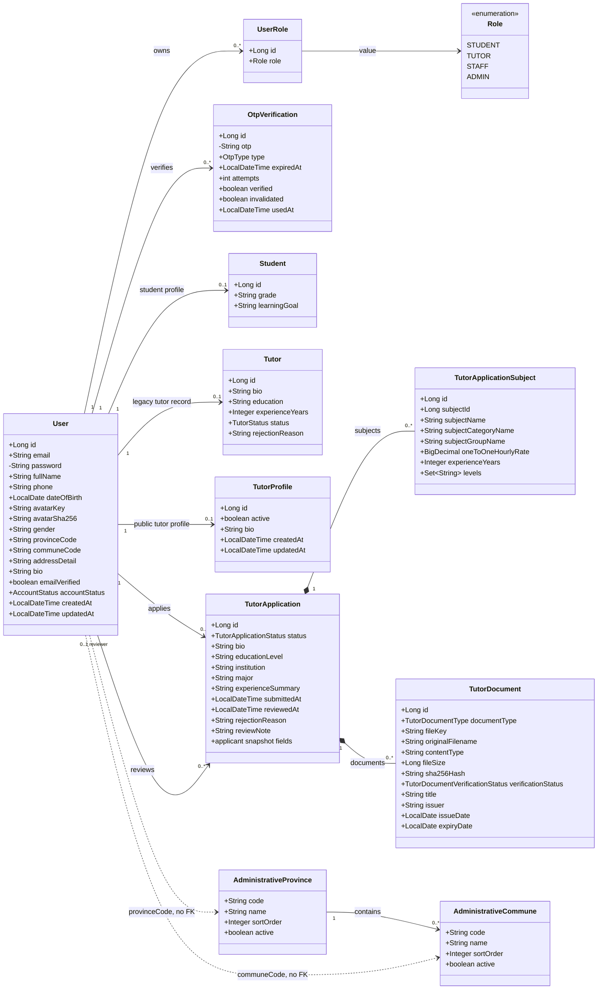
```mermaid
classDiagram
direction LR

class User {
  +Long id
  +String email
  -String password
  +String fullName
  +String phone
  +LocalDate dateOfBirth
  +String avatarKey
  +String avatarSha256
  +String gender
  +String provinceCode
  +String communeCode
  +String addressDetail
  +String bio
  +boolean emailVerified
  +AccountStatus accountStatus
  +LocalDateTime createdAt
  +LocalDateTime updatedAt
}

class UserRole {
  +Long id
  +Role role
}

class Role {
  <<enumeration>>
  STUDENT
  TUTOR
  STAFF
  ADMIN
}

class OtpVerification {
  +Long id
  -String otp
  +OtpType type
  +LocalDateTime expiredAt
  +int attempts
  +boolean verified
  +boolean invalidated
  +LocalDateTime usedAt
}

class Student {
  +Long id
  +String grade
  +String learningGoal
}

class Tutor {
  +Long id
  +String bio
  +String education
  +Integer experienceYears
  +TutorStatus status
  +String rejectionReason
}

class TutorProfile {
  +Long id
  +boolean active
  +String bio
  +LocalDateTime createdAt
  +LocalDateTime updatedAt
}

class TutorApplication {
  +Long id
  +TutorApplicationStatus status
  +String bio
  +String educationLevel
  +String institution
  +String major
  +String experienceSummary
  +LocalDateTime submittedAt
  +LocalDateTime reviewedAt
  +String rejectionReason
  +String reviewNote
  +applicant snapshot fields
}

class TutorApplicationSubject {
  +Long id
  +Long subjectId
  +String subjectName
  +String subjectCategoryName
  +String subjectGroupName
  +BigDecimal oneToOneHourlyRate
  +Integer experienceYears
  +Set~String~ levels
}

class TutorDocument {
  +Long id
  +TutorDocumentType documentType
  +String fileKey
  +String originalFilename
  +String contentType
  +Long fileSize
  +String sha256Hash
  +TutorDocumentVerificationStatus verificationStatus
  +String title
  +String issuer
  +LocalDate issueDate
  +LocalDate expiryDate
}

class AdministrativeProvince {
  +String code
  +String name
  +Integer sortOrder
  +boolean active
}

class AdministrativeCommune {
  +String code
  +String name
  +Integer sortOrder
  +boolean active
}

User "1" --> "0..*" UserRole : owns
UserRole --> Role : value
User "1" --> "0..*" OtpVerification : verifies
User "1" --> "0..1" Student : student profile
User "1" --> "0..1" Tutor : legacy tutor record
User "1" --> "0..1" TutorProfile : public tutor profile
User "1" --> "0..1" TutorApplication : applies
User "0..1 reviewer" --> "0..*" TutorApplication : reviews
TutorApplication "1" *-- "0..*" TutorApplicationSubject : subjects
TutorApplication "1" *-- "0..*" TutorDocument : documents
AdministrativeProvince "1" --> "0..*" AdministrativeCommune : contains
User ..> AdministrativeProvince : provinceCode, no FK
User ..> AdministrativeCommune : communeCode, no FK
```

### 3.2. Ý nghĩa và cardinality

| Quan hệ | Cardinality | Cơ sở hiện tại |
|---|---:|---|
| `User` — `UserRole` | 1 — 0..* | FK `user_roles.user_id`; unique `(user_id, role)` |
| `User` — `OtpVerification` | 1 — 0..* | Mỗi OTP bắt buộc thuộc một user |
| `User` — `Student` | 1 — 0..1 | `students.user_id` unique |
| `User` — `Tutor` | 1 — 0..1 | `tutors.user_id` unique |
| `User` — `TutorProfile` | 1 — 0..1 | `tutor_profiles.user_id` unique |
| `User` — `TutorApplication` | 1 — 0..1 | `tutor_applications.user_id` unique |
| reviewer `User` — `TutorApplication` | 0..1 — 0..* | `reviewed_by` nullable FK tới `users` |
| `TutorApplication` — `TutorApplicationSubject` | 1 — 0..* | Composition, cascade và orphan removal |
| `TutorApplication` — `TutorDocument` | 1 — 0..* | Child bắt buộc có application; DB cascade delete |
| `AdministrativeProvince` — `AdministrativeCommune` | 1 — 0..* | Commune bắt buộc thuộc province |

### 3.3. Điểm cần hiểu đúng

- Một `User` có thể đồng thời có `STUDENT` và `TUTOR`; role không loại trừ nhau.
- `TutorApplication` là hồ sơ xin trở thành gia sư, không phải quyền dạy từng
  môn sau khi đã trở thành gia sư.
- `TutorApplicationSubject` lưu snapshot môn dự định dạy trong lúc xét hồ sơ
  ban đầu. `subjectId` là tham chiếu logic sang Learning Service, không có JPA
  relation và không có FK liên service.
- `TutorDocument` chứng minh danh tính/năng lực của hồ sơ gia sư nói chung.
- `Tutor` và `TutorProfile` đang bị trùng vai trò. Khi vẽ model hiện trạng phải
  giữ cả hai; khi vẽ model đích nên chọn một aggregate duy nhất hoặc ghi rõ
  `Tutor` là legacy.
- `User.provinceCode` và `User.communeCode` chưa có FK trong migration, dù đã có
  bảng địa giới. Đây chỉ là tham chiếu logic ở thời điểm hiện tại.

---

## 4. Learning Service — catalog môn học chuẩn hóa

### 4.1. Ba khái niệm dễ nhầm

| Class | Ý nghĩa | Ví dụ |
|---|---|---|
| `EducationLevel` | Cấp học của nhánh học thuật | Tiểu học, THCS, THPT, Đại học |
| `CatalogLevel` | Đối tượng/trình độ/mục tiêu học của một môn cụ thể | Lớp 5, TOEIC 750+, Cơ bản |
| `ProposedRegistrationLevel` | Value object tạm khi gia sư đề xuất môn chưa có | Lớp 1..5 của “Kỹ năng sống” đề xuất |

`EducationLevel` không phải bằng cấp/chứng chỉ. Bằng cấp và chứng chỉ là
evidence/document. `CatalogLevel` cũng không phải bằng cấp; nó mô tả nhóm người
học hoặc mục tiêu đầu ra của môn.

### 4.2. Catalog chuẩn

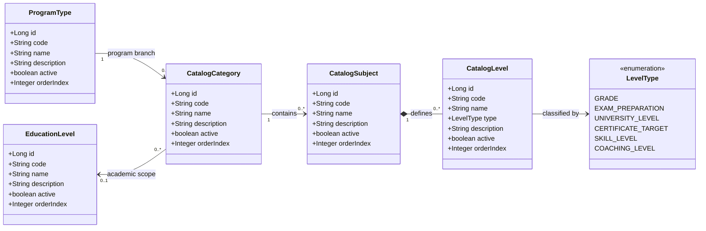
```mermaid
classDiagram
direction LR

class ProgramType {
  +Long id
  +String code
  +String name
  +String description
  +boolean active
  +Integer orderIndex
}

class EducationLevel {
  +Long id
  +String code
  +String name
  +String description
  +boolean active
  +Integer orderIndex
}

class CatalogCategory {
  +Long id
  +String code
  +String name
  +String description
  +boolean active
  +Integer orderIndex
}

class CatalogSubject {
  +Long id
  +String code
  +String name
  +String description
  +boolean active
  +Integer orderIndex
}

class CatalogLevel {
  +Long id
  +String code
  +String name
  +LevelType type
  +String description
  +boolean active
  +Integer orderIndex
}

class LevelType {
  <<enumeration>>
  GRADE
  EXAM_PREPARATION
  UNIVERSITY_LEVEL
  CERTIFICATE_TARGET
  SKILL_LEVEL
  COACHING_LEVEL
}

ProgramType "1" --> "0..*" CatalogCategory : program branch
EducationLevel "0..1" <-- "0..*" CatalogCategory : academic scope
CatalogCategory "1" --> "0..*" CatalogSubject : contains
CatalogSubject "1" *-- "0..*" CatalogLevel : defines
CatalogLevel --> LevelType : classified by
```

Các rule DB quan trọng:

- `ProgramType.code` và `EducationLevel.code` unique.
- Category học thuật bắt buộc có `EducationLevel`.
- Category kỹ năng bắt buộc không có `EducationLevel`.
- Subject unique theo `(category, code)` và `(category, name)`.
- Level unique theo `(subject, code)`.
- Xóa `CatalogSubject` ở mức DB sẽ cascade xuống `CatalogLevel`; nghiệp vụ admin
  hiện dùng `active=false`, nên class diagram nên thể hiện soft delete bằng
  thuộc tính `active` và tránh mô tả thao tác hard delete.

### 4.3. Ví dụ quan hệ đúng

```text
ACADEMIC
  -> EducationLevel: PRIMARY
  -> Category: Kiến thức nền tảng
  -> Subject: Toán
  -> Level: Lớp 1, Lớp 2, ..., Lớp 5 (GRADE)

SKILL
  -> EducationLevel: null
  -> Category: Ngoại ngữ và Chứng chỉ
  -> Subject: TOEIC
  -> Level: TOEIC 500+, TOEIC 750+, TOEIC 900+ (CERTIFICATE_TARGET)
```

---

## 5. Quyền dạy — aggregate trung tâm

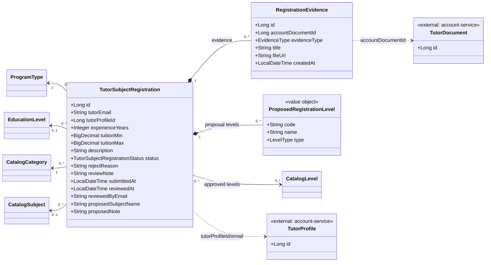
```mermaid
classDiagram
direction LR

class TutorSubjectRegistration {
  +Long id
  +String tutorEmail
  +Long tutorProfileId
  +Integer experienceYears
  +BigDecimal tuitionMin
  +BigDecimal tuitionMax
  +String description
  +TutorSubjectRegistrationStatus status
  +String rejectReason
  +String reviewNote
  +LocalDateTime submittedAt
  +LocalDateTime reviewedAt
  +String reviewedByEmail
  +String proposedSubjectName
  +String proposedNote
}

class RegistrationEvidence {
  +Long id
  +Long accountDocumentId
  +EvidenceType evidenceType
  +String title
  +String fileUrl
  +LocalDateTime createdAt
}

class ProposedRegistrationLevel {
  <<value object>>
  +String code
  +String name
  +LevelType type
}

class ProgramType
class EducationLevel
class CatalogCategory
class CatalogSubject
class CatalogLevel
class TutorProfile {
  <<external: account-service>>
  +Long id
}
class TutorDocument {
  <<external: account-service>>
  +Long id
}

ProgramType "1" <-- "0..*" TutorSubjectRegistration
EducationLevel "0..1" <-- "0..*" TutorSubjectRegistration
CatalogCategory "1" <-- "0..*" TutorSubjectRegistration
CatalogSubject "0..1" <-- "0..*" TutorSubjectRegistration
TutorSubjectRegistration "0..*" --> "0..*" CatalogLevel : approved levels
TutorSubjectRegistration "1" *-- "0..*" ProposedRegistrationLevel : proposal levels
TutorSubjectRegistration "1" *-- "0..*" RegistrationEvidence : evidence
TutorSubjectRegistration ..> TutorProfile : tutorProfileId/email
RegistrationEvidence ..> TutorDocument : accountDocumentId
```

### 5.1. Hai biến thể hợp lệ của registration

Registration chọn môn có sẵn:

```text
subject != null
levels.size >= 1
proposedSubjectName = null
proposedLevels.size = 0
```

Registration đề xuất môn mới:

```text
subject = null khi PENDING
levels.size = 0 khi PENDING
proposedSubjectName != null
proposedLevels.size từ 1 đến 12
```

Khi admin duyệt đề xuất, service tạo `CatalogSubject`, tạo các `CatalogLevel`,
gắn chúng trở lại registration rồi chuyển registration sang `APPROVED`.

### 5.2. Rule về quyền dạy

- Mỗi registration thuộc đúng một gia sư theo `tutorEmail` và snapshot
  `tutorProfileId`.
- Mỗi registration có đúng một `ProgramType` và `CatalogCategory`.
- `EducationLevel` phải khớp với category; nhánh SKILL phải là null.
- Subject, nếu có, phải thuộc category.
- Tất cả level chọn phải thuộc subject.
- Một gia sư không được có hai registration đang hoạt động cho cùng
  `(subject, level)`. DB trigger kiểm tra các status `DRAFT`, `PENDING`,
  `APPROVED`.
- `RegistrationEvidence` là minh chứng cho quyền dạy cụ thể; nó không thay thế
  `TutorDocument` của hồ sơ gia sư tổng quát.
- DB mới chỉ kiểm tra `subject_id IS NOT NULL OR proposed_subject_name IS NOT
  NULL`; chưa ép XOR. Service đang giữ invariant chặt hơn DB.
- DB không thể ép collection level có ít nhất một phần tử; service chịu trách
  nhiệm kiểm tra.

---

## 6. Classroom và yêu cầu tham gia hiện tại

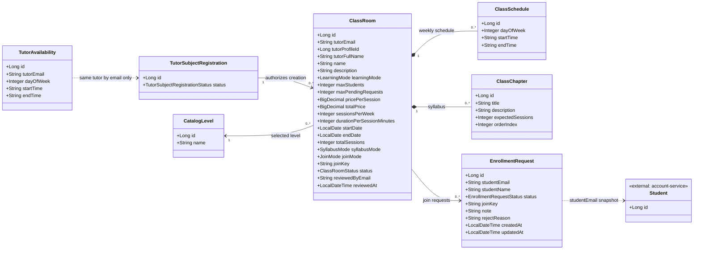
```mermaid
classDiagram
direction LR

class TutorSubjectRegistration {
  +Long id
  +TutorSubjectRegistrationStatus status
}

class CatalogLevel {
  +Long id
  +String name
}

class ClassRoom {
  +Long id
  +String tutorEmail
  +Long tutorProfileId
  +String tutorFullName
  +String name
  +String description
  +LearningMode learningMode
  +Integer maxStudents
  +Integer maxPendingRequests
  +BigDecimal pricePerSession
  +BigDecimal totalPrice
  +Integer sessionsPerWeek
  +Integer durationPerSessionMinutes
  +LocalDate startDate
  +LocalDate endDate
  +Integer totalSessions
  +SyllabusMode syllabusMode
  +JoinMode joinMode
  +String joinKey
  +ClassRoomStatus status
  +String reviewedByEmail
  +LocalDateTime reviewedAt
}

class ClassSchedule {
  +Long id
  +Integer dayOfWeek
  +String startTime
  +String endTime
}

class ClassChapter {
  +Long id
  +String title
  +String description
  +Integer expectedSessions
  +Integer orderIndex
}

class EnrollmentRequest {
  +Long id
  +String studentEmail
  +String studentName
  +EnrollmentRequestStatus status
  +String joinKey
  +String note
  +String rejectReason
  +LocalDateTime createdAt
  +LocalDateTime updatedAt
}

class TutorAvailability {
  +Long id
  +String tutorEmail
  +Integer dayOfWeek
  +String startTime
  +String endTime
}

class Student {
  <<external: account-service>>
  +Long id
}

TutorSubjectRegistration "1" --> "0..*" ClassRoom : authorizes creation
CatalogLevel "1" <-- "0..*" ClassRoom : selected level
ClassRoom "1" *-- "0..*" ClassSchedule : weekly schedule
ClassRoom "1" *-- "0..*" ClassChapter : syllabus
ClassRoom "1" --> "0..*" EnrollmentRequest : join requests
EnrollmentRequest ..> Student : studentEmail snapshot
TutorAvailability ..> TutorSubjectRegistration : same tutor by email only
```

### 6.1. Cardinality và ownership

| Quan hệ | Cardinality | Ghi chú |
|---|---:|---|
| `TutorSubjectRegistration` — `ClassRoom` | 1 — 0..* | Class bắt buộc tạo từ registration APPROVED |
| `CatalogLevel` — `ClassRoom` | 1 — 0..* | Class chọn đúng một level trong registration |
| `ClassRoom` — `ClassSchedule` | 1 — 0..* | Composition; cascade + orphan removal + DB cascade |
| `ClassRoom` — `ClassChapter` | 1 — 0..* | Composition; FORM/BOTH yêu cầu chapter theo service |
| `ClassRoom` — `EnrollmentRequest` | 1 — 0..* | DB cascade khi class bị xóa |
| Tutor — `TutorAvailability` | 1 — 0..* logic | Chỉ nối bằng email, không FK/JPA relation |

### 6.2. Invariant tạo lớp

Backend hiện kiểm tra:

1. Registration thuộc chính tutor đang đăng nhập.
2. Registration có status `APPROVED`.
3. Subject và category còn active.
4. Level còn active và nằm trong danh sách level đã duyệt của registration.
5. Học phí mỗi buổi nằm trong khoảng `tuitionMin..tuitionMax`.
6. ONLINE cần meeting link; OFFLINE cần address.
7. Số lịch tuần phải bằng `sessionsPerWeek` và nằm trong availability của tutor.
8. Syllabus phải phù hợp với `FORM`, `FILE` hoặc `BOTH`.

Điểm còn thiếu ở DB: `class_rooms.level_id` chưa có trigger bảo đảm level đó nằm
trong bảng nối `tutor_subject_registration_levels` của chính registration. Service
đã kiểm tra, nhưng direct SQL vẫn có thể tạo dữ liệu lệch.

### 6.3. EnrollmentRequest chưa phải Enrollment hoàn chỉnh

Hiện tại một record có lifecycle:

```text
PENDING -> ACCEPTED
        -> REJECTED
        -> CANCELLED
```

`ACCEPTED` đang được dùng như “học viên đã ở trong lớp” để tính sĩ số. Tuy nhiên
theo tài liệu kế hoạch, model đích nên tách:

```text
EnrollmentRequest/JoinRequest --ACCEPTED--> Contract/Payment conditions
                                      --> Enrollment
```

Do chưa có `Enrollment`, `Contract`, `Payment`, một request `ACCEPTED` hiện vừa
là quyết định duyệt, vừa là membership của lớp. Khi triển khai contract/payment
cần tách rõ hai class, không đổi tên bảng hiện tại một cách cơ học.

### 6.4. Hai ngưỡng số lượng khác nhau

- `maxStudents`: sức chứa chính thức, so với số request `ACCEPTED`.
- `maxPendingRequests`: trần buffer, hiện so với `PENDING + ACCEPTED`.

Khi `PENDING + ACCEPTED >= maxPendingRequests`, hệ thống tạm ngưng nhận yêu cầu
mới. Tutor có thể tăng trần để mở lại.

Khi `ACCEPTED >= maxStudents`, class chuyển `LOCKED` và các request `PENDING`
còn lại bị từ chối. Guest/student chỉ nên thấy số chỗ trống chính thức; buffer là
thông tin quản trị của tutor.

---

## 7. Catalog legacy vẫn còn trong code

Project hiện có thêm một catalog V1:

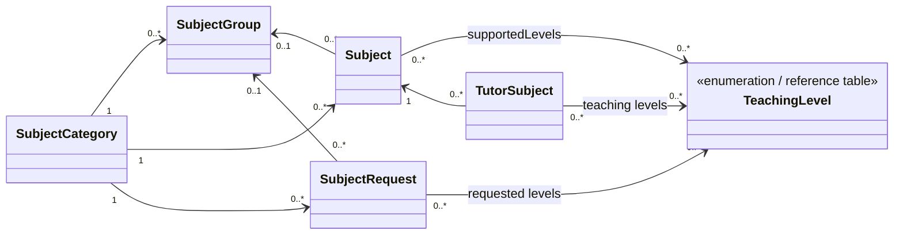
```mermaid
classDiagram
direction LR

class SubjectCategory
class SubjectGroup
class Subject
class TeachingLevel {
  <<enumeration / reference table>>
}
class SubjectRequest
class TutorSubject

SubjectCategory "1" --> "0..*" SubjectGroup
SubjectCategory "1" --> "0..*" Subject
SubjectGroup "0..1" <-- "0..*" Subject
Subject "0..*" --> "0..*" TeachingLevel : supportedLevels
SubjectCategory "1" --> "0..*" SubjectRequest
SubjectGroup "0..1" <-- "0..*" SubjectRequest
SubjectRequest "0..*" --> "0..*" TeachingLevel : requested levels
Subject "1" <-- "0..*" TutorSubject
TutorSubject "0..*" --> "0..*" TeachingLevel : teaching levels
```

Các class legacy gồm:

- `SubjectCategory`, `SubjectGroup`, `Subject`, `TeachingLevel`.
- `SubjectRequest` và bảng levels của request.
- `TutorSubject` và bảng levels của tutor subject.

Migration V20 đã comment rõ đây là catalog cũ. Flow đăng ký quyền dạy và tạo lớp
mới phải dùng:

```text
ProgramType -> CatalogCategory -> CatalogSubject -> CatalogLevel
              -> TutorSubjectRegistration -> ClassRoom
```

Không nối `ClassRoom` vào `Subject` legacy. Trong sơ đồ bảo vệ luận văn nên đặt
cụm legacy trong một package `<<legacy>>` riêng, tô xám hoặc bỏ khỏi sơ đồ model
đích. Account Service hiện vẫn có `TutorApplicationSubject.subjectId` snapshot từ
luồng catalog cũ, nên chưa thể xóa legacy mà không có kế hoạch migrate.

---

## 8. Quan hệ liên service

Theo tài liệu kiến trúc, mỗi service sở hữu dữ liệu của mình. Vì vậy không nên
vẽ JPA association xuyên service. Hãy dùng dependency nét đứt `..>` và ghi tên
trường snapshot/reference.

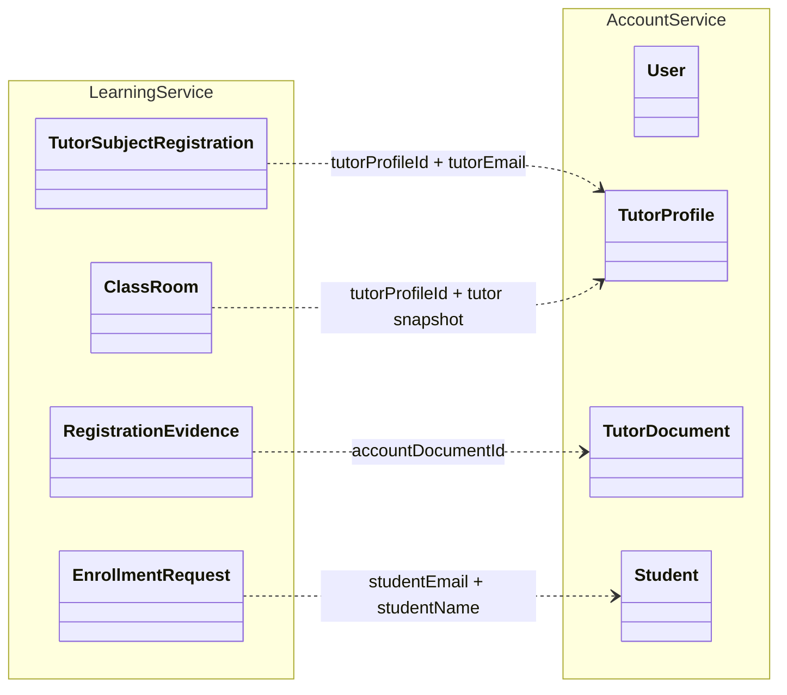
```mermaid
classDiagram
direction LR

namespace AccountService {
  class User
  class TutorProfile
  class TutorDocument
  class Student
}

namespace LearningService {
  class TutorSubjectRegistration
  class RegistrationEvidence
  class ClassRoom
  class EnrollmentRequest
}

TutorSubjectRegistration ..> TutorProfile : tutorProfileId + tutorEmail
RegistrationEvidence ..> TutorDocument : accountDocumentId
ClassRoom ..> TutorProfile : tutorProfileId + tutor snapshot
EnrollmentRequest ..> Student : studentEmail + studentName
```

Hiện cả Account và Learning đang trỏ mặc định tới cùng database `kltn_db`, dùng
hai bảng Flyway history riêng. Một số migration/service Learning còn đọc trực tiếp
`users`, `tutors`, `tutor_profiles`. Điều này chạy được trong môi trường hiện tại
nhưng trái với rule “không join table service khác” trong tài liệu kiến trúc.

Khi vẽ có hai cách trình bày:

- **Sơ đồ hiện trạng vật lý**: cùng PostgreSQL, nhưng các cột cross-domain chủ yếu
  không có FK.
- **Sơ đồ kiến trúc đích**: database/schema ownership tách theo service; đồng bộ
  identity snapshot bằng REST/event.

Không nên vẽ `TutorSubjectRegistration *-- TutorProfile` như composition vì
Learning Service không sở hữu vòng đời TutorProfile.

---

## 9. Các class planned theo tài liệu, chưa được triển khai

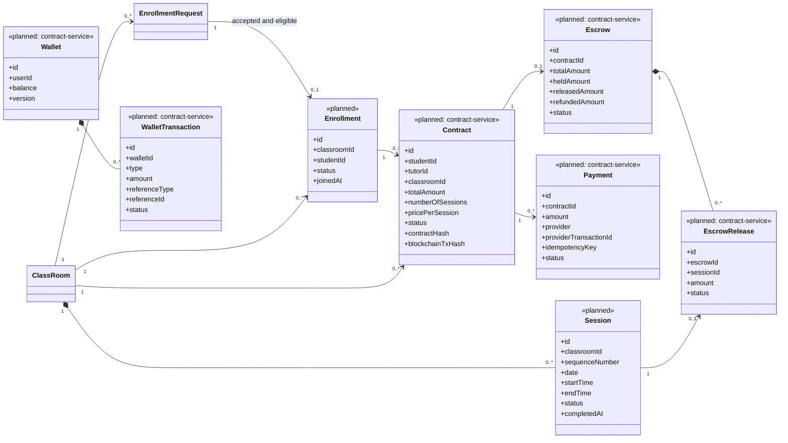
```mermaid
classDiagram
direction LR

class ClassRoom
class EnrollmentRequest

class Enrollment {
  <<planned>>
  +id
  +classroomId
  +studentId
  +status
  +joinedAt
}

class Session {
  <<planned>>
  +id
  +classroomId
  +sequenceNumber
  +date
  +startTime
  +endTime
  +status
  +completedAt
}

class Contract {
  <<planned: contract-service>>
  +id
  +studentId
  +tutorId
  +classroomId
  +totalAmount
  +numberOfSessions
  +pricePerSession
  +status
  +contractHash
  +blockchainTxHash
}

class Payment {
  <<planned: contract-service>>
  +id
  +contractId
  +amount
  +provider
  +providerTransactionId
  +idempotencyKey
  +status
}

class Escrow {
  <<planned: contract-service>>
  +id
  +contractId
  +totalAmount
  +heldAmount
  +releasedAmount
  +refundedAmount
  +status
}

class EscrowRelease {
  <<planned: contract-service>>
  +id
  +escrowId
  +sessionId
  +amount
  +status
}

class Wallet {
  <<planned: contract-service>>
  +id
  +userId
  +balance
  +version
}

class WalletTransaction {
  <<planned: contract-service>>
  +id
  +walletId
  +type
  +amount
  +referenceType
  +referenceId
  +status
}

ClassRoom "1" --> "0..*" EnrollmentRequest
EnrollmentRequest "1" --> "0..1" Enrollment : accepted and eligible
ClassRoom "1" --> "0..*" Enrollment
ClassRoom "1" *-- "0..*" Session
Enrollment "1" --> "0..1" Contract
ClassRoom "1" --> "0..*" Contract
Contract "1" --> "0..*" Payment
Contract "1" --> "0..1" Escrow
Escrow "1" *-- "0..*" EscrowRelease
Session "1" --> "0..1" EscrowRelease
Wallet "1" *-- "0..*" WalletTransaction
```

Các class trong `class.pdf` như `Assignment`, `Submission`, `Attendance`,
`Document`, `Review`, `Conversation`, `Message`, `Notification` có thể thêm ở
phase sau, nhưng hiện tài liệu Plan chưa chốt đủ thuộc tính/invariant để xem là
schema chính thức.

---

## 10. State machine nên đặt cạnh class diagram

### TutorApplication

```text
DRAFT -> PENDING -> APPROVED
                 -> REJECTED
```

### TutorSubjectRegistration

```text
DRAFT -> PENDING -> APPROVED -> SUSPENDED
                 -> REJECTED
```

### ClassRoom hiện tại

```text
DRAFT/PENDING_APPROVAL -> PRIVATE <-> PUBLISHED -> LOCKED -> CLOSED
                      -> REJECTED
                      -> CANCELLED
```

`ACTIVE` còn tồn tại trong enum/schema để tương thích cũ nhưng flow UI hiện dùng
`PRIVATE`, `PUBLISHED`, `LOCKED`. Cần chuẩn hóa lifecycle trước khi triển khai
Session/Contract để tránh hai hệ trạng thái song song.

### EnrollmentRequest hiện tại

```text
PENDING -> ACCEPTED
        -> REJECTED
        -> CANCELLED
```

---

## 11. Những điểm model hiện tại cần cải thiện

### Mức ưu tiên cao

1. Chọn model gia sư chính thức giữa `Tutor` và `TutorProfile`; tránh để hai bảng
   cùng là hồ sơ gia sư mà không có quan hệ rõ ràng.
2. Lập kế hoạch retire catalog legacy; không để feature mới dùng lẫn `Subject`
   và `CatalogSubject`.
3. Thêm DB trigger/constraint bảo đảm `ClassRoom.level` thuộc đúng registration.
4. Khi bắt đầu contract/payment, tách `EnrollmentRequest` và `Enrollment`.
5. Chuẩn hóa `ClassRoomStatus`, quyết định có giữ `ACTIVE` hay dùng
   `PUBLISHED/LOCKED/CLOSED` làm lifecycle chính.
6. Chọn chiến lược data ownership: shared database có schema rõ ràng hoặc tách
   database/service. Không vừa tuyên bố tách service vừa join table trực tiếp.

### Mức ưu tiên trung bình

1. Thêm FK hoặc validation rõ cho `User.provinceCode/communeCode` nếu tiếp tục
   dùng chung DB.
2. Thêm unique constraint cho availability và class schedule để tránh slot trùng.
3. Làm rõ `reviewedByEmail` là snapshot/audit identity; nếu cần lịch sử nhiều lần
   duyệt thì nên có bảng review/audit riêng.
4. `RegistrationEvidence.accountDocumentId` nên được kiểm tra tồn tại qua Account
   API/event thay vì tin ID client gửi.
5. Tránh hard delete subject/level đã được registration/class tham chiếu; dùng
   `active=false` và policy khóa sửa dữ liệu lịch sử.

---

## 12. Bản quan hệ chốt để đưa vào báo cáo

```text
ACCOUNT
User 1 ---------------- 0..* UserRole
User 1 ---------------- 0..* OtpVerification
User 1 ---------------- 0..1 Student
User 1 ---------------- 0..1 TutorProfile
User 1 ---------------- 0..1 TutorApplication
TutorApplication 1 ---- 0..* TutorApplicationSubject
TutorApplication 1 ---- 0..* TutorDocument

LEARNING CATALOG
ProgramType 1 ---------- 0..* CatalogCategory
EducationLevel 0..1 ---- 0..* CatalogCategory
CatalogCategory 1 ------ 0..* CatalogSubject
CatalogSubject 1 ------- 0..* CatalogLevel

TEACHING AUTHORIZATION
TutorProfile 1 --------- 0..* TutorSubjectRegistration  [logical cross-service]
CatalogSubject 0..1 ---- 0..* TutorSubjectRegistration
TutorSubjectRegistration 0..* -- 0..* CatalogLevel
TutorSubjectRegistration 1 -- 0..* RegistrationEvidence
TutorSubjectRegistration 1 -- 0..* ClassRoom

CLASSROOM
CatalogLevel 1 --------- 0..* ClassRoom
ClassRoom 1 ------------ 0..* ClassSchedule
ClassRoom 1 ------------ 0..* ClassChapter
ClassRoom 1 ------------ 0..* EnrollmentRequest
Student 1 -------------- 0..* EnrollmentRequest       [logical cross-service]
```

Đây là quan hệ nên dùng để vẽ sơ đồ hiện tại. Các class financial/learning
operations chỉ đưa vào sơ đồ tương lai và gắn `<<planned>>`.

---

## 13. System Context — sơ đồ tổng quát toàn hệ thống

Đây là sơ đồ đầu tiên nên đặt trong báo cáo. Nó thể hiện service ownership, không
thay cho sơ đồ class chi tiết.

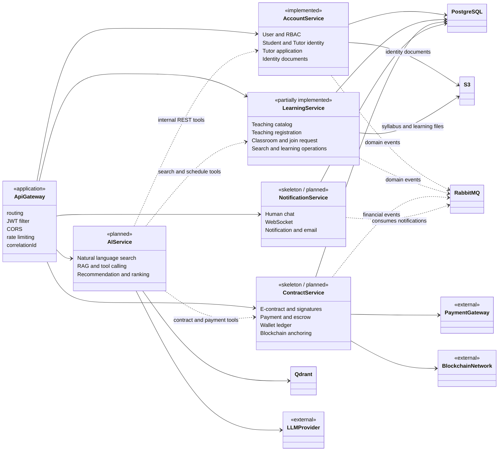
```mermaid
classDiagram
direction LR

class ApiGateway {
  <<application>>
  routing
  JWT filter
  CORS
  rate limiting
  correlationId
}

class AccountService {
  <<implemented>>
  User and RBAC
  Student and Tutor identity
  Tutor application
  Identity documents
}

class LearningService {
  <<partially implemented>>
  Teaching catalog
  Teaching registration
  Classroom and join request
  Search and learning operations
}

class ContractService {
  <<skeleton / planned>>
  E-contract and signatures
  Payment and escrow
  Wallet ledger
  Blockchain anchoring
}

class NotificationService {
  <<skeleton / planned>>
  Human chat
  WebSocket
  Notification and email
}

class AIService {
  <<planned>>
  Natural language search
  RAG and tool calling
  Recommendation and ranking
}

class PostgreSQL
class RabbitMQ
class S3
class Qdrant
class PaymentGateway {
  <<external>>
}
class BlockchainNetwork {
  <<external>>
}
class LLMProvider {
  <<external>>
}

ApiGateway --> AccountService
ApiGateway --> LearningService
ApiGateway --> ContractService
ApiGateway --> NotificationService
ApiGateway --> AIService

AccountService --> PostgreSQL
LearningService --> PostgreSQL
ContractService --> PostgreSQL
NotificationService --> PostgreSQL
AccountService --> S3 : identity documents
LearningService --> S3 : syllabus and learning files

AccountService ..> RabbitMQ : domain events
LearningService ..> RabbitMQ : domain events
ContractService ..> RabbitMQ : financial events
NotificationService ..> RabbitMQ : consumes notifications

ContractService --> PaymentGateway
ContractService --> BlockchainNetwork
AIService --> Qdrant
AIService --> LLMProvider
AIService ..> AccountService : internal REST tools
AIService ..> LearningService : search and schedule tools
AIService ..> ContractService : contract and payment tools
```

Nguyên tắc ownership:

| Service | Aggregate chính | Không được sở hữu |
|---|---|---|
| Account | User, Role, TutorApplication, TutorProfile, TutorDocument | Subject, ClassRoom, Payment |
| Learning | Catalog, TeachingRegistration, Post, ClassRoom, Session, Learning records | User password, Contract ledger |
| Contract | Contract, Signature, Payment, Escrow, Wallet, Blockchain anchor | Class schedule, User profile |
| Notification | Conversation, Message, Notification, Delivery | Contract hoặc ClassRoom nghiệp vụ |
| AI | AI conversation, knowledge index metadata, recommendation artifacts | Dữ liệu nghiệp vụ nguồn |

API Gateway không có domain entity và không được đưa vào quan hệ composition với
bất kỳ entity nào.

### 13.1. Hiện trạng triển khai thực tế của từng application

| Thành phần | Hiện trạng source code |
|---|---|
| `account-service` | Đã có REST, security, JPA entities, Flyway, S3 và RabbitMQ |
| `learning-service` | Đã có catalog, quyền dạy, classroom, enrollment request, Flyway và RabbitMQ |
| `api-gateway` | Hiện mới route Account và Learning; chưa có route Contract/Notification/AI |
| `contract-service` | Chỉ có Spring Boot skeleton; artifact/package còn ghi nhầm `contact-service`/`contact_service` |
| `notification-service` | Chỉ có Spring Boot skeleton; chưa có WebSocket, mail consumer, entity hoặc persistence |
| `ai-service` | Thư mục có tồn tại nhưng hiện chưa có source/module triển khai |
| Chat frontend | `Conversation`/`ChatMessage` và `MessagesView` dùng state mock, chưa gọi backend |

Do đó các sơ đồ từ mục 14 trở đi là **target domain model** để định hướng triển
khai. Chúng không phải mô tả rằng các bảng tương ứng đang tồn tại.

---

## 14. Learning Post, Class Post, Search và Matching

Phần này lấy từ `03_LEARNING_SEARCH_POST_RECOMMENDATION.md`. Các class dưới đây
chưa có backend entity, nhưng là model đích phù hợp với flow tổng quát.

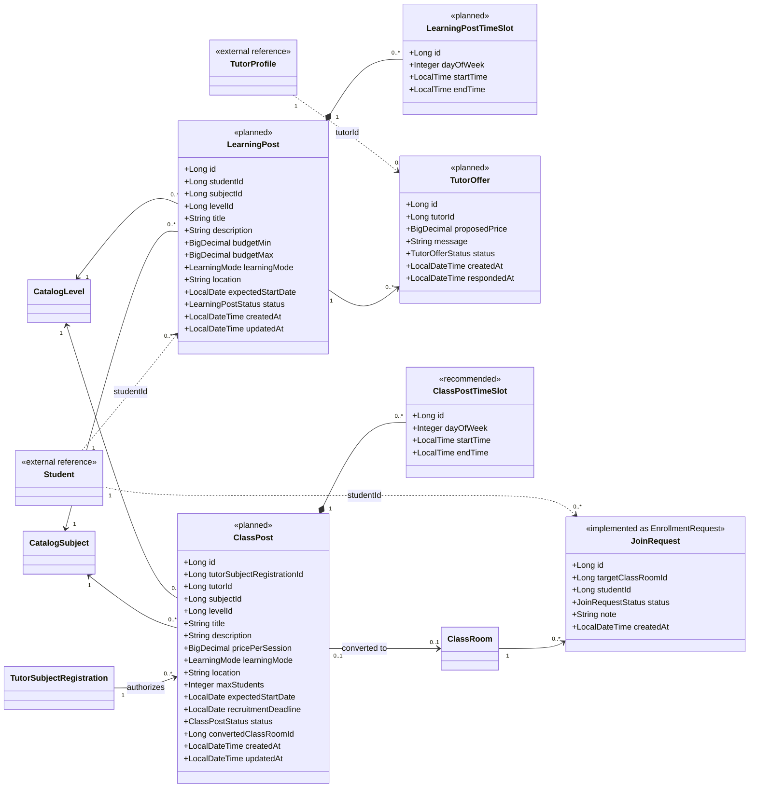
```mermaid
classDiagram
direction LR

class LearningPost {
  <<planned>>
  +Long id
  +Long studentId
  +Long subjectId
  +Long levelId
  +String title
  +String description
  +BigDecimal budgetMin
  +BigDecimal budgetMax
  +LearningMode learningMode
  +String location
  +LocalDate expectedStartDate
  +LearningPostStatus status
  +LocalDateTime createdAt
  +LocalDateTime updatedAt
}

class LearningPostTimeSlot {
  <<planned>>
  +Long id
  +Integer dayOfWeek
  +LocalTime startTime
  +LocalTime endTime
}

class TutorOffer {
  <<planned>>
  +Long id
  +Long tutorId
  +BigDecimal proposedPrice
  +String message
  +TutorOfferStatus status
  +LocalDateTime createdAt
  +LocalDateTime respondedAt
}

class ClassPost {
  <<planned>>
  +Long id
  +Long tutorSubjectRegistrationId
  +Long tutorId
  +Long subjectId
  +Long levelId
  +String title
  +String description
  +BigDecimal pricePerSession
  +LearningMode learningMode
  +String location
  +Integer maxStudents
  +LocalDate expectedStartDate
  +LocalDate recruitmentDeadline
  +ClassPostStatus status
  +Long convertedClassRoomId
  +LocalDateTime createdAt
  +LocalDateTime updatedAt
}

class ClassPostTimeSlot {
  <<recommended>>
  +Long id
  +Integer dayOfWeek
  +LocalTime startTime
  +LocalTime endTime
}

class JoinRequest {
  <<implemented as EnrollmentRequest>>
  +Long id
  +Long targetClassRoomId
  +Long studentId
  +JoinRequestStatus status
  +String note
  +LocalDateTime createdAt
}

class TutorSubjectRegistration
class CatalogSubject
class CatalogLevel
class Student {
  <<external reference>>
}
class TutorProfile {
  <<external reference>>
}
class ClassRoom

Student "1" ..> "0..*" LearningPost : studentId
CatalogSubject "1" <-- "0..*" LearningPost
CatalogLevel "1" <-- "0..*" LearningPost
LearningPost "1" *-- "0..*" LearningPostTimeSlot
LearningPost "1" --> "0..*" TutorOffer
TutorProfile "1" ..> "0..*" TutorOffer : tutorId

TutorSubjectRegistration "1" --> "0..*" ClassPost : authorizes
CatalogSubject "1" <-- "0..*" ClassPost
CatalogLevel "1" <-- "0..*" ClassPost
ClassPost "1" *-- "0..*" ClassPostTimeSlot
ClassPost "0..1" --> "0..1" ClassRoom : converted to
ClassRoom "1" --> "0..*" JoinRequest
Student "1" ..> "0..*" JoinRequest : studentId
```

### 14.1. Không gộp ClassPost và ClassRoom

- `ClassPost` là nội dung tuyển sinh/search, có thể mở trước khi hình thành lớp.
- `ClassRoom` là aggregate vận hành học, có schedule, chapter, member, session và
  ràng buộc hợp đồng.
- Project hiện đang search trực tiếp `ClassRoom PUBLISHED`. Đây là lựa chọn V1
  hợp lệ. Khi bổ sung ClassPost cần có migration/flow chuyển đổi rõ, không tạo hai
  nguồn public listing cạnh tranh nhau.

### 14.2. Search không nhất thiết là entity

Các class service nên xuất hiện trong sơ đồ thiết kế phần mềm, nhưng không cần
thành bảng:

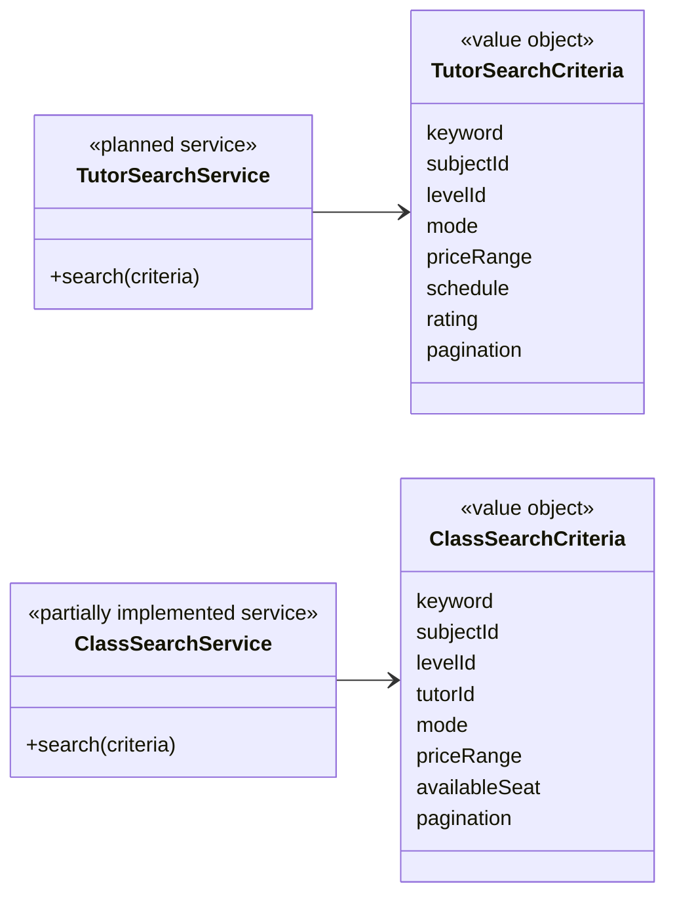
```mermaid
classDiagram
direction LR

class TutorSearchCriteria {
  <<value object>>
  keyword
  subjectId
  levelId
  mode
  priceRange
  schedule
  rating
  pagination
}

class ClassSearchCriteria {
  <<value object>>
  keyword
  subjectId
  levelId
  tutorId
  mode
  priceRange
  availableSeat
  pagination
}

class TutorSearchService {
  <<planned service>>
  +search(criteria)
}

class ClassSearchService {
  <<partially implemented service>>
  +search(criteria)
}

TutorSearchService --> TutorSearchCriteria
ClassSearchService --> ClassSearchCriteria
```

Search phải hard-filter tutor verified, quyền dạy APPROVED, đúng subject/level,
đúng lịch, giá, mode và trạng thái còn hoạt động trước khi ranking.

---

## 15. Recommendation và Interaction Tracking

Recommendation không sở hữu `Tutor`, `ClassRoom` hay `LearningPost`. Nó tạo kết
quả tham chiếu đến các aggregate nguồn.

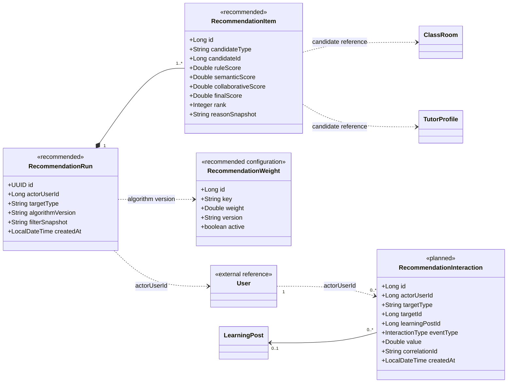
```mermaid
classDiagram
direction LR

class RecommendationInteraction {
  <<planned>>
  +Long id
  +Long actorUserId
  +String targetType
  +Long targetId
  +Long learningPostId
  +InteractionType eventType
  +Double value
  +String correlationId
  +LocalDateTime createdAt
}

class RecommendationRun {
  <<recommended>>
  +UUID id
  +Long actorUserId
  +String targetType
  +String algorithmVersion
  +String filterSnapshot
  +LocalDateTime createdAt
}

class RecommendationItem {
  <<recommended>>
  +Long id
  +String candidateType
  +Long candidateId
  +Double ruleScore
  +Double semanticScore
  +Double collaborativeScore
  +Double finalScore
  +Integer rank
  +String reasonSnapshot
}

class RecommendationWeight {
  <<recommended configuration>>
  +Long id
  +String key
  +Double weight
  +String version
  +boolean active
}

class User {
  <<external reference>>
}
class LearningPost
class ClassRoom
class TutorProfile

User "1" ..> "0..*" RecommendationInteraction : actorUserId
LearningPost "0..1" <-- "0..*" RecommendationInteraction
RecommendationRun "1" *-- "1..*" RecommendationItem
RecommendationRun ..> User : actorUserId
RecommendationItem ..> ClassRoom : candidate reference
RecommendationItem ..> TutorProfile : candidate reference
RecommendationRun ..> RecommendationWeight : algorithm version
```

`RecommendationRun/Item` không bắt buộc cho MVP, nhưng hữu ích để giải thích
“vì sao được gợi ý”, A/B test và đánh giá chất lượng. Nếu không lưu kết quả thì
chỉ cần `RecommendationInteraction`.

Interaction type theo Plan:

```text
IMPRESSION, VIEW, CLICK, SAVE, CONTACT, JOIN_REQUEST,
ACCEPT, REJECT, ENROLL, COMPLETE_CLASS, REVIEW
```

---

## 16. Classroom vận hành đầy đủ: member, session, attendance, content

`ClassSchedule` là lịch lặp hàng tuần; `LearningSession` là một buổi học cụ thể
có ngày giờ và trạng thái. Hai class không được gộp.

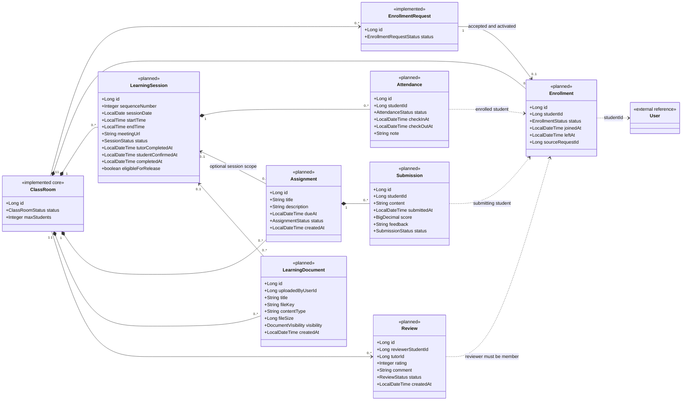
```mermaid
classDiagram
direction LR

class ClassRoom {
  <<implemented core>>
  +Long id
  +ClassRoomStatus status
  +Integer maxStudents
}

class EnrollmentRequest {
  <<implemented>>
  +Long id
  +EnrollmentRequestStatus status
}

class Enrollment {
  <<planned>>
  +Long id
  +Long studentId
  +EnrollmentStatus status
  +LocalDateTime joinedAt
  +LocalDateTime leftAt
  +Long sourceRequestId
}

class LearningSession {
  <<planned>>
  +Long id
  +Integer sequenceNumber
  +LocalDate sessionDate
  +LocalTime startTime
  +LocalTime endTime
  +String meetingUrl
  +SessionStatus status
  +LocalDateTime tutorCompletedAt
  +LocalDateTime studentConfirmedAt
  +LocalDateTime completedAt
  +boolean eligibleForRelease
}

class Attendance {
  <<planned>>
  +Long id
  +Long studentId
  +AttendanceStatus status
  +LocalDateTime checkInAt
  +LocalDateTime checkOutAt
  +String note
}

class Assignment {
  <<planned>>
  +Long id
  +String title
  +String description
  +LocalDateTime dueAt
  +AssignmentStatus status
  +LocalDateTime createdAt
}

class Submission {
  <<planned>>
  +Long id
  +Long studentId
  +String content
  +LocalDateTime submittedAt
  +BigDecimal score
  +String feedback
  +SubmissionStatus status
}

class LearningDocument {
  <<planned>>
  +Long id
  +Long uploadedByUserId
  +String title
  +String fileKey
  +String contentType
  +Long fileSize
  +DocumentVisibility visibility
  +LocalDateTime createdAt
}

class Review {
  <<planned>>
  +Long id
  +Long reviewerStudentId
  +Long tutorId
  +Integer rating
  +String comment
  +ReviewStatus status
  +LocalDateTime createdAt
}

class User {
  <<external reference>>
}

ClassRoom "1" --> "0..*" EnrollmentRequest
EnrollmentRequest "1" --> "0..1" Enrollment : accepted and activated
ClassRoom "1" *-- "0..*" Enrollment
Enrollment ..> User : studentId
ClassRoom "1" *-- "0..*" LearningSession
LearningSession "1" *-- "0..*" Attendance
Attendance ..> Enrollment : enrolled student
ClassRoom "1" *-- "0..*" Assignment
LearningSession "0..1" <-- "0..*" Assignment : optional session scope
Assignment "1" *-- "0..*" Submission
Submission ..> Enrollment : submitting student
ClassRoom "1" *-- "0..*" LearningDocument
LearningSession "0..1" <-- "0..*" LearningDocument
ClassRoom "1" --> "0..*" Review
Review ..> Enrollment : reviewer must be member
```

### 16.1. Rule cần thể hiện bằng note trên sơ đồ

- Một student chỉ có tối đa một enrollment active trong một class:
  `UNIQUE(class_room_id, student_id)` cho các trạng thái active nếu DB hỗ trợ
  partial unique index.
- `Enrollment` chỉ được tạo khi request được accept và điều kiện contract/payment
  đã thỏa mãn theo loại lớp.
- `Attendance` unique theo `(session_id, student_id)`.
- `LearningSession.sequenceNumber` unique trong class.
- `Submission` unique theo `(assignment_id, student_id)` nếu mỗi bài chỉ nộp một
  bản hiện hành; nếu cho nộp nhiều lần thì thêm `attemptNumber`.
- `Review` chỉ được tạo sau khi enrollment/class đạt điều kiện hoàn thành; unique
  theo `(class_room_id, reviewer_student_id)`.
- Session không tự `COMPLETED` chỉ vì đã qua giờ. V1 nên yêu cầu tutor hoàn tất và
  student xác nhận hoặc hết grace period mà không có dispute.

### 16.2. Status đề xuất

```text
Enrollment: PENDING_ACTIVATION, ACTIVE, COMPLETED, CANCELLED, SUSPENDED
Session: SCHEDULED, IN_PROGRESS, PENDING_CONFIRMATION, COMPLETED, CANCELLED, MISSED
Attendance: PRESENT, ABSENT, LATE, EXCUSED
Assignment: DRAFT, PUBLISHED, CLOSED, CANCELLED
Submission: DRAFT, SUBMITTED, LATE, GRADED, RETURNED
Review: PENDING_MODERATION, PUBLISHED, HIDDEN
```

---

## 17. Hợp đồng điện tử và chữ ký

Sơ đồ cũ chỉ có một `Contract` đơn giản. Để biểu diễn ký hợp đồng đúng, cần tách
phiên bản hợp đồng, các bên tham gia và chữ ký. Blockchain chỉ neo hash, không
thay thế chữ ký và không lưu toàn bộ PDF.

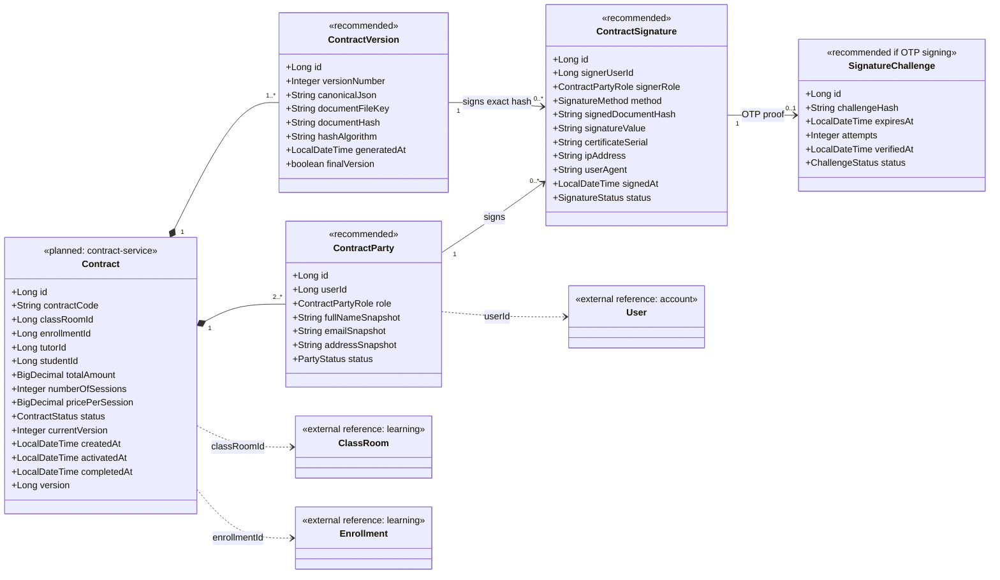
```mermaid
classDiagram
direction LR

class Contract {
  <<planned: contract-service>>
  +Long id
  +String contractCode
  +Long classRoomId
  +Long enrollmentId
  +Long tutorId
  +Long studentId
  +BigDecimal totalAmount
  +Integer numberOfSessions
  +BigDecimal pricePerSession
  +ContractStatus status
  +Integer currentVersion
  +LocalDateTime createdAt
  +LocalDateTime activatedAt
  +LocalDateTime completedAt
  +Long version
}

class ContractVersion {
  <<recommended>>
  +Long id
  +Integer versionNumber
  +String canonicalJson
  +String documentFileKey
  +String documentHash
  +String hashAlgorithm
  +LocalDateTime generatedAt
  +boolean finalVersion
}

class ContractParty {
  <<recommended>>
  +Long id
  +Long userId
  +ContractPartyRole role
  +String fullNameSnapshot
  +String emailSnapshot
  +String addressSnapshot
  +PartyStatus status
}

class ContractSignature {
  <<recommended>>
  +Long id
  +Long signerUserId
  +ContractPartyRole signerRole
  +SignatureMethod method
  +String signedDocumentHash
  +String signatureValue
  +String certificateSerial
  +String ipAddress
  +String userAgent
  +LocalDateTime signedAt
  +SignatureStatus status
}

class SignatureChallenge {
  <<recommended if OTP signing>>
  +Long id
  +String challengeHash
  +LocalDateTime expiresAt
  +Integer attempts
  +LocalDateTime verifiedAt
  +ChallengeStatus status
}

class ClassRoom {
  <<external reference: learning>>
}
class Enrollment {
  <<external reference: learning>>
}
class User {
  <<external reference: account>>
}

Contract ..> ClassRoom : classRoomId
Contract ..> Enrollment : enrollmentId
Contract "1" *-- "1..*" ContractVersion
Contract "1" *-- "2..*" ContractParty
ContractParty ..> User : userId
ContractVersion "1" --> "0..*" ContractSignature : signs exact hash
ContractParty "1" --> "0..*" ContractSignature : signs
ContractSignature "1" --> "0..1" SignatureChallenge : OTP proof
```

### 17.1. Lifecycle hợp đồng đề xuất

```text
DRAFT
  -> PENDING_SIGNATURE
  -> PARTIALLY_SIGNED
  -> PENDING_PAYMENT
  -> ACTIVE
  -> COMPLETED

Nhánh phụ: CANCELLED, EXPIRED, DISPUTED, TERMINATED
```

Rule quan trọng:

1. Mỗi chữ ký phải ký đúng `ContractVersion.documentHash`.
2. Sửa điều khoản sau khi đã có chữ ký phải tạo version mới và ký lại.
3. `Contract` chỉ sang `PENDING_PAYMENT` khi đủ chữ ký bắt buộc.
4. `signatureValue` chỉ lưu dữ liệu chữ ký/chứng thư cần thiết; không lưu private
   key của user.
5. OTP ký hợp đồng phải tách với OTP đăng nhập/reset password hoặc ít nhất dùng
   `OtpType.CONTRACT_SIGNATURE` và audit riêng trong Contract Service.
6. Snapshot tên/email/địa chỉ giúp hợp đồng lịch sử không đổi khi User sửa profile.

Nếu khóa luận chỉ cần xác nhận điện tử đơn giản, có thể bỏ `ContractParty` và
`SignatureChallenge`, nhưng vẫn nên giữ `ContractVersion` + `ContractSignature`
để chứng minh ai ký phiên bản nào.

---

## 18. Payment, Escrow, Refund, Dispute và Wallet Ledger

Ví nội bộ và ví blockchain là hai khái niệm khác nhau:

- `Wallet`: số dư kế toán nội bộ, bắt buộc có ledger transaction.
- `BlockchainAccount`: địa chỉ on-chain tùy chọn; không dùng làm nguồn số dư học
  phí chính trừ khi thiết kế thanh toán crypto riêng.

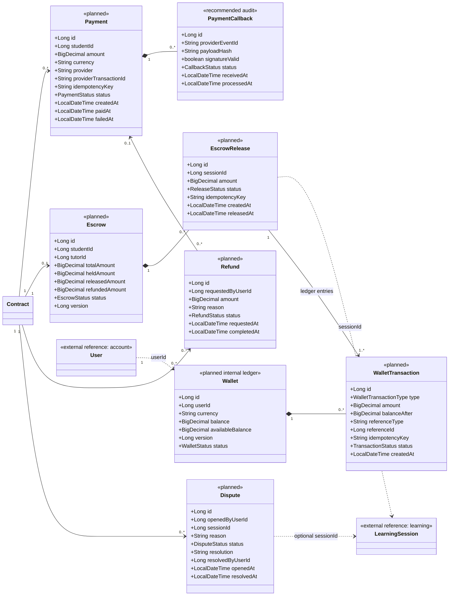
```mermaid
classDiagram
direction LR

class Contract

class Payment {
  <<planned>>
  +Long id
  +Long studentId
  +BigDecimal amount
  +String currency
  +String provider
  +String providerTransactionId
  +String idempotencyKey
  +PaymentStatus status
  +LocalDateTime createdAt
  +LocalDateTime paidAt
  +LocalDateTime failedAt
}

class PaymentCallback {
  <<recommended audit>>
  +Long id
  +String providerEventId
  +String payloadHash
  +boolean signatureValid
  +CallbackStatus status
  +LocalDateTime receivedAt
  +LocalDateTime processedAt
}

class Escrow {
  <<planned>>
  +Long id
  +Long studentId
  +Long tutorId
  +BigDecimal totalAmount
  +BigDecimal heldAmount
  +BigDecimal releasedAmount
  +BigDecimal refundedAmount
  +EscrowStatus status
  +Long version
}

class EscrowRelease {
  <<planned>>
  +Long id
  +Long sessionId
  +BigDecimal amount
  +ReleaseStatus status
  +String idempotencyKey
  +LocalDateTime createdAt
  +LocalDateTime releasedAt
}

class Wallet {
  <<planned internal ledger>>
  +Long id
  +Long userId
  +String currency
  +BigDecimal balance
  +BigDecimal availableBalance
  +Long version
  +WalletStatus status
}

class WalletTransaction {
  <<planned>>
  +Long id
  +WalletTransactionType type
  +BigDecimal amount
  +BigDecimal balanceAfter
  +String referenceType
  +Long referenceId
  +String idempotencyKey
  +TransactionStatus status
  +LocalDateTime createdAt
}

class Refund {
  <<planned>>
  +Long id
  +Long requestedByUserId
  +BigDecimal amount
  +String reason
  +RefundStatus status
  +LocalDateTime requestedAt
  +LocalDateTime completedAt
}

class Dispute {
  <<planned>>
  +Long id
  +Long openedByUserId
  +Long sessionId
  +String reason
  +DisputeStatus status
  +String resolution
  +Long resolvedByUserId
  +LocalDateTime openedAt
  +LocalDateTime resolvedAt
}

class LearningSession {
  <<external reference: learning>>
}
class User {
  <<external reference: account>>
}

Contract "1" --> "0..*" Payment
Payment "1" *-- "0..*" PaymentCallback
Contract "1" --> "0..1" Escrow
Escrow "1" *-- "0..*" EscrowRelease
EscrowRelease ..> LearningSession : sessionId
User "1" ..> "0..*" Wallet : userId
Wallet "1" *-- "0..*" WalletTransaction
EscrowRelease "1" --> "1..*" WalletTransaction : ledger entries
Contract "1" --> "0..*" Refund
Payment "0..1" <-- "0..*" Refund
Contract "1" --> "0..*" Dispute
Dispute ..> LearningSession : optional sessionId
```

### 18.1. Luồng tài chính chuẩn

```text
Contract đủ chữ ký
  -> Payment PENDING
  -> Payment SUCCESS
  -> Escrow FUNDED
  -> Contract ACTIVE
  -> Session COMPLETED và đủ điều kiện giải ngân
  -> EscrowRelease duy nhất cho session
  -> WalletTransaction ESCROW_RELEASE
  -> Tutor Wallet tăng available balance
  -> Hết session: Escrow RELEASED, Contract COMPLETED
```

### 18.2. Constraint/idempotency bắt buộc

```text
Payment.idempotencyKey UNIQUE
Payment(provider, providerTransactionId) UNIQUE
PaymentCallback(providerEventId) UNIQUE
Escrow.contractId UNIQUE
EscrowRelease(escrowId, sessionId) UNIQUE
Wallet(userId, currency) UNIQUE
WalletTransaction.idempotencyKey UNIQUE
```

Mọi thay đổi balance phải tạo `WalletTransaction`; không update `Wallet.balance`
mà không có ledger. Nên dùng optimistic/pessimistic locking cho Payment, Escrow và
Wallet để tránh xử lý callback/release hai lần.

---

## 19. Blockchain và Smart Contract

Blockchain trong EduConnect dùng để chứng minh hash hợp đồng và audit transaction,
không phải nơi lưu PDF, profile, lịch học hoặc toàn bộ business state.

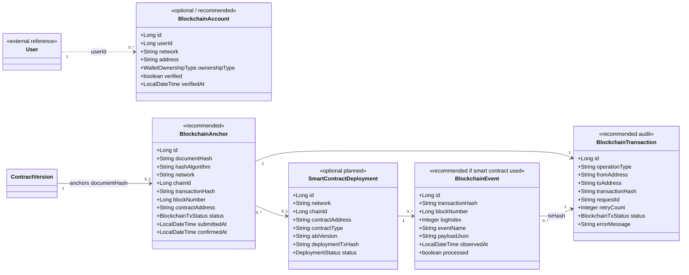
```mermaid
classDiagram
direction LR

class ContractVersion

class BlockchainAccount {
  <<optional / recommended>>
  +Long id
  +Long userId
  +String network
  +String address
  +WalletOwnershipType ownershipType
  +boolean verified
  +LocalDateTime verifiedAt
}

class BlockchainAnchor {
  <<recommended>>
  +Long id
  +String documentHash
  +String hashAlgorithm
  +String network
  +Long chainId
  +String transactionHash
  +Long blockNumber
  +String contractAddress
  +BlockchainTxStatus status
  +LocalDateTime submittedAt
  +LocalDateTime confirmedAt
}

class SmartContractDeployment {
  <<optional planned>>
  +Long id
  +String network
  +Long chainId
  +String contractAddress
  +String contractType
  +String abiVersion
  +String deploymentTxHash
  +DeploymentStatus status
}

class BlockchainEvent {
  <<recommended if smart contract used>>
  +Long id
  +String transactionHash
  +Long blockNumber
  +Integer logIndex
  +String eventName
  +String payloadJson
  +LocalDateTime observedAt
  +boolean processed
}

class BlockchainTransaction {
  <<recommended audit>>
  +Long id
  +String operationType
  +String fromAddress
  +String toAddress
  +String transactionHash
  +String requestId
  +Integer retryCount
  +BlockchainTxStatus status
  +String errorMessage
}

class User {
  <<external reference>>
}

User "1" ..> "0..*" BlockchainAccount : userId
ContractVersion "1" --> "0..1" BlockchainAnchor : anchors documentHash
BlockchainAnchor "0..*" --> "0..1" SmartContractDeployment
SmartContractDeployment "1" --> "0..*" BlockchainEvent
BlockchainAnchor "1" --> "1" BlockchainTransaction
BlockchainEvent "0..*" --> "1" BlockchainTransaction : txHash
```

### 19.1. Có cần Smart Contract hay không?

Có hai mức triển khai hợp lệ:

**Mức A — hash anchoring, phù hợp khóa luận và ít rủi ro:**

```text
ContractVersion canonical JSON/PDF
  -> SHA-256
  -> blockchain transaction ghi hash
  -> lưu txHash, network, blockNumber trong BlockchainAnchor
```

Không cần ví người dùng. Backend có một signer/service wallet được bảo vệ bằng
secret manager để gửi transaction.

**Mức B — smart contract escrow:**

Smart contract theo dõi contract hash/escrow/release. Mức này cần audit Solidity,
quản lý gas, key custody, retry/reorg và đồng bộ on-chain/off-chain. Chỉ nên làm
sau khi lifecycle Contract–Payment–Escrow trong DB đã ổn định.

### 19.2. Quy tắc bảo mật ví

- Không lưu private key/seed phrase dạng plaintext trong DB.
- Không đặt blockchain private key trong frontend hoặc commit vào `.env`.
- Nếu user tự ký bằng ví, backend chỉ lưu address và signature proof.
- Nếu platform ký, private key thuộc infrastructure secret manager/KMS.
- `BlockchainAccount` không phải `Wallet` ledger. Hai class không kế thừa nhau.
- DB là nguồn business state chính; blockchain là bằng chứng/audit hoặc execution
  adapter tùy mức triển khai.

---

## 20. Chat người dùng và realtime messaging

Frontend đã có `Conversation` và `ChatMessage` dạng mock trong `portal/types.ts`
và `MessagesView.tsx`, nhưng chưa có API, DB, WebSocket hoặc persistence. Model
đích nên hỗ trợ chat 1-1, chat lớp và support mà không cần đổi schema.

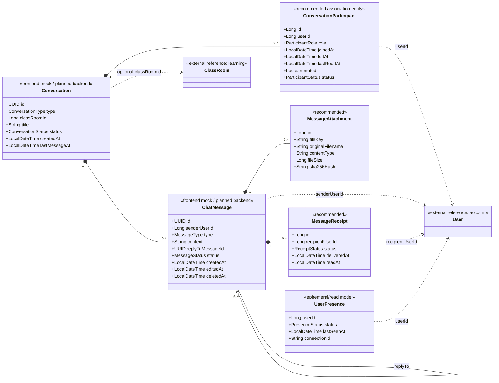
```mermaid
classDiagram
direction LR

class Conversation {
  <<frontend mock / planned backend>>
  +UUID id
  +ConversationType type
  +Long classRoomId
  +String title
  +ConversationStatus status
  +LocalDateTime createdAt
  +LocalDateTime lastMessageAt
}

class ConversationParticipant {
  <<recommended association entity>>
  +Long id
  +Long userId
  +ParticipantRole role
  +LocalDateTime joinedAt
  +LocalDateTime leftAt
  +LocalDateTime lastReadAt
  +boolean muted
  +ParticipantStatus status
}

class ChatMessage {
  <<frontend mock / planned backend>>
  +UUID id
  +Long senderUserId
  +MessageType type
  +String content
  +UUID replyToMessageId
  +MessageStatus status
  +LocalDateTime createdAt
  +LocalDateTime editedAt
  +LocalDateTime deletedAt
}

class MessageAttachment {
  <<recommended>>
  +Long id
  +String fileKey
  +String originalFilename
  +String contentType
  +Long fileSize
  +String sha256Hash
}

class MessageReceipt {
  <<recommended>>
  +Long id
  +Long recipientUserId
  +ReceiptStatus status
  +LocalDateTime deliveredAt
  +LocalDateTime readAt
}

class UserPresence {
  <<ephemeral/read model>>
  +Long userId
  +PresenceStatus status
  +LocalDateTime lastSeenAt
  +String connectionId
}

class User {
  <<external reference: account>>
}
class ClassRoom {
  <<external reference: learning>>
}

Conversation "1" *-- "2..*" ConversationParticipant
ConversationParticipant ..> User : userId
Conversation "1" *-- "0..*" ChatMessage
ChatMessage ..> User : senderUserId
ChatMessage "1" *-- "0..*" MessageAttachment
ChatMessage "1" *-- "0..*" MessageReceipt
MessageReceipt ..> User : recipientUserId
Conversation ..> ClassRoom : optional classRoomId
UserPresence ..> User : userId
ChatMessage "0..1" --> "0..*" ChatMessage : replyTo
```

### 20.1. Conversation type

```text
DIRECT       Student ↔ Tutor
CLASSROOM    Tutor ↔ nhiều Student trong lớp
SUPPORT      User ↔ Staff/Admin
```

Không đặt `from` và `to` trực tiếp trong `Conversation` như `class.pdf`, vì cách
đó chỉ hỗ trợ 1-1 và khó mở rộng chat lớp. `ConversationParticipant` giải quyết
membership, unread/read cursor, mute và rời nhóm.

### 20.2. WebSocket không phải entity

- WebSocket/STOMP gateway quản lý connection và push event.
- Message phải persist trước, sau đó mới broadcast.
- Presence/typing có thể giữ Redis hoặc memory với TTL; không cần ghi mọi typing
  event vào PostgreSQL.
- REST dùng để tải lịch sử/pagination; WebSocket dùng cho message mới, typing,
  receipt và presence.
- Authorization phải kiểm tra user là participant trước khi subscribe/send.
- Attachment dùng presigned S3 URL; server validate type, size và quyền truy cập.

---

## 21. Notification, Email và Reminder

Chat message và system notification là hai aggregate khác nhau. Một message có
thể sinh notification, nhưng notification không sở hữu message.

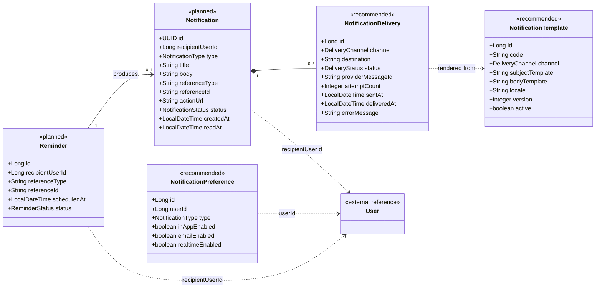
```mermaid
classDiagram
direction LR

class Notification {
  <<planned>>
  +UUID id
  +Long recipientUserId
  +NotificationType type
  +String title
  +String body
  +String referenceType
  +String referenceId
  +String actionUrl
  +NotificationStatus status
  +LocalDateTime createdAt
  +LocalDateTime readAt
}

class NotificationDelivery {
  <<recommended>>
  +Long id
  +DeliveryChannel channel
  +String destination
  +DeliveryStatus status
  +String providerMessageId
  +Integer attemptCount
  +LocalDateTime sentAt
  +LocalDateTime deliveredAt
  +String errorMessage
}

class NotificationPreference {
  <<recommended>>
  +Long id
  +Long userId
  +NotificationType type
  +boolean inAppEnabled
  +boolean emailEnabled
  +boolean realtimeEnabled
}

class NotificationTemplate {
  <<recommended>>
  +Long id
  +String code
  +DeliveryChannel channel
  +String subjectTemplate
  +String bodyTemplate
  +String locale
  +Integer version
  +boolean active
}

class Reminder {
  <<planned>>
  +Long id
  +Long recipientUserId
  +String referenceType
  +String referenceId
  +LocalDateTime scheduledAt
  +ReminderStatus status
}

class User {
  <<external reference>>
}

Notification ..> User : recipientUserId
Notification "1" *-- "0..*" NotificationDelivery
NotificationDelivery ..> NotificationTemplate : rendered from
NotificationPreference ..> User : userId
Reminder ..> User : recipientUserId
Reminder "1" --> "0..1" Notification : produces
```

Nguồn event điển hình:

```text
tutor.approved
teaching-registration.approved
classroom.approved
enrollment-request.created/accepted/rejected
contract.signature.requested
contract.activated
payment.completed/failed
session.reminder/completed
escrow.released
chat.message.created
```

Notification consumer phải idempotent. Nên có `sourceEventId UNIQUE` hoặc inbox
event để một RabbitMQ message retry không tạo nhiều notification/email.

---

## 22. AI Search, RAG, Tool Calling và Conversation Memory

AI chat và human chat phải tách aggregate. `AIChatSession` lưu hội thoại với trợ
lý; `Conversation` ở mục 20 là nhắn tin giữa người dùng.

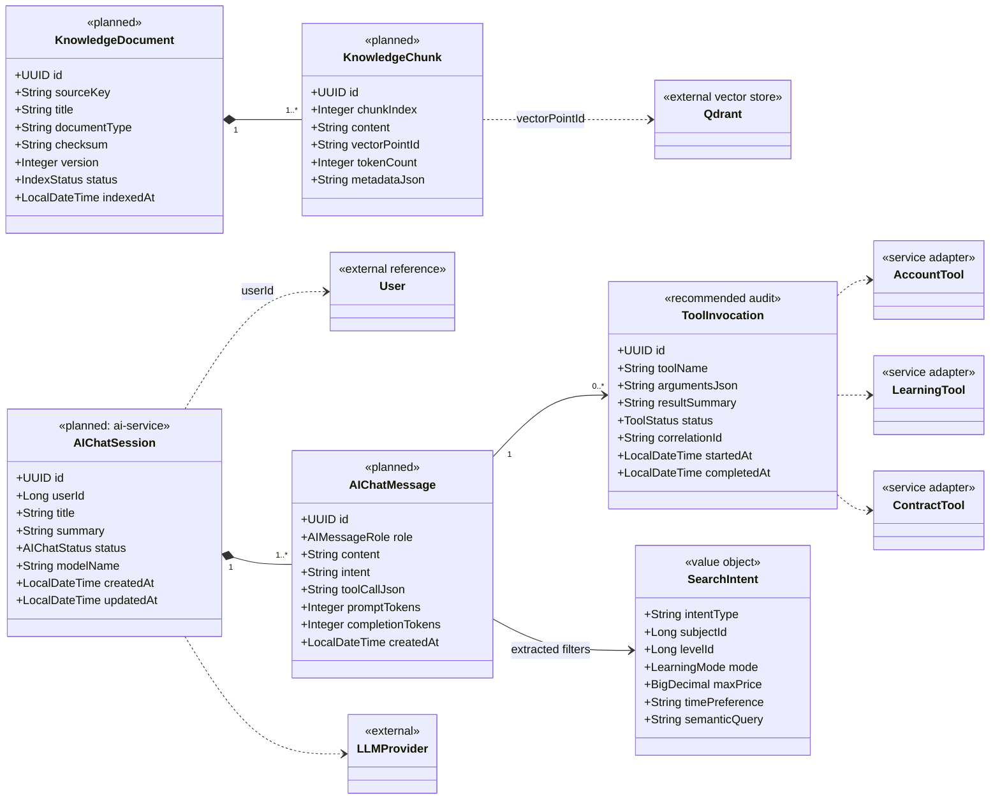
```mermaid
classDiagram
direction LR

class AIChatSession {
  <<planned: ai-service>>
  +UUID id
  +Long userId
  +String title
  +String summary
  +AIChatStatus status
  +String modelName
  +LocalDateTime createdAt
  +LocalDateTime updatedAt
}

class AIChatMessage {
  <<planned>>
  +UUID id
  +AIMessageRole role
  +String content
  +String intent
  +String toolCallJson
  +Integer promptTokens
  +Integer completionTokens
  +LocalDateTime createdAt
}

class KnowledgeDocument {
  <<planned>>
  +UUID id
  +String sourceKey
  +String title
  +String documentType
  +String checksum
  +Integer version
  +IndexStatus status
  +LocalDateTime indexedAt
}

class KnowledgeChunk {
  <<planned>>
  +UUID id
  +Integer chunkIndex
  +String content
  +String vectorPointId
  +Integer tokenCount
  +String metadataJson
}

class ToolInvocation {
  <<recommended audit>>
  +UUID id
  +String toolName
  +String argumentsJson
  +String resultSummary
  +ToolStatus status
  +String correlationId
  +LocalDateTime startedAt
  +LocalDateTime completedAt
}

class SearchIntent {
  <<value object>>
  +String intentType
  +Long subjectId
  +Long levelId
  +LearningMode mode
  +BigDecimal maxPrice
  +String timePreference
  +String semanticQuery
}

class AccountTool {
  <<service adapter>>
}
class LearningTool {
  <<service adapter>>
}
class ContractTool {
  <<service adapter>>
}
class Qdrant {
  <<external vector store>>
}
class LLMProvider {
  <<external>>
}
class User {
  <<external reference>>
}

AIChatSession ..> User : userId
AIChatSession "1" *-- "1..*" AIChatMessage
AIChatMessage "1" --> "0..*" ToolInvocation
AIChatMessage --> SearchIntent : extracted filters
KnowledgeDocument "1" *-- "1..*" KnowledgeChunk
KnowledgeChunk ..> Qdrant : vectorPointId
AIChatSession ..> LLMProvider
ToolInvocation ..> AccountTool
ToolInvocation ..> LearningTool
ToolInvocation ..> ContractTool
```

### 22.1. Luồng Natural Language Search

```text
User query
  -> LLM extract SearchIntent
  -> Learning Search API hard filtering
  -> optional semantic candidates từ Qdrant
  -> business validation
  -> ranking
  -> response + lý do phù hợp
```

LLM không trực tiếp query DB và không được bỏ qua status APPROVED, availability,
price, capacity hoặc ownership.

### 22.2. Luồng RAG

```text
KnowledgeDocument
  -> chunking
  -> embedding
  -> KnowledgeChunk + Qdrant vector point

Question policy/FAQ
  -> retrieve top chunks
  -> prompt có context và source
  -> LLM answer hoặc báo thiếu thông tin
```

### 22.3. Tool Calling

| Câu hỏi | Cách xử lý |
|---|---|
| “Điều kiện hoàn tiền là gì?” | RAG policy |
| “Hôm nay tôi có lớp nào?” | `LearningTool.getMySchedule()` |
| “Hợp đồng của tôi đã ký chưa?” | `ContractTool.getMyContract()` |
| “Tôi còn khoản nào chưa thanh toán?” | `ContractTool.getPendingPayments()` |
| “Tìm gia sư Toán 12 online dưới 200k” | Extract intent + Learning Search API |

Chỉ lưu metadata/payload cần audit; không lưu access token, password, private key
hoặc toàn bộ response nhạy cảm trong `ToolInvocation`.

---

## 23. Event, Outbox và idempotent consumer

`ProcessedEvent` đã tồn tại trong Learning Service. Khi mở rộng event-driven,
mỗi service có thể dùng cùng pattern nhưng sở hữu bảng riêng.

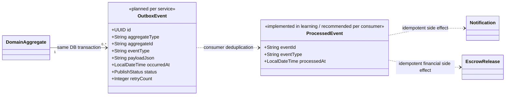
```mermaid
classDiagram
direction LR

class DomainAggregate
class OutboxEvent {
  <<planned per service>>
  +UUID id
  +String aggregateType
  +String aggregateId
  +String eventType
  +String payloadJson
  +LocalDateTime occurredAt
  +PublishStatus status
  +Integer retryCount
}

class ProcessedEvent {
  <<implemented in learning / recommended per consumer>>
  +String eventId
  +String eventType
  +LocalDateTime processedAt
}

class Notification
class EscrowRelease

DomainAggregate "1" --> "0..*" OutboxEvent : same DB transaction
OutboxEvent ..> ProcessedEvent : consumer deduplication
ProcessedEvent ..> Notification : idempotent side effect
ProcessedEvent ..> EscrowRelease : idempotent financial side effect
```

Outbox đặc biệt quan trọng với `payment.completed`, `session.completed`,
`contract.activated` và `escrow.released`. Không dựa vào “save DB rồi publish” ở
hai thao tác rời nhau cho financial flow.

---

## 24. Ma trận class: hiện có, mock và planned

| Domain | Class | Trạng thái hiện tại |
|---|---|---|
| Account | User, UserRole, OtpVerification, Student | Implemented |
| Tutor identity | Tutor, TutorProfile, TutorApplication, TutorApplicationSubject, TutorDocument | Implemented; Tutor/TutorProfile cần hợp nhất trách nhiệm |
| Catalog | ProgramType, EducationLevel, CatalogCategory, CatalogSubject, CatalogLevel | Implemented |
| Teaching authorization | TutorSubjectRegistration, ProposedRegistrationLevel, RegistrationEvidence | Implemented |
| Classroom | ClassRoom, ClassSchedule, ClassChapter, TutorAvailability | Implemented |
| Join | EnrollmentRequest | Implemented; đang kiêm membership sau ACCEPTED |
| Posts | LearningPost, LearningPostTimeSlot, TutorOffer, ClassPost | Planned |
| Learning operations | Enrollment, LearningSession, Attendance, Assignment, Submission, LearningDocument, Review | Planned |
| Human chat | Conversation, ChatMessage | Frontend mock only |
| Realtime chat | ConversationParticipant, Attachment, Receipt, Presence | Recommended/planned |
| Notification | Notification, Delivery, Preference, Template, Reminder | Planned |
| Contract | Contract | Service skeleton; entity planned |
| Signing | ContractVersion, ContractParty, ContractSignature, SignatureChallenge | Recommended/planned |
| Finance | Payment, Escrow, EscrowRelease, Wallet, WalletTransaction, Refund, Dispute | Planned |
| Blockchain | BlockchainAnchor, Transaction, Event, optional Account/Deployment | Planned |
| Recommendation | RecommendationInteraction | Planned in Plan |
| Explainable ranking | RecommendationRun, RecommendationItem, Weight | Recommended |
| AI | AIChatSession, AIChatMessage, KnowledgeDocument, KnowledgeChunk, ToolInvocation | Planned |
| Event reliability | ProcessedEvent | Implemented in Learning |
| Event reliability | OutboxEvent | Planned |

---

## 25. Quan hệ tổng quát cuối cùng để vẽ lại `class.pdf`

```text
User
├── 0..* UserRole
├── 0..1 Student
├── 0..1 TutorProfile
├── 0..1 TutorApplication
│   ├── 0..* TutorApplicationSubject
│   └── 0..* TutorDocument
├── 0..* AIChatSession
├── 0..* ConversationParticipant
├── 0..* Notification
├── 0..* ContractParty
├── 0..* Wallet
└── 0..* BlockchainAccount (optional)

ProgramType
└── 0..* CatalogCategory
    ├── 0..1 EducationLevel
    └── 0..* CatalogSubject
        └── 0..* CatalogLevel

TutorProfile
├── 0..* TutorAvailability
├── 0..* TutorSubjectRegistration
│   ├── 0..* CatalogLevel
│   ├── 0..* RegistrationEvidence
│   ├── 0..* ClassPost
│   └── 0..* ClassRoom
└── 0..* TutorOffer

Student
├── 0..* LearningPost
│   ├── 0..* LearningPostTimeSlot
│   └── 0..* TutorOffer
└── 0..* EnrollmentRequest

ClassRoom
├── 0..* ClassSchedule
├── 0..* ClassChapter
├── 0..* EnrollmentRequest
├── 0..* Enrollment
├── 0..* LearningSession
│   ├── 0..* Attendance
│   └── 0..* EscrowRelease [cross-service reference]
├── 0..* Assignment
│   └── 0..* Submission
├── 0..* LearningDocument
├── 0..* Review
├── 0..* Contract
└── 0..1 Conversation(type=CLASSROOM)

Contract
├── 1..* ContractVersion
│   ├── 0..* ContractSignature
│   └── 0..1 BlockchainAnchor
├── 2..* ContractParty
├── 0..* Payment
├── 0..1 Escrow
│   └── 0..* EscrowRelease
├── 0..* Refund
└── 0..* Dispute

Wallet
└── 0..* WalletTransaction

Conversation
├── 2..* ConversationParticipant
└── 0..* ChatMessage
    ├── 0..* MessageAttachment
    └── 0..* MessageReceipt

Notification
└── 0..* NotificationDelivery

AIChatSession
├── 1..* AIChatMessage
│   └── 0..* ToolInvocation
└── uses KnowledgeDocument -> KnowledgeChunk -> Qdrant
```

---

## 26. Cách bố trí bản vẽ cuối cùng

Nếu dùng StarUML, Visual Paradigm, Draw.io hoặc PlantUML, nên bố trí:

### Trang 1 — Core identity và teaching

- Góc trái: `User`, role, Student/Tutor.
- Chính giữa: Tutor application và documents.
- Góc phải: catalog và `TutorSubjectRegistration`.
- Dưới cùng: `ClassRoom`, schedule, chapter, join request.

### Trang 2 — Search, posts và learning operations

- Trái: LearningPost, slots, TutorOffer.
- Trên: ClassPost và conversion.
- Giữa: ClassRoom và Enrollment.
- Phải/dưới: Session, Attendance, Assignment, Submission, Document, Review.

### Trang 3 — Contract và blockchain

- Trái: Contract, Party, Version, Signature.
- Giữa: Payment, Escrow, Release, Refund, Dispute.
- Phải: Wallet ledger.
- Trên/phải: BlockchainAnchor, Transaction, Deployment, Event.
- Dùng nét đứt từ Contract/Class/Session tới domain Learning vì là liên service.

### Trang 4 — Communication và AI

- Trái: Conversation, Participant, Message, Attachment, Receipt.
- Giữa: Notification, Delivery, Template, Reminder.
- Phải: AIChatSession, AIMessage, KnowledgeDocument/Chunk, ToolInvocation.
- Ngoài biên: Qdrant, LLM Provider, RabbitMQ.

Quy ước màu khuyên dùng:

```text
Xanh dương  = Account Service
Xanh lá     = Learning Service
Cam         = Contract Service
Tím         = Notification/Chat
Hồng        = AI Service
Xám         = external system hoặc legacy
Viền liền   = FK/association nội service
Viền đứt    = ID/event/API liên service
Hình thoi đen = composition, parent sở hữu vòng đời child
```

Đối với bản bảo vệ khóa luận, nên có thêm một nhãn nhỏ trên mỗi class:
`Implemented`, `Planned` hoặc `Recommended`. Nhờ đó sơ đồ vừa mô tả tầm nhìn toàn
hệ thống vừa không gây hiểu nhầm rằng Contract/Blockchain/AI đã được code xong.
