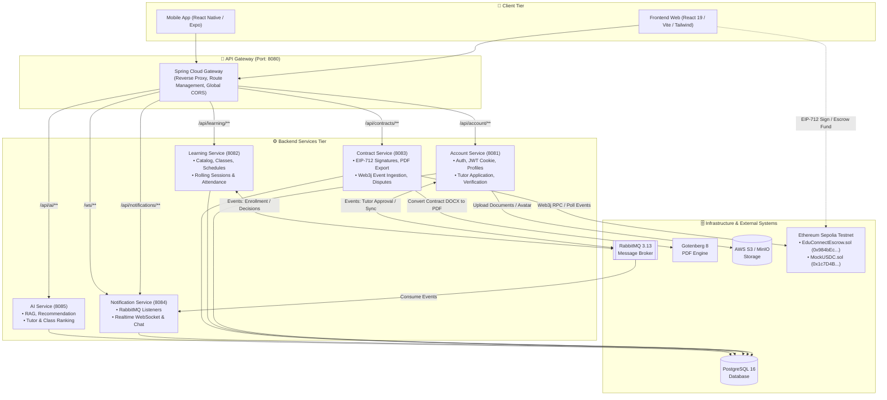

<div align="center">

# 🎓 EduConnect Platform
### Nền tảng Kết Nối Gia Sư và Học Viên Ứng Dụng AI & Blockchain Smart Contract

[](https://www.oracle.com/java/)
[](https://spring.io/projects/spring-boot)
[](https://react.dev/)
[](https://soliditylang.org/)
[](https://www.postgresql.org/)
[](https://www.rabbitmq.com/)
[]()

---
</div>

## 📌 1. TỔNG QUAN ĐỀ TÀI

**EduConnect** là nền tảng số kết nối giữa **Học viên (Student)** và **Gia sư (Tutor)**, giải quyết các thách thức về độ tin cậy, tính minh bạch tài chính và hiệu quả ghép nối:
* 🤖 **Ứng dụng Trí tuệ Nhân tạo (AI Matching & Recommendation):** Hỗ trợ gợi ý, xếp hạng và ghép nối lớp học/gia sư tối ưu dựa trên nhu cầu học tập, trình độ và khoảng cách địa lý.
* ⛓️ **Ứng dụng Blockchain & Smart Contract (EIP-712 & Escrow):** Quản lý hợp đồng đào tạo điện tử, ký số phi tập trung qua ví Web3, khóa tiền ký quỹ (Escrow) bằng USDC Testnet và tự động giải ngân theo từng buổi học đã hoàn thành/điểm danh hợp lệ.
* 🛡️ **Bảo vệ quyền lợi hai chiều:** Cơ chế phân xử khiếu nại (Dispute Resolution) minh bạch, bảo vệ tài chính cho học viên và đảm bảo thu nhập xứng đáng cho gia sư.

---

## 🏛️ 2. KIẾN TRÚC HỆ THỐNG (SERVICE-BASED ARCHITECTURE)

Hệ thống được thiết kế theo mô hình **Service-Based Architecture**, phân tách rõ ràng ranh giới nghiệp vụ (bounded contexts), giao tiếp qua **REST API**, **WebSocket Realtime** và **RabbitMQ Event-Driven Messaging**.



---

## 🛠️ 3. CÔNG NGHỆ SỬ DỤNG (TECH STACK)

| Phân hệ | Công nghệ & Thư viện chủ đạo |
| :--- | :--- |
| **Backend Core** | Java 21, Spring Boot 3.4+, Spring Cloud Gateway, Spring Data JPA, Spring Security |
| **Frontend Web** | React 19, TypeScript, Vite, TailwindCSS, Lucide Icons, Recharts |
| **Mobile App** | React Native, Expo, React Navigation |
| **Web3 & Blockchain** | Solidity 0.8.20, Foundry, Web3j, Ethers.js v6, Reown AppKit (WalletConnect) |
| **Message Broker** | RabbitMQ (Topic & Direct Exchanges, Dead-letter Queues) |
| **Database & Cache** | PostgreSQL 16, Flyway Migration (Quản lý version schema tự động) |
| **Document Engine** | Gotenberg 8 (Chuyển đổi mẫu hợp đồng `.docx` sang `.pdf` chuẩn in ấn) |
| **DevOps & Container** | Docker, Docker Compose, PowerShell / Bash Automation Scripts |

---

## 📂 4. CẤU TRÚC REPOSITORY

```text
KLTN_Edu/
├── backend/
│   ├── api-gateway/            # Cổng định tuyến API Gateway tập trung (Port 8080)
│   ├── account-service/        # Quản lý người dùng, phân quyền, xác thực OTP, duyệt gia sư (Port 8081)
│   ├── learning-service/       # Quản lý lớp học, đăng ký môn, buổi học & điểm danh (Port 8082)
│   ├── contract-service/       # Quản lý hợp đồng, ký EIP-712, tích hợp Blockchain Escrow (Port 8083)
│   ├── notification-service/   # Trung tâm thông báo RabbitMQ & Chat Realtime WebSocket (Port 8084)
│   └── ai-service/             # Dịch vụ AI Chatbot, RAG và gợi ý ghép nối gia sư (Port 8085)
├── frontend-web/               # Ứng dụng Web Portal (React 19, Vite, Tailwind, Web3Modal)
├── mobile-app/                 # Ứng dụng di động (Expo / React Native)
├── blockchain/                 # Mã nguồn Smart Contract (Solidity, Foundry tests, Deploy scripts)
├── database/                   # Schema cơ sở dữ liệu mẫu và tài nguyên liên quan
├── docker/                     # Cấu hình container hóa môi trường
├── docs/                       # Tài liệu đặc tả hệ thống, quy tắc nghiệp vụ (Architecture, Security, Business)
├── scripts/                    # Script khởi chạy tự động đa nền tảng (start-all.ps1, start-all.sh)
├── docker-compose.yml          # Quản lý dịch vụ phụ trợ: PostgreSQL, RabbitMQ, Gotenberg
└── pom.xml                     # Root Maven Aggregator quản lý build đa module
```

---

## 🔄 5. QUY TRÌNH NGHIỆP VỤ CỐT LÕI (CORE WORKFLOW)

```text
1. Đăng ký & Xét duyệt   : Gia sư nộp hồ sơ, văn bằng chứng chỉ -> Nhân viên (Staff) kiểm duyệt và kích hoạt.
2. Ghép nối & Tạo lớp    : Học viên tìm kiếm (hỗ trợ bởi AI) -> Gửi yêu cầu tham gia lớp học.
3. Khởi tạo Hợp đồng     : Gia sư chấp nhận -> Hệ thống sinh hợp đồng điện tử với các điều khoản đã thỏa thuận.
4. Ký số & Ký quỹ Escrow : Học viên và Gia sư ký số EIP-712 qua ví Web3 -> Học viên nạp tiền ký quỹ (USDC) vào Smart Contract.
5. Tiến trình Học tập    : Gia sư mở buổi học theo lịch cuốn chiếu -> Thực hiện điểm danh học viên -> Chốt buổi.
6. Tự động Quyết toán    : Smart Contract tự động giải ngân học phí từng buổi cho gia sư sau khi kết thúc buổi học hợp lệ.
7. Xử lý Khiếu nại       : Học viên khiếu nại (nếu có gian lận) -> Gia sư nộp giải trình -> Quản trị viên phân xử minh bạch.
```

---

## 🚦 6. BẢNG PHÂN BỔ CỔNG DỊCH VỤ (NETWORK PORT MATRIX)

| Thành phần | Port | Giao thức / Endpoint Gateway | Trách nhiệm chính |
| :--- | :---: | :--- | :--- |
| **Frontend Web** | `5173` | `http://localhost:5173` | Giao diện tương tác người dùng |
| **API Gateway** | `8080` | `http://localhost:8080` | Điểm tiếp nhận API duy nhất của hệ thống |
| **Account Service** | `8081` | `/api/account/**`, `/api/auth/**`, `/api/users/**` | Xác thực, phân quyền, hồ sơ |
| **Learning Service** | `8082` | `/api/learning/**` | Quản lý môn học, lớp học, điểm danh |
| **Contract Service** | `8083` | `/api/contracts/**` | Ký hợp đồng điện tử, Web3 Escrow |
| **Notification Service** | `8084` | `/api/notifications/**`, `/ws/notifications`, `/ws/chat` | Thông báo sự kiện, Realtime Chat |
| **AI Service** | `8085` | `/api/ai/**` | Tìm kiếm ngữ nghĩa, gợi ý gia sư |
| **PostgreSQL** | `5434` | `localhost:5434` | Cơ sở dữ liệu quan hệ |
| **RabbitMQ Broker** | `5672` / `15672` | Management: `http://localhost:15672` | Hàng đợi tin nhắn bất đồng bộ |
| **Gotenberg Service** | `3000` | `http://localhost:3000` | Xuất file PDF hợp đồng từ mẫu `.docx` |

---

## 🚀 7. HƯỚNG DẪN TRIỂN KHAI & KHỞI CHẠY (QUICKSTART)

### 📋 Yêu cầu môi trường
* **Java Development Kit (JDK):** Phiên bản 21 trở lên.
* **Node.js:** Phiên bản 20.x hoặc 22.x LTS & npm.
* **Docker & Docker Compose:** Đã cài đặt và đang chạy.

---

### 🔹 Bước 1: Khởi động Hạ tầng (Docker Containers)
Khởi chạy cơ sở dữ liệu PostgreSQL, RabbitMQ và Gotenberg:
```powershell
docker compose up -d
```
> Kiểm tra trạng thái containers: `docker compose ps` (đảm bảo cả 3 dịch vụ đều ở trạng thái *Healthy/Running*).

---

### 🔹 Bước 2: Thiết lập Biến Môi trường
Tạo file `.env` tại thư mục gốc của dự án từ mẫu:
```powershell
cp .env.example .env
```
*(Điền các khóa bảo mật và thông số cần thiết của bạn trong `.env` theo tài liệu hướng dẫn nội bộ).*

---

### 🔹 Bước 3: Khởi động Toàn bộ Backend Services
Hệ thống cung cấp sẵn script tự động hóa khởi chạy đồng thời cả 6 micro-services trong các tiến trình riêng biệt:

* **Trên Windows (PowerShell):**
  ```powershell
  .\scripts\start-all.ps1
  ```
* **Trên Linux / macOS (Bash):**
  ```bash
  chmod +x ./scripts/start-all.sh
  ./scripts/start-all.sh
  ```

---

### 🔹 Bước 4: Khởi động Frontend Web
Mở một cửa sổ dòng lệnh mới và chạy:
```powershell
cd frontend-web
npm install
npm run dev
```
Truy cập ứng dụng tại: `http://localhost:5173`

---

## 📖 8. TÀI LIỆU KỸ THUẬT NÂNG CAO

Để tìm hiểu sâu hơn về kiến trúc và các quy chuẩn thiết kế của hệ thống, vui lòng tham khảo các tài liệu trong thư mục [`/docs`](file:///d:/KL/khoaluan/KLTN_Edu/docs):
* [`docs/ARCHITECTURE.md`](file:///d:/KL/khoaluan/KLTN_Edu/docs/ARCHITECTURE.md): Chi tiết kiến trúc Service-Based, phân định domain và luồng sự kiện.
* [`docs/BUSINESS_RULES.md`](file:///d:/KL/khoaluan/KLTN_Edu/docs/BUSINESS_RULES.md): Toàn bộ ma trận phân quyền 5 Actors và quy tắc nghiệp vụ.
* [`docs/AUTH_SECURITY.md`](file:///d:/KL/khoaluan/KLTN_Edu/docs/AUTH_SECURITY.md): Cơ chế xác thực Cookie JWT bảo mật, chống CSRF và quản lý phiên.
* [`docs/BLOCKCHAIN.md`](file:///d:/KL/khoaluan/KLTN_Edu/docs/BLOCKCHAIN.md): Đặc tả Smart Contract Escrow, cấu trúc EIP-712 và mã hóa Settlement.
* [`docs/AI_MATCHING.md`](file:///d:/KL/khoaluan/KLTN_Edu/docs/AI_MATCHING.md): Thiết kế giải thuật tìm kiếm ngữ nghĩa và xếp hạng gợi ý AI.

---
<div align="center">
  <sub>Khóa Luận Tốt Nghiệp — EduConnect System Platform © 2026</sub>
</div>
