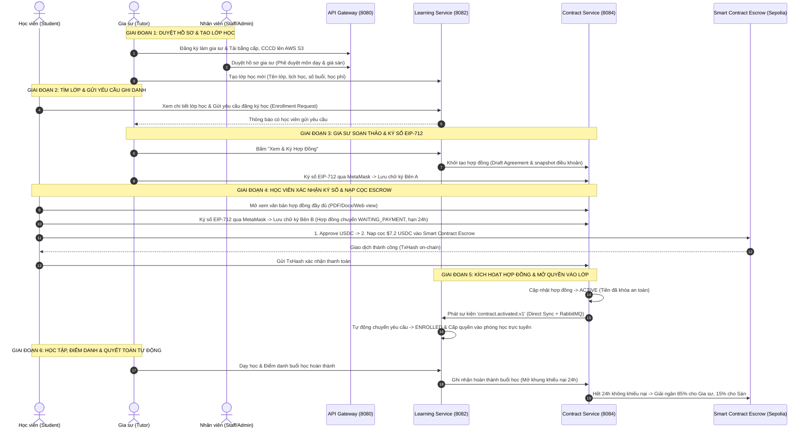

# 🎓 EDUCONNECT — NỀN TẢNG KẾT NỐI GIA SƯ VÀ HỌC TẬP TRỰC TUYẾN TÍCH HỢP HỢP ĐỒNG THÔNG MINH (BLOCKCHAIN ESCROW)

> **Khóa Luận Tốt Nghiệp**  
> Hệ thống giáo dục thông minh kết hợp Hợp đồng điện tử ký số EIP-712 và Ký quỹ bảo chứng phi tập trung (Smart Contract Escrow) trên mạng Ethereum Sepolia.

---

## 📌 MỤC LỤC
1. [Tổng Quan Hệ Thống](#1-tổng-quan-hệ-thống)
2. [Kiến Trúc Microservices & Công Nghệ](#2-kiến-trúc-microservices--công-nghệ)
3. [Luồng Nghiệp Vụ Chi Tiết Từ A Đến Z](#3-luồng-nghiệp-vụ-chi-tiết-từ-a-đến-z)
4. [Các Quy Định Nghiệp Vụ & Ràng Buộc Cốt Lõi](#4-các-quy-định-nghiệp-vụ--ràng-buộc-cốt-lõi)
5. [Cấu Trúc Thư Mục Dự Án](#5-cấu-trúc-thư-mục-dự-án)
6. [Cấu Hình Môi Trường (.env)](#6-cấu-hình-môi-trường-env)
7. [Hướng Dẫn Khởi Chạy Toàn Bộ Hệ Thống](#7-hướng-dẫn-khởi-chạy-toàn-bộ-hệ-thống)
8. [Tài Khoản & Môi Trường Test Mẫu](#8-tài-khoản--môi-trường-test-mẫu)

---

## 1. TỔNG QUAN HỆ THỐNG

**EduConnect** giải quyết bài toán cốt lõi trong thị trường gia sư trực tuyến: **Bảo vệ quyền lợi tài chính và chất lượng đào tạo cho cả Học viên và Gia sư**.
- **Vấn đề cũ**: Học viên sợ đóng tiền cả khóa học bị gia sư bỏ rơi / chất lượng kém; Gia sư sợ dạy xong bị quỵt tiền học phí; Trung tâm môi giới thu phí cao nhưng không minh bạch.
- **Giải pháp EduConnect**:
  - **Hợp đồng điện tử chuẩn EIP-712**: Hai bên ký cam kết bằng ví Web3 (MetaMask) có giá trị pháp lý, lưu trữ `Terms Hash` chống chỉnh sửa.
  - **Két sắt Smart Contract Escrow**: 100% học phí (bằng đồng USDC) được khóa an toàn trên Smart Contract trong suốt khóa học.
  - **Tự động quyết toán theo từng buổi**: Sau mỗi buổi học được điểm danh xác nhận, Smart Contract tự động giải ngân **85%** cho Gia sư và **15%** cho Nền tảng.
  - **Bảo vệ rủi ro & Trọng tài**: Có cơ chế khiếu nại 24h, hoàn trả tiền học cho học viên nếu gia sư vắng mặt hoặc vi phạm cam kết.

---

## 2. KIẾN TRÚC MICROSERVICES & CÔNG NGHỆ

Hệ thống được xây dựng theo kiến trúc **Service-Based Microservices** hướng sự kiện (Event-Driven):

```
                                  [Trình Duyệt Người Dùng / MetaMask]
                                                  │
                                                  ▼
                               [Spring Cloud API Gateway (Port 8080)]
                                                  │
            ┌─────────────────────────────────────┼─────────────────────────────────────┐
            ▼                                     ▼                                     ▼
   [Account Service (8081)]             [Learning Service (8082)]             [Contract Service (8084)]
   • Auth (JWT HttpOnly Cookie)         • Quản lý môn học / lớp học           • Soạn thảo & snapshot điều khoản
   • Profile Học viên / Gia sư          • Đăng ký & duyệt yêu cầu             • Xác thực chữ ký EIP-712
   • KYC & Duyệt hồ sơ Gia sư           • Điểm danh & nhật ký buổi học        • Ký quỹ Escrow & Giải ngân
   • Quản trị phân quyền                • Lịch học & Chat Socket              • Tạo văn bản PDF / Word
            │                                     │                                     │
            └─────────────────────────────────────┼─────────────────────────────────────┘
                                                  │
                                                  ▼
                                  [RabbitMQ Message Broker (5672)]
                                  (Event Outbox: contract.activated.v1, ...)
                                                  │
                                                  ▼
                                 [PostgreSQL Database (Port 5434)]
                                                  │
                                                  ▼
                        [Ethereum Sepolia Testnet / Smart Contract Escrow]
                        (Master Escrow: your_escrow_contract_address_here)
```

### Công nghệ sử dụng:
* **Backend**: Java 21, Spring Boot 3.x, Spring Cloud Gateway, Spring Security, Spring Data JPA, Flyway Migration, Web3j, Docx4j/OpenPDF.
* **Frontend**: React 18, Vite, TypeScript, TailwindCSS, Lucide Icons, Ethers.js v6, Reown AppKit (@reown/appkit).
* **Blockchain**: Solidity 0.8.36, Foundry (Forge/Cast), OpenZeppelin Contracts, Ethereum Sepolia Testnet, Circle USDC (ERC-20).
* **Database & Storage**: PostgreSQL 16, AWS S3 (Lưu trữ ảnh hồ sơ, bằng cấp, avatar, hợp đồng xuất bản).
* **Giao tiếp**: REST API, WebSocket (STOMP), RabbitMQ (Async Event Messaging).

---

## 3. LUỒNG NGHIỆP VỤ CHI TIẾT TỪ A ĐẾN Z



---

## 4. CÁC QUY ĐỊNH NGHIỆP VỤ & RÀNG BUỘC CỐT LÕI

1. **Quy định Chữ ký số EIP-712**:
   - Chữ ký phải xuất phát từ đúng địa chỉ ví Web3 đã được liên kết và snapshot vào hợp đồng.
   - Không chấp nhận chữ ký giả lập hoặc địa chỉ ví bị thay đổi giữa chừng.
   - Cả 2 bên Gia sư và Học viên đều phải hoàn tất ký số thì cổng thanh toán mới mở.

2. **Quy định Hạn chót Nạp cọc 24 Giờ (`Payment Deadline`)**:
   - Kể từ thời điểm Học viên ký xác nhận, hệ thống cấp đúng **24 giờ** để học viên nạp cọc USDC vào Smart Contract.
   - Sau 24 giờ nếu chưa nạp cọc, tiến trình ngầm `ContractExpirationScheduler` tự động hủy hợp đồng (`EXPIRED`) và mở lại slot trống của lớp học cho học viên khác.

3. **Quy định Quyền vào lớp (`Slot Reservation` vs `Class Access`)**:
   - Khi Gia sư chấp nhận yêu cầu: Học viên ở trạng thái `ACCEPTED` (được giữ chỗ tạm thời trong lớp, nhưng **CHƯA CÓ LINK PHÒNG HỌC**).
   - Chỉ khi nạp cọc thành công và hợp đồng chuyển `ACTIVE`: Học viên mới chuyển sang `ENROLLED` và được mở toàn bộ quyền học tập, link Google Meet/Zoom và tài liệu.

4. **Quy định Phân chia Tài chính (Financial Terms)**:
   - **85%** Học phí mỗi buổi học: Tự động chuyển vào ví Web3 của Gia sư sau khi buổi học hoàn tất hợp lệ.
   - **15%** Phí nền tảng: Tự động trích về ví Platform Sàn EduConnect để duy trì hệ thống.
   - **100%** Hoàn trả cho Học viên: Đối với các buổi học chưa diễn ra nếu lớp bị hủy hoặc gia sư vi phạm cam kết.

5. **Quy định Giải quyết Tranh chấp & Khiếu nại (Dispute Management)**:
   - Trong vòng 24 giờ sau khi kết thúc buổi học, học viên có quyền bấm *"Mở khiếu nại"* nếu gia sư vắng mặt hoặc dạy sai cam kết.
   - Trọng tài Sàn (Admin/Staff) sẽ vào phòng đối chất, xem nhật ký điểm danh để đưa ra phán quyết: Hoàn tiền cho học viên hoặc tiếp tục giải ngân cho gia sư.

---

## 5. CẤU TRÚC THƯ MỤC DỰ ÁN

```text
KLTN_Edu/
├── .env                               # File cấu hình biến môi trường tổng
├── .env.example                       # File mẫu biến môi trường
├── docker-compose.yml                 # Docker chạy PostgreSQL & RabbitMQ
├── backend/                           # Chứa toàn bộ Microservices Backend (Java Spring Boot)
│   ├── api-gateway/                   # Spring Cloud Gateway (Port 8080)
│   ├── account-service/               # Quản lý User, Auth, Tutor Application (Port 8081)
│   ├── learning-service/              # Quản lý Môn học, Lớp học, Điểm danh (Port 8082)
│   └── contract-service/              # Quản lý Hợp đồng, EIP-712, Escrow, PDF (Port 8084)
├── blockchain/                        # Source Smart Contract & Script deploy Foundry
│   ├── src/
│   │   ├── EduConnectEscrow.sol       # Master Smart Contract Escrow cốt lõi
│   │   └── interfaces/                # Interface IEduConnectEscrow
│   ├── script/                        # Script deploy lên Sepolia Testnet
│   └── test/                          # Invariant & Unit tests cho Smart Contract
├── frontend-web/                      # Giao diện Web Người Dùng (React + Vite + Tailwind)
│   ├── src/
│   │   ├── api/                       # API clients gọi Gateway (contracts, classes, auth, ...)
│   │   ├── components/contract/       # Modal ký hợp đồng, văn bản PDF, Ký quỹ Escrow
│   │   ├── pages/                     # Các trang Tìm gia sư, Chi tiết lớp học, Profile
│   │   ├── portal/components/         # Dashboard Gia sư, Học viên, Quản trị viên
│   │   └── web3/                      # Kết nối MetaMask, EIP-712 signer, cấu hình Sepolia
└── docs/                              # Toàn bộ tài liệu phân tích thiết kế & đặc tả hệ thống
```

---

## 6. CẤU HÌNH MÔI TRƯỜNG (.env)

Đảm bảo file `.env` ở thư mục gốc có đầy đủ các thông số sau:

```ini
# Database PostgreSQL
DB_URL=jdbc:postgresql://localhost:5434/kltn_db
POSTGRES_PORT=5434
POSTGRES_DB=kltn_db
POSTGRES_USER=postgres
POSTGRES_PASSWORD=your_db_password_here

# JWT & Security
JWT_SECRET=your_jwt_secret_base64_64_bytes_here
JWT_EXPIRATION=86400000

# Service Ports & URLs
FRONTEND_URL=http://localhost:5173
API_GATEWAY_PORT=8080
ACCOUNT_SERVICE_PORT=8081
LEARNING_SERVICE_PORT=8082
CONTRACT_SERVICE_PORT=8083

# RabbitMQ
RABBITMQ_HOST=localhost
RABBITMQ_PORT=5672
RABBITMQ_USERNAME=guest
RABBITMQ_PASSWORD=guest

# AWS S3 Storage
STORAGE_PROVIDER=s3
AWS_REGION=ap-southeast-1
AWS_S3_BUCKET=your_s3_bucket_name
AWS_ACCESS_KEY_ID=your_aws_access_key_here
AWS_SECRET_ACCESS_KEY=your_aws_secret_key_here

# Blockchain Ethereum Sepolia
BLOCKCHAIN_ENABLED=true
BLOCKCHAIN_CHAIN_ID=11155111
BLOCKCHAIN_RPC_URL=your_blockchain_rpc_url_here
BLOCKCHAIN_ESCROW_ADDRESS=your_escrow_contract_address_here
BLOCKCHAIN_USDC_ADDRESS=your_usdc_contract_address_here
BLOCKCHAIN_OPERATOR_ENABLED=false

# Frontend Web3
VITE_DEFAULT_CHAIN_ID=11155111
VITE_ESCROW_CONTRACT_ADDRESS=your_escrow_contract_address_here
VITE_USDC_CONTRACT_ADDRESS=your_usdc_contract_address_here
VITE_SEPOLIA_RPC_URL=your_blockchain_rpc_url_here
VITE_PROJECT_ID_WALLETCONNECT=your_walletconnect_project_id_here
```

---

## 7. HƯỚNG DẪN KHỞI CHẠY TOÀN BỘ HỆ THỐNG

### Bước 1: Khởi động Database & RabbitMQ (Docker)
Mở terminal tại thư mục gốc `KLTN_Edu`:
```bash
docker compose up -d postgres rabbitmq
```
*Kiểm tra:* PostgreSQL chạy tại port `5434`, RabbitMQ chạy tại port `5672` (Giao diện web quản lý: `http://localhost:15672`).

---

### Bước 2: Khởi động 4 Microservices Backend
Mở 4 tab terminal riêng biệt cho từng service:

1. **API Gateway (Port 8080)**:
   ```bash
   cd backend/api-gateway
   ./mvnw spring-boot:run
   ```
2. **Account Service (Port 8081)**:
   ```bash
   cd backend/account-service
   ./mvnw spring-boot:run
   ```
3. **Learning Service (Port 8082)**:
   ```bash
   cd backend/learning-service
   ./mvnw spring-boot:run
   ```
4. **Contract Service (Port 8084)**:
   ```bash
   cd backend/contract-service
   ./mvnw spring-boot:run
   ```

---

### Bước 3: Khởi động Frontend Web
Mở terminal tại thư mục `frontend-web`:
```bash
cd frontend-web
npm install
npm run dev
```
Truy cập ứng dụng tại: `http://localhost:5173`.

---

## 8. TÀI KHOẢN & MÔI TRƯỜNG TEST MẪU

Hệ thống sử dụng **Flyway Migration** (`V10` và `V12` trong `account-service`), do đó **khi bất kỳ ai clone code về và khởi động backend lần đầu, hệ thống sẽ TỰ ĐỘNG TẠO SẴN các tài khoản Quản trị viên và Nhân viên** vào Database mà không cần tạo thủ công:

| Vai Trò | Email Đăng Nhập | Mật Khẩu Mặc Định | Mô Tả & Phân Quyền |
| :--- | :--- | :--- | :--- |
| **Quản trị viên (Admin)** | `admin@educonnect.vn` | `Admin@123456` | Toàn quyền hệ thống, quản trị người dùng, phân xử tranh chấp |
| **Nhân viên duyệt (Staff)**| `staff1@educonnect.vn` | `Staff@123456` | Kiểm duyệt hồ sơ gia sư, duyệt bằng cấp CCCD, hỗ trợ lớp học |
| **Nhân viên duyệt (Staff 2)**| `staff2@educonnect.vn` | `Staff@123456` | Nhân viên kiểm duyệt |
| **Gia sư mẫu (Tutor)** | Tự đăng ký hoặc dùng tài khoản test | Tự thiết lập | Tạo lớp, soạn thảo và ký số hợp đồng EIP-712 |
| **Học viên mẫu (Student)**| Tự đăng ký hoặc dùng tài khoản test | Tự thiết lập | Tìm lớp, ký xác nhận EIP-712 & nạp cọc USDC Sepolia |

> **💡 Lưu ý cho người mới clone dự án**:
> - Đối với tài khoản **Học viên** và **Gia sư**, bạn có thể bấm nút **"Đăng ký"** trực tiếp trên giao diện web để trải nghiệm luồng xác thực OTP Email (`javax.mail`) thực tế.
> - Nếu muốn kiểm tra tính năng phân quyền Admin/Staff ngay lập tức, bạn có thể đăng nhập bằng các tài khoản đã được seed tự động ở bảng trên.

---
*Dự án Khóa Luận Tốt Nghiệp — Bản quyền thuộc về Nhóm Tác Giả EduConnect.*
